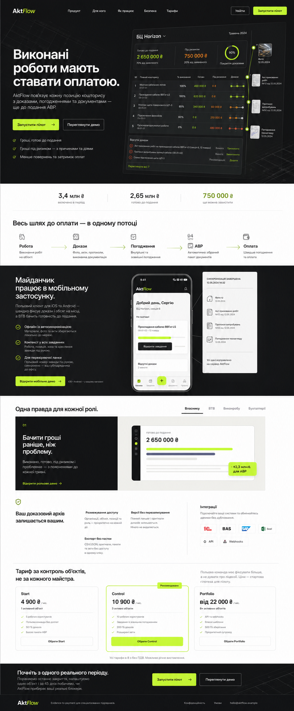
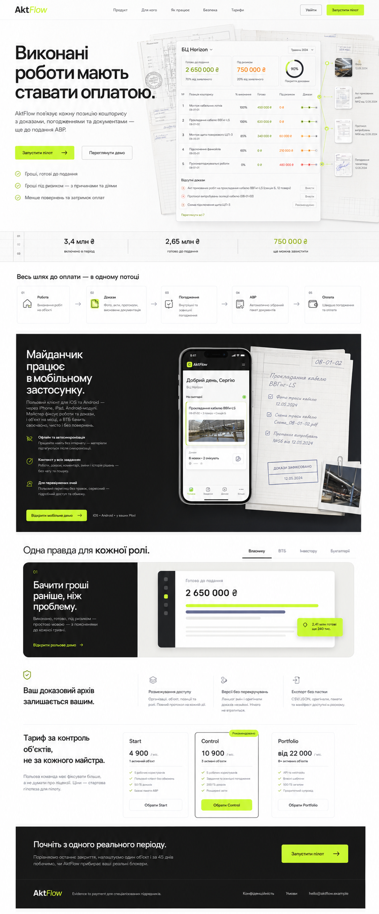
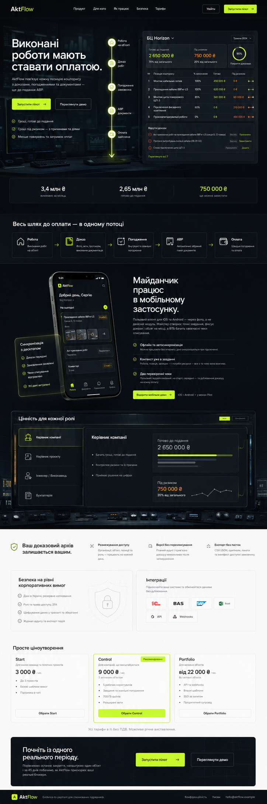

# AktFlow — three visual directions

Дата: 23 июля 2026  
Scope: landing page и связанные product/mobile mockups  
Ограничение: только визуальная система, композиция блоков и motion. Тексты, навигация, цены, продуктовые claims, роли и бизнес-функции не изменяются.

## Общий visual lock

Все направления используют действующие токены прототипа:

| Token | Value | Роль |
|---|---:|---|
| Carbon | `#171717` | основной текст или темный canvas |
| Lime | `#c6ff34` | readiness, verified state, primary CTA |
| Slate | `#484c5e` | вторичный UI, линии, глубина |
| Paper | `#fbfbfb` | светлый canvas и document surfaces |
| White | `#ffffff` | активные product surfaces |
| Glass light | `rgba(255,255,255,.78)` | только для плавающих активных поверхностей |
| Glass dark | `rgba(23,23,23,.78)` | только для control-room overlays |
| Shadow small | `0 12px 32px rgba(23,23,23,.085)` | phone, receipt, selected control |
| Shadow main | `0 24px 70px rgba(23,23,23,.13)` | единственный primary product frame |

Типографика остается прежней:

- Manrope Variable — display headings, financial values, product titles;
- Inter Variable — navigation, body, UI chrome, tables and controls.

Общая продуктовая последовательность также остается прежней:

1. Header.
2. Hero и readiness demonstration.
3. Financial outcome strip.
4. Evidence-to-payment workflow.
5. Mobile field application.
6. Role-based value.
7. Security и evidence archive.
8. Pricing.
9. Final Pilot CTA и footer.

Generated mockups показывают визуальную иерархию. При реализации весь настоящий UI-текст остается code-native и берется из текущего `Landing.jsx`; артефакты не используются как статическая замена интерфейса.

---

## Direction 01 — Executive Ledger

### Идея

AktFlow выглядит как строгий финансовый command center: не «еще одна строительная CRM», а система, которая объясняет готовность денег к подаче.

Это наиболее безопасная эволюция текущего прототипа. Она сохраняет сильный темный hero, но делает всю страницу визуально более цельной, спокойной и взрослой.

### Использование палитры

- 55–60% Carbon;
- 34–40% Paper/White;
- не более 5–6% Lime;
- Slate используется преимущественно в data chrome и разделителях.

### Блоки

| Блок | Визуальное решение |
|---|---|
| Header | Тихая навигация на Carbon, одна Lime CTA; без дополнительных controls |
| Hero | Copy слева; один крупный readiness ledger справа; документальные evidence nodes расположены на одной оси |
| Outcome strip | Три значения на Paper, отделенные ledger rules, без отдельных cards |
| Workflow | Открытая горизонтальная цепочка `Робота → Докази → Погодження → АВР → Оплата` |
| Mobile | Полноширинная Carbon band; phone и server receipt образуют одну sync-сцену |
| Roles | Один split command-center вместо набора role cards |
| Security | Открытая колонная сетка и archive statement |
| Pricing | Три спокойных плана; `Control` выделен только border + Lime CTA |
| Final CTA | Темная горизонтальная команда с большим заголовком и одной CTA |

### Signature components

- Ledger frame с тонкими горизонтальными rules.
- Evidence connector с фиксированными verified/risk nodes.
- Large financial rail.
- Indexed section numbers.
- Один слегка повернутый product surface вместо россыпи карточек.

### Motion

| Interaction | Motion spec |
|---|---|
| Hero load | Ledger: `opacity 0→1`, `translateY 16→0`, `rotate .8deg→1.3deg`, 520 ms |
| Financial rail | Одно заполнение слева направо, 800–900 ms после появления |
| Evidence connector | Line trace 650 ms; nodes фиксируются с задержкой 80 ms |
| Workflow hover | Lime background reveal 160 ms; текст не прыгает |
| Mobile sync | Receipt поднимается на 14 px и проявляется за 320 ms |
| Role switch | Cross-fade + horizontal translate 12 px, 260 ms |

Easing: `cubic-bezier(.2,.8,.2,1)`. Никакой бесконечной анимации.

### Сильные стороны

- Самый низкий implementation risk.
- Максимальная преемственность с текущим дизайном.
- Сильный фокус на ROI и руководителе компании.
- Хорошо масштабируется из landing в dashboard.

### Риск

Если использовать Carbon слишком долго, страница может стать тяжелой. Нужен четкий ритм темных и Paper-секций.

---

## Direction 02 — Evidence Atlas

> **Superseded 2026-09-05.** Конкурс дизайнов владельца
> (`design-references/contest-2026-09/`) выбрал светлый прототип «Daylight»;
> причины — в его README. Direction 04 ниже — это направление, ушедшее в
> продакшн.

### Идея

AktFlow представлен как цифровой доказательный архив: чертеж, позиция кошториса, фото, акт, согласование и сумма визуально принадлежат одному dossier.

Это наиболее дифференцированное направление. Оно непосредственно материализует ключевое преимущество продукта — traceable evidence chain — и меньше напоминает типичный SaaS landing.

### Использование палитры

- 74–78% Paper/White;
- 17–21% Carbon;
- 4–5% Lime;
- Slate используется как document ink, rules и annotations.

Paper остается именно `#fbfbfb`, без ухода в beige/cream.

### Блоки

| Блок | Визуальное решение |
|---|---|
| Header | Светлый editorial header, Carbon text, Lime CTA |
| Hero | Большой headline слева; справа layered project folio: dashboard, plan sheet и exact evidence thumbnails |
| Outcome strip | Индексированный ledger с column numbers и thin rules |
| Workflow | Пять document-control nodes с одной связующей линией |
| Mobile | Carbon dossier stage: phone, field sheet, stamp и evidence thumbnail |
| Roles | Tabbed project dossier с одной selected role и крупной financial surface |
| Security | Archive manifesto + три открытые policy columns |
| Pricing | Editorial comparison; plans не выглядят как generic SaaS cards |
| Final CTA | Carbon document footer с одной Lime action |

### Signature components

- Layered folio sheets с offset 8–12 px.
- Audit stamp и verified outline.
- Thin cross-reference lines.
- Evidence thumbnail с caption/date.
- Tabbed dossier вместо card grid.

### Motion

| Interaction | Motion spec |
|---|---|
| Hero folio | Задние sheets расходятся на 8–12 px за 450 ms |
| Evidence verification | Outline stamp превращается в Lime verified state за 280 ms |
| Connector | Line drawing на scroll progress, без perpetual pulse |
| Folio hover | `translateY(-3px)` + Shadow small, 160 ms |
| Mobile sync | Receipt визуально «вкладывается» в dossier, 360 ms |
| Role switch | Dossier slide 18 px + opacity, 320 ms |

Для `prefers-reduced-motion` остаются только opacity changes до 120 ms.

### Сильные стороны

- Самая сильная связь с реальным construction/document workflow.
- Выглядит надежно и premium без избыточной «технологичности».
- Светлый фон улучшает длинное чтение и доверие.
- Хорошо подходит для SEO-страниц, кейсов и объяснения продукта.

### Риск

Нельзя превращать документальную эстетику в декоративный scrapbook. Используются только реальные типы доказательств и существующие product entities.

---

## Direction 03 — Flow Terminal

### Идея

AktFlow — единый operational terminal, через который Lime signal проходит от выполненной работы к оплате. Визуальный wow-effect создается не количеством элементов, а непрерывным evidence spine и глубиной интерфейса.

Это самое выразительное направление и самое подходящее для sales demo, выставки или сильного first impression.

### Использование палитры

- 72–78% Carbon;
- 16–22% Paper/White;
- около 5% Lime;
- Slate формирует глубину glass surfaces.

Glass используется только у активных terminal layers, а не как фон каждого блока.

### Блоки

| Блок | Визуальное решение |
|---|---|
| Header | Минимальный Carbon terminal header |
| Hero | Copy слева; вертикальный evidence spine по центру; readiness console справа |
| Outcome strip | Темный console footer с тремя крупными outcomes |
| Workflow | Один uninterrupted signal track вместо отдельных feature cards |
| Mobile | Phone пересекает boundary между field и office; рядом один translucent sync panel |
| Roles | Большой role console с левой selection rail и selected state |
| Security | Спокойная Paper interval для визуального отдыха и доверия |
| Pricing | Paper comparison с одной Lime edge у `Control` |
| Final CTA | Возвращение в Carbon terminal и завершение signal path |

### Signature components

- Vertical evidence spine.
- Layered translucent command surfaces.
- Technical coordinates и тонкие grid marks.
- Magnetic verified nodes.
- One selected console surface.

### Motion

| Interaction | Motion spec |
|---|---|
| Evidence spine | Один Lime pulse сверху вниз, 1.1 s после hero load |
| Dashboard depth | Pointer parallax в пределах 3–6 px; отключается на touch/mobile |
| Verified node | Scale `.96→1` + shadow snap, 180 ms |
| Mobile handoff | Sync panel перемещается к office console на 24 px, 420 ms |
| Role switch | Masked wipe слева направо, 420 ms |
| Section reveal | `opacity + translateY(18px)`, 420 ms, только один раз |

Никаких glowing orbs, непрерывного floating или фонового particle system.

### Сильные стороны

- Самый сильный wow-effect.
- Отлично объясняет end-to-end flow.
- Дает запоминаемый visual asset для презентаций и видео.
- Хорошо сочетается с интерактивным product demo.

### Риск

Наиболее высокий implementation и performance risk. Нужно жестко ограничить blur, parallax и количество composited layers.

---

## Direction 04 — Daylight (approved 2026-09-05)

### Идея

Четвертое направление — не третий пункт этого сравнения, а победитель отдельного
конкурса дизайнов (`design-references/contest-2026-09/`, девять итераций,
2026-09-04 → 2026-09-05), проведённого позже и независимо от трёх направлений
выше. Владелец выбрал светлый прототип «Daylight»: тёплая бумага, холодные
чернила и одна кобальтовая метка вместо лайма — страница читается как
досье, разложенное на столе при дневном свете, а не как control room.

### Палитра и типографика

Paper `#F6F5F1`, Ink `#15161A`, Cobalt `#2B4BFF` (единственный акцентный цвет —
лайм полностью выведен из системы). Onest Variable для display и текста,
JetBrains Mono для индексов и evidence-идентификаторов — сериф не используется
нигде.

### Композиция

Собрана из узнаваемых блоков 21st.dev (Announcement pill, Container Scroll +
Border Beam, Dot Pattern, Grid Feature Cards, Bento, Cta-4) и sticky-стека
карточек Fora — взятых как структура и полностью перекрашенных в токен-роли,
без второй системы компонентов рядом с `packages/ui`.

### Motion

Общий словарь из шестнадцати primitives в `@goproceed/ui/motion`, ровно два
scroll-linked элемента на странице и никогда в одном экране; под reduced
motion — другая, статичная композиция, никогда не более быстрая версия той же.

Полное описание системы — в [`DESIGN.md`](../../DESIGN.md); процедура и gate —
в [`docs/design/02-building-ui.md`](../../docs/design/02-building-ui.md).

---

## Сравнение

| Критерий | Executive Ledger | Evidence Atlas | Flow Terminal |
|---|---:|---:|---:|
| Преемственность с prototype | 10/10 | 8/10 | 8/10 |
| Отличимость от generic SaaS | 8/10 | 10/10 | 9/10 |
| Доверие строительной аудитории | 9/10 | 10/10 | 8/10 |
| Фокус на финансовом результате | 10/10 | 9/10 | 9/10 |
| Wow-effect | 8/10 | 9/10 | 10/10 |
| Читаемость длинного landing | 9/10 | 10/10 | 7/10 |
| Implementation risk | Low | Medium | High |
| Motion/performance risk | Low | Low–Medium | Medium–High |

## Рекомендация

Для основного публичного landing рекомендуется **Direction 04 — Daylight**
(см. выше — принято владельцем 2026-09-05, реализовано в `apps/landing`).
Ниже — исходное сравнение трёх направлений, сохранённое как запись решения,
которое действовало до конкурса дизайнов.

Причины (исходная рекомендация, замененная Direction 04):

1. Она сильнее остальных материализует уникальную идею AktFlow: не project management вообще, а доказуемый путь от позиции кошториса к оплате.
2. Светлый document-first canvas лучше подходит для длинного B2B landing, SEO-контента и доверия.
3. Визуальная метафора остается близкой реальным артефактам пользователя: чертежам, фото, актам, протоколам и реестрам.
4. Она отличается от темных «AI SaaS» и generic dashboard-шаблонов.
5. Motion можно сделать выразительным без тяжелого runtime.

**Direction 01** — лучший безопасный выбор, если важна быстрая реализация и максимальная преемственность.  
**Direction 03** — лучший вариант для cinematic demo, но не первый выбор для всего production landing.

## Implementation guardrails

- Не менять существующий `Landing.jsx` content contract и route behavior.
- Не добавлять новые claims, metrics, badges, integrations или pricing.
- Не использовать generated mockup как финальный UI.
- Реализовать выбранное направление через CSS tokens и существующие React-компоненты.
- Держать один primary frame на viewport, избегать nested card grids.
- Проверить desktop 1440/1487, laptop 1200 и mobile 390.
- Сохранить keyboard focus, WCAG contrast и `prefers-reduced-motion`.
- Lint, build и browser QA обязательны после реализации.

