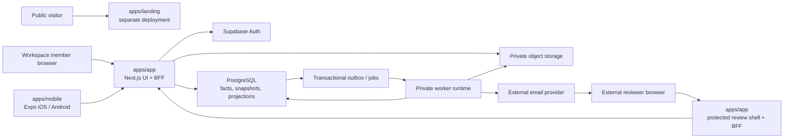

# System overview

**Status:** Approved

**Applies to:** v0.0 and v0.1

**Last reviewed:** 2026-08-03

**Related decisions:** [ADR-001](../decisions/ADR-001-product-boundary.md),
[ADR-003](../decisions/ADR-003-evidence-packages-and-acceptance.md),
[ADR-004](../decisions/ADR-004-roadmap-demo-and-documentation.md)

## Purpose

This document defines the logical runtime boundaries for GoProceed. It separates
the code that happens to exist today from the approved product architecture.
Directory presence, a successful local build, or a prototype screen is not proof
that a production capability is implemented.

It should be read with the [product scope](../product/scope-and-boundaries.md),
[roadmap](../product/roadmap.md), [canonical domain
model](../domain/domain-model.md), and [jobs/events/audit
architecture](jobs-events-and-audit.md).

The v0.1 runtime supports the online path from contract baseline through
evidence, immutable packages, protected external decisions, and derived
acceptance value at risk. Accounting, qualified signatures, full offline
operation, and a general integration platform are outside this boundary.

## Implemented baseline versus approved target

### Current repository baseline

- `apps/landing` and `apps/app` physically exist as Next.js workspaces.
- `apps/demo` and `prototype/` physically exist as legacy/reference design
  material. They are not canonical v0.1 runtime surfaces and must not be treated
  as deployable product closure.
- `apps/mobile` exists as a committed pnpm workspace (22 tracked files, Expo
  SDK 57.0.9, expo-router). The v0.1 mobile milestone remains open on
  functionality, not on existence.
- Supabase foundation assets and database packages exist, but their presence
  does not prove that the canonical domain, security, worker, storage, or
  recovery behavior is complete.

### Approved product surfaces

| Surface | Runtime responsibility | Deployment and version boundary |
|---|---|---|
| `apps/landing` | Public marketing, positioning, and acquisition surface | Permanent separate product and deployment. It is not a tenant application and receives no customer-database service credential. Separate free Vercel domains are acceptable initially. |
| `apps/app` | Next.js authenticated UI and backend-for-frontend (BFF) for members, public protected-link shell, command/query API, and server-rendered product views | Canonical web product from v0.0 onward. Browser and native clients use this BFF for domain access. |
| `apps/app` `/demo` | Durable interactive product demo backed only by isolated synthetic data | v0.2, not v0.1. Demo mode is selected by the server-side route/deployment boundary, never by `?demo=true` or another query switch on a customer session. |
| `apps/mobile` | Expo/React Native field client for iOS and Android | Approved v0.1 target. Online capture and interrupted-upload recovery ship in v0.1; full offline authorization, task access, sync, conflicts, and resumable chunks arrive in v0.3. |
| Worker runtime | Claims outbox/jobs, scans and finalizes evidence, generates artifacts, refreshes projections, and delivers notifications | Private service identity with no public user interface. It may be deployed as one process initially and split only when operational evidence requires it. |
| Email delivery adapter | Sends transactional product mail through an external provider and records delivery evidence | Outbound-only provider boundary. It receives the minimum template and recipient data needed for one delivery. |

The landing and product applications may share versioned UI packages at build
time. They do not thereby share runtime trust, cookies, secrets, or tenant
authority.

## Platform components

### Next.js BFF and UI

`apps/app` owns the server boundary presented to both web and mobile clients.
Route handlers and other server-side commands:

1. authenticate the member or external session;
2. resolve and validate workspace/project/package scope;
3. authorize the exact command;
4. validate request and optimistic/idempotency versions;
5. execute one bounded database transaction;
6. return a typed result or stable error.

Customer-domain reads and writes do not rely on a browser-supplied
`workspace_id`, role, or object identifier. The BFF derives or verifies the full
identity chain. Browser code never receives a database service key and does not
perform privileged direct table mutation.

The BFF is not an independent source of business truth. PostgreSQL relational
facts and immutable snapshots remain authoritative; current readiness,
acceptance, and value at risk are projections.

### One backend for web and mobile

`apps/mobile` calls the same versioned BFF contracts as the web product. There is
no separate mobile backend, mobile-only database, or mobile-specific acceptance
authority.

The native client may use platform libraries for authentication, camera/photo
selection, encrypted local pending data, and direct upload to a server-issued
short-lived storage destination. It must return to the BFF to create/finalize
domain facts and receive the authoritative receipt.

The online v0.1 client requires current server authorization when capture begins.
It preserves the pending original across an ordinary restart and connection
failure. v0.3 extends the same client with time-bounded offline authorization and
sync; it is not a replacement backend or second native rewrite.

### Supabase Auth

Supabase Auth supplies member identity and session primitives. Authentication
does not itself grant workspace or project authority. The BFF combines the
authenticated subject with:

- active workspace membership and governance role;
- explicit project access;
- the required responsibility/permission;
- current resource version and tenant-safe identity chain.

External reviewers are not workspace members and do not become Supabase Auth
users merely by opening a review link. They use the separate grant/session
protocol defined in
[Packages and acceptance](../domain/packages-and-acceptance.md#protected-access).

### PostgreSQL

PostgreSQL is the canonical relational system of record. It stores:

- tenant-local identities and access facts;
- published contract and template snapshots;
- append-only progress, exception, evidence, review, and decision facts;
- immutable package versions and artifact identities;
- idempotency, audit, outbox, job, attempt, delivery, and notification records;
- rebuildable readiness, acceptance, value-at-risk, and operational projections.

Every tenant relation carries or derives one workspace. Cross-boundary
references use workspace-leading composite constraints rather than trusting
application checks alone. ROW LEVEL SECURITY protects every tenant table
reachable through an exposed role; server and worker roles remain narrowly
scoped and future grants are deny-by-default.

### Private object storage

Supabase private object storage is the initial target for evidence originals,
derivatives, package artifacts, and import source files. Objects live under
immutable, non-overwriting private keys. Database rows retain content hash, size,
media/type validation, storage provenance, and the exact owning identity.

Clients receive only short-lived, purpose-scoped upload/download authorization.
A successful byte upload is not an evidence fact. The server must verify size
and hash, recheck authorization, complete the required inspection boundary, and
commit the evidence identity and available receipt before the original is
server-confirmed.

### Workers and external providers

Workers consume committed work through the transactional outbox and job
protocol. A worker service identity can perform only its allowlisted operation
and records both its own actor and the originating command/event. Worker or email
success never substitutes for the domain fact that authorized the work.

External email and malware/inspection providers are outside the trusted
application boundary. Requests contain the minimum data required for one
operation. Provider responses are untrusted input that must be normalized before
they affect an availability or delivery record.

## Trust boundaries



The diagram shows logical trust, not a requirement for a particular number of
processes. The important boundaries are:

1. **Public client boundary.** Browser/mobile input, identifiers, filenames,
   metadata, and provider responses are untrusted.
2. **BFF authorization boundary.** The server authenticates and authorizes every
   domain command and validates the complete tenant/resource chain.
3. **Database boundary.** Relational constraints and RLS protect invariants even
   when application code is wrong.
4. **Storage boundary.** Possessing a storage key or uploaded bytes does not
   create evidence or package authority.
5. **Worker boundary.** Service principals have task-specific permissions, not a
   generic user-equivalent session.
6. **External-review boundary.** A bearer email link proves possession, not
   verified identity or a regulated signature.
7. **Provider boundary.** Email, inspection, Vercel, Expo, Apple, and Google are
   external processors/distribution systems, not domain authorities.

## Canonical data flows

### Member query or command

```text
web/mobile session
→ apps/app BFF
→ authenticate subject
→ resolve membership + project access + permission
→ tenant-safe transaction
→ domain facts/snapshot + audit + outbox
→ typed receipt
```

No asynchronous side effect is started before the authorizing transaction
commits. Later worker execution is causally linked to that transaction.

### Online mobile evidence

```text
mobile with current authorization
→ BFF creates bounded upload intent
→ short-lived upload to private staging key
→ finalization command verifies bytes, hash, authorization, and inspection state
→ transaction creates evidence identity + available receipt
→ mobile persists receipt
→ local original becomes cleanup-eligible
```

In v0.1 that step is not a worker. Content inspection runs synchronously inside
the finalization command
(`apps/app/app/v1/upload-intents/[intentId]/finalize/route.ts`), not as a
separate job over intent-bound staged content, and the same transaction that
records the terminal state creates the evidence receipt.

If authorization fails after bytes arrive, they never become evidence: the
intent moves directly from `intent_authorized` to `orphaned_for_purge`. The
object becomes inaccessible orphaned storage for bounded purge while the
client quarantines its local original according to the approved
recovery/deletion policy.

### Frozen package and artifacts

```text
authorized freeze/corrected-successor command
→ immutable package-version snapshot + source manifest + outbox
→ artifact job loads only that snapshot
→ deterministic PDF/XLSX/ZIP/manifest generation
→ private immutable object key + package_artifact fact
```

A renderer/configuration change creates a new artifact identity. No retry
overwrites an earlier immutable key.

### Protected external review

Initial protected-link delivery is deliberately not an ordinary asynchronous
email job. The authorizing BFF command generates the raw token, commits only its
HMAC verifier and grant facts, then—after commit—holds the raw token in memory
only long enough to make one provider send request. The raw token is never
serialized into PostgreSQL, outbox, job, audit, logs, traces, or analytics.

If the process crashes or the provider result is ambiguous, the old raw token
cannot be replayed. An authorized revoke-and-reissue command creates a new grant,
invalidates the old grant/sessions, and attempts a new one-time delivery. A
token-free outbox event may create a `delivery_attention` notification for the
sender/operator.

```text
email fragment link
→ same-origin public shell GET (fragment is not sent)
→ deliberate redacted POST exchange
→ short HttpOnly/Secure/SameSite session
→ BFF renders exact frozen scope
→ immutable decision batch transaction
```

GET prefetch cannot consume the grant. Decision commit rechecks grant,
revocation, expiry, package review epoch, exact target scope, CSRF, and
idempotency.

### Durable demo in v0.2

`/demo` is implemented inside `apps/app`, but it uses an isolated synthetic
dataset and a server-side demo principal that is structurally denied access to
customer workspaces. Demo reset and abuse controls are explicit operations.
Customer sessions cannot be switched into demo mode with a query parameter, and
demo data cannot be promoted into a real workspace by changing an identifier.

`apps/demo` and `prototype/` may continue to help compare interaction ideas
during migration, but they do not become the durable `/demo` implementation.

## Deployment and secret rules

- `apps/landing` and `apps/app` are separate deployments; separate free Vercel
  domains are acceptable initially.
- The protected review shell and token-exchange POST are served from the same
  product origin.
- Development, preview, staging/pilot, and production use separate environment
  configuration and Supabase/storage credentials.
- Public/publishable client configuration is distinct from server-only database,
  storage-signing, email, and worker credentials.
- Service credentials never enter client bundles, mobile builds, URLs, analytics,
  audit payloads, or generic outbox payloads.
- `apps/mobile` preview builds use EAS internal distribution. Pilot delivery may
  use TestFlight and Google Play internal testing when store accounts are ready;
  public store listing is not a v0.1 gate.
- Workers expose no public administrative mutation endpoint. Replay and recovery
  use authorized, audited application/operations commands.

## Implementation references

These official guides inform implementation choices; they are not evidence that
the target is already implemented:

- [Next.js Backend for Frontend guide](https://nextjs.org/docs/app/guides/backend-for-frontend)
- [Expo EAS internal distribution](https://docs.expo.dev/build/internal-distribution/)
- [Expo submission to app stores](https://docs.expo.dev/deploy/submit-to-app-stores/)
