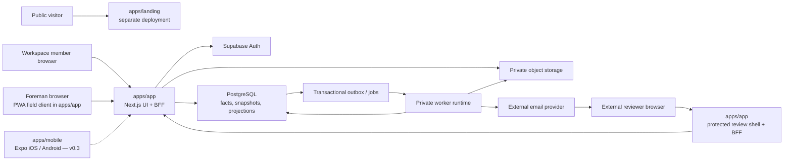

# System overview

**Status:** Approved

**Applies to:** v0.0 and v0.1

**Last reviewed:** 2026-08-06

**Related decisions:** [ADR-001](../decisions/ADR-001-product-boundary.md),
[ADR-003](../decisions/ADR-003-evidence-packages-and-acceptance.md),
[ADR-004](../decisions/ADR-004-roadmap-demo-and-documentation.md),
[ADR-005](../decisions/ADR-005-readiness-gate-and-hidden-works.md),
[ADR-006](../decisions/ADR-006-pilot-shaped-v0.1.md),
[ADR-007](../decisions/ADR-007-pilot-field-client.md)

## Purpose

This document defines the logical runtime boundaries for GoProceed. It separates
the code that happens to exist today from the approved product architecture.
Directory presence, a successful local build, or a prototype screen is not proof
that a production capability is implemented.

It should be read with the [product scope](../product/scope-and-boundaries.md),
[roadmap](../product/roadmap.md), [canonical domain
model](../domain/domain-model.md), and [jobs/events/audit
architecture](jobs-events-and-audit.md).

The v0.1 runtime supports the online path from contract baseline through
assignment and performed quantity, requirements and evidence, stage closure and
the statutory act, to one protected external evidence decision — and it stops
there. Immutable package versions, per-segment partial acceptance, and the
seven-state value-at-risk projection are **v0.2** under
[ADR-006](../decisions/ADR-006-pilot-shaped-v0.1.md); their architecture is
unchanged and is described below against the version it lands in. Accounting,
qualified signatures, full offline operation, and a general integration platform
are outside the product boundary entirely.

Two client decisions govern everything below.
[ADR-006](../decisions/ADR-006-pilot-shaped-v0.1.md) re-cuts v0.1 to six steps
and puts the pilot ahead of the commercial half of the product;
[ADR-007](../decisions/ADR-007-pilot-field-client.md) makes the v0.1 field
client a PWA served from `apps/app` and takes `apps/mobile` off the v0.1 path
without deleting it.

## Implemented baseline versus approved target

### Current repository baseline

- `apps/landing` and `apps/app` physically exist as Next.js workspaces.
- `apps/demo` and `prototype/` physically exist as legacy/reference design
  material. They are not canonical v0.1 runtime surfaces and must not be treated
  as deployable product closure.
- `apps/mobile` exists as a committed pnpm workspace (22 tracked files, Expo
  SDK 57.0.9, expo-router). Under
  [ADR-007](../decisions/ADR-007-pilot-field-client.md) it is **not on the v0.1
  path**; it stays in the tree as the starting point for the v0.3 native
  client. Its whole route table is `apps/mobile/src/app/_layout.tsx` (14 lines)
  and `apps/mobile/src/app/index.tsx` (8 lines), the one screen they render is
  `apps/mobile/src/screens/token-proof.tsx`, and `apps/mobile/package.json`
  declares no camera and no image-picker dependency.
- **The v0.1 field client does not exist either.** `apps/app` carries no web app
  manifest, no service worker, and no `.well-known` directory. No capture screen
  has been written in either client, which is why ADR-007 is a choice of client
  rather than a rewrite: it decides where the capture screen is written, and it
  reports none as written.
- Supabase foundation assets and database packages exist, but their presence
  does not prove that the canonical domain, security, worker, storage, or
  recovery behavior is complete.

### Approved product surfaces

| Surface | Runtime responsibility | Deployment and version boundary |
|---|---|---|
| `apps/landing` | Public marketing, positioning, and acquisition surface | Permanent separate product and deployment. It is not a tenant application and receives no customer-database service credential. Separate free Vercel domains are acceptable initially. |
| `apps/app` | Next.js authenticated UI and backend-for-frontend (BFF) for members, public protected-link shell, command/query API, and server-rendered product views | Canonical web product from v0.0 onward. Browser and native clients use this BFF for domain access. |
| `apps/app` field client (PWA) | Authenticated field surface for the foreman: the requirement that must be photographed before covering, in the standard's own wording with a reference image, and the capture itself | v0.1 per [ADR-007](../decisions/ADR-007-pilot-field-client.md). It is a route set inside `apps/app` — same origin, same session, same BFF — and not a separate deployment. It needs an HTTPS origin, which `apps/app` already requires, and no install step, store account, or distribution track. |
| `apps/app` `/demo` | Durable interactive product demo backed only by isolated synthetic data | v0.2, not v0.1. Demo mode is selected by the server-side route/deployment boundary, never by `?demo=true` or another query switch on a customer session. |
| `apps/mobile` | Expo/React Native client, retained in the tree and off the v0.1 delivery path | **v0.3** per [ADR-007](../decisions/ADR-007-pilot-field-client.md) decision 2. Offline authorization, task access, sync, conflicts, resumable chunks, and a hardware-key-backed durable pending original are the work it is kept for. It is removed from the v0.1 milestone outcome, entry evidence, and closing evidence, and its presence proves no v0.1 capability. |
| Worker runtime | Claims outbox/jobs, scans and finalizes evidence, generates artifacts, refreshes projections, and delivers notifications | Private service identity with no public user interface. It may be deployed as one process initially and split only when operational evidence requires it. |
| Email delivery adapter | Sends transactional product mail through an external provider and records delivery evidence | Outbound-only provider boundary. It receives the minimum template and recipient data needed for one delivery. |

The landing and product applications may share versioned UI packages at build
time. They do not thereby share runtime trust, cookies, secrets, or tenant
authority.

## Platform components

### Next.js BFF and UI

`apps/app` owns the server boundary presented to every client — the web product,
the v0.1 field client, and the v0.3 native client. Route handlers and other
server-side commands:

1. authenticate the member or external session;
2. resolve and validate workspace/project/package scope;
3. authorize the exact command;
4. validate request and optimistic/idempotency versions;
5. execute one bounded database transaction;
6. return a typed result or stable error.

Customer-domain reads and writes do not rely on a browser-supplied
`workspace_id`, role, or object identifier. The BFF derives or verifies the full
identity chain. Browser code never receives a database service key and does not
perform privileged direct table mutation.

The BFF is not an independent source of business truth. PostgreSQL relational
facts and immutable snapshots remain authoritative; current readiness,
acceptance, and value at risk are projections.

### One backend for every client

Every client calls the same versioned BFF contracts. There is no separate field
backend, field-only database, or client-specific acceptance authority, and that
holds for the v0.1 PWA and the v0.3 native client alike.

The client is therefore replaceable, and ADR-007 decision 3 keeps it that way:
the upload protocol, the evidence identity and provenance record, the readiness
predicate, the blocked-reason object, and every ADR-005 refusal sit below the
client boundary, and a client-specific field on an evidence object, an upload
intent, or a requirement occurrence is prohibited without an ADR that says so on
purpose. A capture screen written against these contracts is written once,
whichever client renders it — which is what makes ADR-007 reversible without a
migration.

Any client may use platform facilities for authentication, camera/photo
selection, and direct upload to a server-issued short-lived storage destination.
Every client must return to the BFF to create and finalize domain facts and to
receive the authoritative receipt. The v0.3 native client additionally holds
encrypted local pending data under a hardware-backed key; the v0.1 field client
does not, for the reasons below.

### The v0.1 field client is a browser page

[ADR-007](../decisions/ADR-007-pilot-field-client.md) makes the v0.1 field
client a PWA served from `apps/app`, reversing the one ADR-004 sentence that
required a separate native client rather than a responsive-web substitute. It is
an authenticated member surface behind the BFF boundary above: the server
authenticates the subject, resolves membership, project access and permission,
and executes one bounded transaction. The client trusts nothing it holds.

It carries exactly two of the six steps that are v0.1 under
[ADR-006](../decisions/ADR-006-pilot-shaped-v0.1.md): it shows the foreman what
must be photographed **before covering**, in the standard's own wording, with a
reference image, before work starts — a placeholder appearing after the stage is
covered does not satisfy it — and it takes the photo. That is the whole
interaction. Every regulatory string it renders is governed without exception by
[hidden-works-content-rules.md](../product/hidden-works-content-rules.md), and
nothing in this document adds a normative item, a clause number, or a form
field.

This does not merge the field client with the protected external review shell.
That shell keeps its own discipline — fragment-only delivery, POST exchange,
short session, no account (see [Protected external
review](#protected-external-review)) — and the rule that it is never routed into
a native client is simply not engaged in v0.1, because v0.1 has no native client
on its path.

The field client is **pull-only** and no push ships in v0.1 on either platform.
The earliest push named in the canonical package is the v0.2 statutory-notice
push at notice-window opening, and web push on iOS additionally requires the PWA
to be installed to the Home Screen on iOS 16.4 or later. The version floor costs
nothing, because it matches the support floor already fixed for v0.1; the
**installation** requirement is a real cost, because it reintroduces an install
step for the one capability the no-install argument cannot cover. v0.2 decides
between an installed PWA and the native client. No document may describe v0.1 as
push-capable.

#### What a captured photo may attest, and what it may not

The provenance the product can honestly claim is **weaker in a browser than in a
native camera session**. ADR-007 decision 5 fixes both halves, and the negative
half binds the UI, a generated package, a demo, and a sales sentence equally:

| May be claimed, and this is all | May not be claimed |
|---|---|
| A **client-computed content hash**, verified at finalization against the bytes the server received. It proves the object was not altered between declaration and receipt, and nothing about where the bytes came from | **Camera-only capture** for a blocking requirement |
| A **server receipt time**, generated by the server and never by the client | That a photo is **distinguishable as camera-taken** rather than gallery-supplied |
| A **device-claimed capture time**, stored beside the server time and explicitly labelled untrusted | **Tamper-evident provenance** |
| — | **Verified capture-time GPS** |

This is a property of the platform, not a gap in effort. The `capture` attribute
on a file input is a hint about a preferred source, not a guarantee: the page
receives a file either way, and no reliable signal on it says whether the bytes
came from the sensor a moment ago or from a folder. The server-side fallback —
inferring the source from EXIF presence and integrity plus a camera-session
identity — loses both of its inputs in a browser, because there is no
camera-session identity and the browser may strip or re-encode image metadata
before the page ever sees the bytes.

Two rules follow and bind the implementation:

- **the client uploads the file bytes unmodified** and never draws a photo to a
  canvas before upload. It can promise only that *it* did not transform the
  bytes; it cannot promise the browser did not. The hash therefore binds the
  uploaded artifact and never the sensor output, and no screen, package, or
  document may describe it as binding the sensor output;
- **no object captured through the PWA is recorded with an origin-method value
  that asserts a native camera session.** The evidence record needs an origin
  value meaning *not distinguished*, which belongs to
  [execution-and-evidence.md](../domain/execution-and-evidence.md) and the state
  and entity catalogs, and this document deliberately does not invent it.
  **That value now exists in the target DDL
  (`technical/database/schema-v0.1.sql:97`), in the state catalog and in
  INV-086; it does not exist in the runtime.** The deployed CHECK
  (`supabase/migrations/0015_execution_evidence_module.sql:254-255`) enumerates
  six values — native camera, photo picker, file picker, form, import and
  generated derivative — and the request contract
  (`packages/contracts/src/uploads.ts:9`) enumerates the four of them a client
  may submit. Every one of them asserts a distinguished origin. **Until it lands
  in both, no PWA capture may be recorded at all**, and it may not be recorded as
  `photo_picker` or
  `file_picker` in the meantime — those name a distinguished origin the browser
  cannot supply. Adding the value is a domain and catalog change, not a decision
  this document may take.

Which engines and versions strip EXIF, which transcode, and how each honours a
capture hint is **measured on the physical pilot-device inventory, never
asserted from memory in any customer-facing artifact**. ADR-007 removes the
distribution chain — store accounts, D-U-N-S enrolment, UDID registration,
internal-distribution tracks — and removes nothing about testing: one supported
iPhone and one lower-resource Android device are still required, and matter
more, because browser behaviour varies by engine and version in ways a native
camera API does not.

#### A pending original is not durable, and the client says so

v0.1 capture is online-only — no new capture begins when current authorization
cannot be checked — and in a browser the pending original additionally has no
durable home. Safari evicts script-writable site storage after roughly seven days
of non-use. A non-extractable Web Crypto key in IndexedDB is bound to the
**origin**, not to a secure element, so it is evicted together with the
ciphertext it was protecting rather than outliving it, and a discarded tab takes
an in-memory original with it. The eviction window is the same order of
magnitude as the native seven-day warned quarantine, so a quarantined original
could disappear before the warning it was promised.

Three invariants therefore **do not hold on the PWA path and are not claimed for
it**: INV-013 (upload failure does not delete the original; local cleanup
requires a persisted `available` receipt with a matching hash), INV-014 (an
ordinary restart does not lose a pending capture), and INV-053 (pending
originals are envelope-encrypted and inaccessible to another identity; logout or
revocation quarantines rather than deletes). They remain the native client's
invariants and become v0.3 obligations, and they may not be re-scoped back onto
the browser path by a catalog edit. `quarantined` and `expired_purged` are
native-client states for the same reason; the PWA discards the in-memory
original on logout, revocation, or account switch, and says so.

What v0.1 claims in their place is weaker and testable:

- **no success before the receipt.** `upload_received` is not
  `evidence_available`, and no screen shows a photo as recorded until the
  `available` receipt is persisted;
- **upload immediately**, with no durable local queue and no queue affordance
  the client cannot honour;
- **warn rather than silently lose bytes.** If an upload cannot complete, or the
  page is about to be left with an in-flight or unsent original, the user is told
  plainly that GoProceed has not saved the photo and that it must be retaken or
  kept by them. A silent loss is the one outcome this client must not produce;
- **the six live client states survive** — not sent, sending, awaiting receipt,
  server-confirmed, failed, and discarded — because a user still needs to tell
  them apart.

The exact eviction rule, and whether an installed home-screen PWA is exempt from
it, are measured on the same two devices. Until measured, the client behaves as
though eviction can happen at any time.

**This is a real reduction in what the product guarantees a foreman.** It is
accepted for the pilot because the alternative is a client nobody can install,
not because the guarantee did not matter, and no positioning sentence may round
it off.

### Field-client links

The field client is reachable by link, and a link is how a notification, an
email, or a colleague hands a foreman one exact object. This contract was
recovered on 2026-08-06 from the archived
[screen specification](../legacy/04-screen-specification.md) §S29, its only
previous home, is rewritten here under the GoProceed name, and is restated for a
browser client after [ADR-007](../decisions/ADR-007-pilot-field-client.md).

**In v0.1 a URL is the deep link.** The field client is a page on the product
origin, so opening one exact object needs an HTTPS path and nothing else: no app
association, no `apple-app-site-association`, no `assetlinks.json`, and no
custom scheme. ADR-007 turns an app-association problem into a plain URL
problem. It does not turn it into no problem — a GoProceed domain still has to be
chosen, and every rule below binds a URL exactly as it bound a scheme.

**What exists.** `apps/mobile` registers the custom scheme `goproceed`
(`apps/mobile/app.json`) and enables Expo Router typed routes, so the native
deep-linking *mechanism* is real and is kept for v0.3. Its entire route table is
`apps/mobile/src/app/_layout.tsx` and `apps/mobile/src/app/index.tsx`. **None of
the routes below exist in either client**, neither well-known file below is in
the repository, and `apps/app` carries no web app manifest or service worker.

**Approved target.**

| Element | Version | Contract |
|---|---|---|
| HTTPS path on the product origin | v0.1 | The v0.1 field-client link, and in v0.1 the only entry mechanism. Same origin as `apps/app`, same member session, same BFF |
| Host | v0.1 | **Undecided.** The archived screen specification named a host built on the former product name. Choosing and registering the GoProceed host is part of the outstanding rename slice, not of this document — see [`TODOS.md`](../../TODOS.md) P1, split item 2. A browser client does not remove this item; it is now the whole of it |
| Custom scheme `goproceed://` | v0.3 | Registered today in `apps/mobile`; the fallback entry point for contexts that will not honour an HTTPS association, once a native client exists to receive it |
| Universal Links (iOS) | v0.3 | An HTTPS host serving `/.well-known/apple-app-site-association`. The file does not exist and is not a v0.1 requirement |
| App Links (Android) | v0.3 | The same host serving `/.well-known/assetlinks.json`. The file does not exist and is not a v0.1 requirement |
| `assignment/{id}` | v0.1 | One work assignment |
| `occurrence/{id}` | v0.1 | One requirement occurrence — the object [ADR-005](../decisions/ADR-005-readiness-gate-and-hidden-works.md) defines and the runtime has no table for |
| `capture/{assignmentId}` | v0.1 | Evidence capture opened against one assignment |
| `invite#<token>` | v0.1 | Membership invitation redemption. The token rides in the **fragment**, which no browser sends; the page exchanges it by POST to `/v1/invitations/accept`, and a GET consumes nothing. Built to the contract in «The invitation link» below. Corrected 2026-09-19 by [DEV-024](../tasks/DEV-024-invite-token-in-fragment.md) (BL-109) from `invite/{token}`, which put a bearer token in the path |

Rules that bind whenever those routes are built, in either client:

- **A link this app mints for its own origin never carries a bearer secret in a
  path segment or a query string** (INV-104, DEV-024). The invitation token and
  the external review token ride in the URL fragment and are exchanged by POST;
  a path or query token reaches this origin's access logs, `Referer` headers,
  analytics and caches. `apps/app/src/lib/url-secrets.test.ts` holds every
  dynamic segment to an id-shaped name and every query-string read to a short
  allowlist. **Links in another party's format are outside this rule**, each for
  its reason: the Telegram deep link (`t.me/<bot>?start=` / `?startgroup=` — the
  vendor's protocol, a one-use token that expires in minutes), Supabase Storage
  signed URLs (`?token=`, another origin, short-lived) and the Supabase Auth
  confirmation URL in the sign-in email (the vendor's). How a custom-scheme form
  of any link carries a secret is a v0.3 question for `gp-mobile`: another app
  can register the same scheme.
- **A link is a destination, never an authorization.** Route resolution happens
  after the BFF has re-derived the identity chain for the target object. The
  client never trusts an identifier because it arrived in a link.
- **Out of scope resolves to an explicit refusal, never an empty object.** A
  link to an object outside the opener's workspace or project scope lands on a
  "no access" screen. Rendering an empty shell leaks the existence of the object
  and teaches users that the app is broken.
- **Filter context travels inside the link**, so a link to a filtered list
  reopens that list and not the default one.
- **One route set, several entry mechanisms.** In v0.1 the HTTPS path is the
  only one. When the v0.3 native client exists, Universal/App Links become its
  primary path and the custom scheme remains its fallback for contexts that will
  not honour an HTTPS association. All three must resolve to the same route set,
  with the same checks; a route that behaves differently by entry mechanism is a
  security defect, not a platform difference.
- **The protected external review link is not one of these.** It is an HTTPS
  fragment link into the web shell (see [Protected external
  review](#protected-external-review)). It must never be routed into the v0.3
  native client — the fragment would leave the browser's custody — and it must
  not be folded into the field client's authenticated route set merely because
  both are now pages on the same origin: the review shell has no account, its
  own short session, and its own POST exchange.
- **Notification taps depend on this route set.** The v0.1 field client is
  pull-only; the earliest push named in the canonical package is the v0.2
  statutory-notice push at notice-window opening
  ([scope and boundaries](../product/scope-and-boundaries.md)), and web push on
  iOS additionally requires an installed home-screen PWA. Whenever push ships,
  the standing contract is that its payload carries only `type`, object id and
  tenant with no content, and that the tap opens the matching route **after**
  the access check — so a push surface cannot ship before these routes do.

### Supabase Auth

Supabase Auth supplies member identity and session primitives. Authentication
does not itself grant workspace or project authority. The BFF combines the
authenticated subject with:

- active workspace membership and governance role;
- explicit project access;
- the required responsibility/permission;
- current resource version and tenant-safe identity chain.

External reviewers are not workspace members and do not become Supabase Auth
users merely by opening a review link. They use the separate grant/session
protocol defined in
[Packages and acceptance](../domain/packages-and-acceptance.md#protected-access).

### PostgreSQL

PostgreSQL is the canonical relational system of record. It stores:

- tenant-local identities and access facts;
- published contract and template snapshots;
- append-only progress, exception, evidence, review, and decision facts;
- immutable package versions and artifact identities;
- idempotency, audit, outbox, job, attempt, delivery, and notification records;
- rebuildable readiness, acceptance, value-at-risk, and operational projections.

Every tenant relation carries or derives one workspace. Cross-boundary
references use workspace-leading composite constraints rather than trusting
application checks alone. ROW LEVEL SECURITY protects every tenant table
reachable through an exposed role; server and worker roles remain narrowly
scoped and future grants are deny-by-default.

### Private object storage

Supabase private object storage is the initial target for evidence originals,
derivatives, package artifacts, and import source files. Objects live under
immutable, non-overwriting private keys. Database rows retain content hash, size,
media/type validation, storage provenance, and the exact owning identity.

Clients receive only short-lived, purpose-scoped upload/download authorization.
A successful byte upload is not an evidence fact. The server must verify size
and hash, recheck authorization, complete the required inspection boundary, and
commit the evidence identity and available receipt before the original is
server-confirmed.

### The invitation link

The v0.1 contract for `invite#<token>` (DEV-024, BL-109). The page is not built
yet; whoever builds it builds it to this. It follows the external review shell
(`apps/app/app/external/review/route.ts`, [Protected external
review](#protected-external-review)) wherever the two agree.

- **The fragment is stripped first.** The page reads `location.hash` and calls
  `history.replaceState` to remove it before any network request, as the review
  shell's step 1 does, so the address bar and session history stop holding it.
- **The token never enters a URL, a cookie or durable storage.** Not `next`, not
  any other query parameter or path, not a cookie, not `localStorage` or
  IndexedDB. The proxy's sign-in redirect builds `next` from the path and query
  (`apps/app/proxy.ts`), and `safeNext` would carry a fragment placed inside it
  (`apps/app/src/lib/safe-next.ts`), so «put `#token` into `next`» would work and
  would put the token in the `/login` request line: it is forbidden.
- **It survives sign-in without leaving the page.** `invite` is excluded from
  the proxy's sign-in redirect, as `/external` is, and signs the member in on
  the page itself, holding the token in memory. If a navigation to `/login`
  cannot be avoided, the token waits in `sessionStorage`, written after the strip
  and removed as soon as the accept POST answers.
- **No third-party script and no referrer.** The page loads no analytics or
  other third-party script, and sends `Referrer-Policy: no-referrer` and
  `Cache-Control: no-store`, as `externalSecurityHeaders`
  (`apps/app/src/lib/external-link.ts`) does for the review shell: the token is
  not bound to the invited email (BL-013), so any script that reads it can accept
  the invitation into its own account.
- **The invitee must already have an account.** Sign-in is OTP with
  `shouldCreateUser: false`, and nothing provisions an Auth user for an invitee.
  Letting the invite page create one is an auth change for `gp-architect` and
  `gp-security`, not part of building the page.
- **Its evidence, when built:** a browser audit that opens `/invite#<token>`
  signed out and asserts that no request URL and no `Referer` through sign-in and
  accept contains the token; a unit test that the minted link has an empty query
  and the token only in its fragment; header assertions as in
  `apps/app/tests/external-shell.test.ts`.

### Workers and external providers

Workers consume committed work through the transactional outbox and job
protocol. A worker service identity can perform only its allowlisted operation
and records both its own actor and the originating command/event. Worker or email
success never substitutes for the domain fact that authorized the work.

External email and malware/inspection providers are outside the trusted
application boundary. Requests contain the minimum data required for one
operation. Provider responses are untrusted input that must be normalized before
they affect an availability or delivery record.

## Trust boundaries



The dotted edge is the v0.3 native client: it uses the same BFF and the same
boundaries, and it is on no v0.1 path.

The diagram shows logical trust, not a requirement for a particular number of
processes. The important boundaries are:

1. **Public client boundary.** Client input, identifiers, filenames, metadata,
   and provider responses are untrusted. After ADR-007 the field client is a
   browser page, so nothing in the capture path may be trusted because it claims
   a camera: an origin label, a device time, or an EXIF block is client-supplied
   metadata and is stored as such.
2. **BFF authorization boundary.** The server authenticates and authorizes every
   domain command and validates the complete tenant/resource chain.
3. **Database boundary.** Relational constraints and RLS protect invariants even
   when application code is wrong.
4. **Storage boundary.** Possessing a storage key or uploaded bytes does not
   create evidence or package authority.
5. **Worker boundary.** Service principals have task-specific permissions, not a
   generic user-equivalent session.
6. **External-review boundary.** A bearer email link proves possession, not
   verified identity or a regulated signature.
7. **Provider boundary.** Email, inspection, and Vercel are external processors.
   Expo, Apple, and Google are distribution systems for the v0.3 native client
   and sit on no v0.1 path after ADR-007. None of them is a domain authority.

## Canonical data flows

### Member query or command

```text
member session — web, field client, or v0.3 native
→ apps/app BFF
→ authenticate subject
→ resolve membership + project access + permission
→ tenant-safe transaction
→ domain facts/snapshot + audit + outbox
→ typed receipt
```

No asynchronous side effect is started before the authorizing transaction
commits. Later worker execution is causally linked to that transaction.

### Online field evidence

```text
field client with current authorization
→ BFF creates bounded upload intent
→ short-lived upload to private staging key
→ finalization command verifies bytes, hash, authorization, and inspection state
→ transaction creates evidence identity + available receipt
→ client persists the receipt
→ only now is the photo shown as recorded
```

In v0.1 that step is not a worker. Content inspection runs synchronously inside
the finalization command
(`apps/app/app/v1/upload-intents/[intentId]/finalize/route.ts`), not as a
separate job over intent-bound staged content, and the same transaction that
records the terminal state creates the evidence receipt.

If authorization fails after bytes arrive, they never become evidence: the
intent moves directly from `intent_authorized` to `orphaned_for_purge`. The
object becomes inaccessible orphaned storage for bounded purge. What the client
then does with its own copy differs by client, and the difference is not
cosmetic: the v0.3 native client quarantines its local original under the
approved recovery/deletion policy, while the v0.1 field client has no quarantine
to offer and instead tells the user plainly that GoProceed did not save the
photo.

### Frozen package and artifacts — v0.2

Immutable package versions move to v0.2 under
[ADR-006](../decisions/ADR-006-pilot-shaped-v0.1.md) decision 5. The flow below
is unchanged and is stated against the version it lands in. What v0.1 freezes
instead is a statutory act version, pinned by the stage closure rather than by a
package version (ADR-006 decision 4.5), under the same discipline: assembled only
from already-recorded facts, immutable once written, and never overwritten by a
retry.

```text
authorized freeze/corrected-successor command
→ immutable package-version snapshot + source manifest + outbox
→ artifact job loads only that snapshot
→ deterministic PDF/XLSX/ZIP/manifest generation
→ private immutable object key + package_artifact fact
```

A renderer/configuration change creates a new artifact identity. No retry
overwrites an earlier immutable key.

### Protected external review

Initial protected-link delivery is deliberately not an ordinary asynchronous
email job. The authorizing BFF command generates the raw token, commits only its
HMAC verifier and grant facts, then—after commit—holds the raw token in memory
only long enough to make one provider send request. The raw token is never
serialized into PostgreSQL, outbox, job, audit, logs, traces, or analytics.

If the process crashes or the provider result is ambiguous, the old raw token
cannot be replayed. An authorized revoke-and-reissue command creates a new grant,
invalidates the old grant/sessions, and attempts a new one-time delivery. A
token-free outbox event may create a `delivery_attention` notification for the
sender/operator.

```text
email fragment link
→ same-origin public shell GET (fragment is not sent)
→ deliberate redacted POST exchange
→ short HttpOnly/Secure/SameSite session
→ BFF renders exact frozen scope
→ immutable decision transaction
```

GET prefetch cannot consume the grant. Decision commit rechecks grant,
revocation, expiry, the review epoch of the target scope, exact target scope,
CSRF, and idempotency.

**Scope in v0.1.** Under [ADR-006](../decisions/ADR-006-pilot-shaped-v0.1.md)
the frozen scope a v0.1 grant renders is a requirement occurrence — together
with the act version pinned by its stage closure, where the closure has produced
one — and the reviewer records one `evidence_decision`: accept, or return with a
reason. That submit records an
`external_decision_batches` row — the table entered v0.1-M5 on 2026-08-06 by
owner decision (ADR-006 decision 4, amendment note) and carries the receipt, the
confirmation-text version and the idempotency record for the occurrence-scoped
arc. Package-version scope,
per-segment partial acceptance, the structured issues and the commercial decision
arrive with packages in v0.2. The grant discipline above is unchanged in every
respect by that narrowing; only the kind of scope a grant may target is
narrower. The assurance recorded for a v0.1 external decision is
`LINK_CONFIRMATION`, which every rendered page states plainly is not an
electronic signature —
[hidden-works-content-rules.md](../product/hidden-works-content-rules.md)
governs that wording and the assurance ladder behind it.

### Durable demo in v0.2

`/demo` is implemented inside `apps/app`, but it uses an isolated synthetic
dataset and a server-side demo principal that is structurally denied access to
customer workspaces. Demo reset and abuse controls are explicit operations.
Customer sessions cannot be switched into demo mode with a query parameter, and
demo data cannot be promoted into a real workspace by changing an identifier.

`apps/demo` and `prototype/` may continue to help compare interaction ideas
during migration, but they do not become the durable `/demo` implementation.

## Deployment and secret rules

- `apps/landing` and `apps/app` are separate deployments; separate free Vercel
  domains are acceptable initially.
- The protected review shell and token-exchange POST are served from the same
  product origin.
- The field client is not a separate deployment. It is a route set inside
  `apps/app`, on the same origin, under the same environment configuration and
  the same member session. The one thing it requires that a native client does
  not is an HTTPS origin, which `apps/app` already requires.
- Any service worker or cached asset the field client ships is client code on the
  product origin: it receives no service credential and must not cache evidence
  originals or authenticated domain responses. `apps/app` ships no service worker
  today.
- Development, preview, staging/pilot, and production use separate environment
  configuration and Supabase/storage credentials.
- Public/publishable client configuration is distinct from server-only database,
  storage-signing, email, and worker credentials.
- Service credentials never enter client bundles — web, field client, or mobile
  build — nor URLs, analytics, audit payloads, or generic outbox payloads.
- `apps/mobile` preview builds use EAS internal distribution, and pilot delivery
  through TestFlight or Google Play internal testing belongs to the v0.3 native
  client. After [ADR-007](../decisions/ADR-007-pilot-field-client.md) **no store
  account, D-U-N-S enrolment, UDID registration, funded Expo plan, or
  internal-testing track is a v0.1 gate**, and public store listing is a gate for
  no version named in this document.
- Workers expose no public administrative mutation endpoint. Replay and recovery
  use authorized, audited application/operations commands.

## Implementation references

These official guides inform implementation choices; they are not evidence that
the target is already implemented:

- [Next.js Backend for Frontend guide](https://nextjs.org/docs/app/guides/backend-for-frontend)
- [Expo EAS internal distribution](https://docs.expo.dev/build/internal-distribution/) —
  v0.3 native client only
- [Expo submission to app stores](https://docs.expo.dev/deploy/submit-to-app-stores/) —
  v0.3 native client only

Browser behaviour is deliberately absent from this list. How a given engine and
version honours a capture hint, whether it strips or re-encodes image metadata,
and when it evicts site storage are measured on the pilot-device inventory and
recorded there. A documentation page is not evidence of what the two devices in
the pilot's hands actually do.
