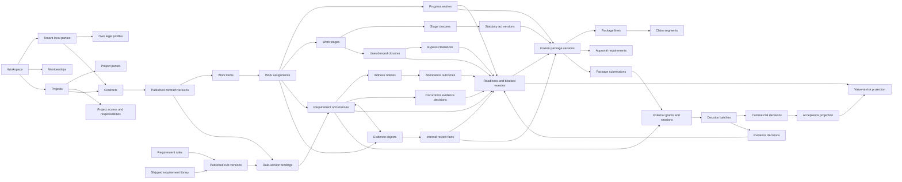

# Canonical domain model

**Status:** Approved

**Applies to:** v0.1, v0.2 and v0.3

**Last reviewed:** 2026-08-08

**Related decisions:** [ADR-001](../decisions/ADR-001-product-boundary.md),
[ADR-002](../decisions/ADR-002-tenancy-parties-and-contracts.md),
[ADR-003](../decisions/ADR-003-evidence-packages-and-acceptance.md),
[ADR-005](../decisions/ADR-005-readiness-gate-and-hidden-works.md),
[ADR-006](../decisions/ADR-006-pilot-shaped-v0.1.md),
[ADR-007](../decisions/ADR-007-pilot-field-client.md),
[ADR-008](../decisions/ADR-008-valuation-carves-at-admission.md)

> **Version note (2026-08-08) — two decisions taken after this document was
> last reviewed. Both change what v0.1 means, and both are recorded in every
> document that states v0.1 scope.**
>
> 1. **The valuation carve happens at admission, not at recording.**
>    [ADR-008](../decisions/ADR-008-valuation-carves-at-admission.md) (Approved,
>    2026-08-07) moves it out of `progress.record` and into the **stage closure**,
>    which is v0.1's admission event. Performed quantity is recorded **unvalued**;
>    only admitted quantity competes for the work item's pool; admission is a
>    deliberate authorised act and not a side effect of measurement (INV-089, P0).
>    Until 2026-08-08 this ADR was named in no document but the glossary.
>    **What is built is not yet what it decided:** `progress.adjust` still carves
>    at measurement time whenever the root already holds an allocation — no
>    closure, `admitted_by_closure_id` NULL — and that is an open P0, not a
>    nuance.
> 2. **The work type's carrier is a column on the work line, and it needed no
>    ADR.** Settled by the owner on 2026-08-08. Migration `0050` adds
>    `public.work_items.work_type_key`, so the requirement-rule predicate's first
>    argument has a left-hand side at last and a **hand-typed** baseline
>    materialises obligations. Two things it did not settle: the **owning
>    entity** — a table that defines the set of work types — still needs an ADR
>    ([glossary.md](glossary.md) «Work type»), so a work type is validated as *a real one* and not as *the
>    right one*; and an **imported** baseline carries no work type at all, which
>    is permanent for the life of that contract version.
>
> **Neither decision is deployed, and neither is anything else.** Migrations
> `0041`–`0050` are ten files written on an uncommitted branch and **none has
> been applied anywhere**. Against applied history (`0001`–`0040`) the runtime is
> **33 tables**, of which **9** are among the 26 that ADR-006 decision 4 builds
> in v0.1. Nothing in this package may be described as green, verified, or
> confirmed working.


## Implementation status

This document is **approved target domain design**. Approved is not deployed, and
the version an object belongs to is now stated wherever it differs from v0.1.

The readiness-gate objects introduced by
[ADR-005](../decisions/ADR-005-readiness-gate-and-hidden-works.md) — requirement
rules and rule versions, occurrences carrying `intervention_type` and
`blocking_scope`, work stages, stage closures, unevidenced closures, blocked
reasons, and statutory acts — have no tables in the applied migrations. What
exists today is a nullable single-template pin on the assignment
(`supabase/migrations/0015_execution_evidence_module.sql:85`), a template whose
`severity` CHECK and `timing jsonb` are read by no application code
(`supabase/migrations/0015_execution_evidence_module.sql:45-46`), and a
placeholder column whose table is explicitly deferred
(`supabase/migrations/0015_execution_evidence_module.sql:251`). ADR-005 retires
the first two and replaces the model behind the third. The runtime is **33
tables** defined by 40 migrations through `0040`, and `0036`–`0040` create no
table.

*(Qualified 2026-08-08 — «deployed» and «written» have come apart, and every sentence above
is about the first. All of it is still exactly true of the **applied** migrations, `0001`–`0040`,
which define 33 tables. Migrations `0041`–`0050` are ten files written on an uncommitted branch and
**applied nowhere**; between them they carry `create table` for **seventeen of the twenty-six** v0.1
tables, plus every CHECK, trigger, policy and grant the readiness gate is made of. Having DDL is not
existing, and none of the ten files has ever been executed.)*

### What ADR-006 and ADR-007 change here

[ADR-006](../decisions/ADR-006-pilot-shaped-v0.1.md) re-cut v0.1 to six steps a
pilot customer can use unaided; [ADR-007](../decisions/ADR-007-pilot-field-client.md)
made the v0.1 field client a PWA. Under [docs/README.md](../README.md) §"Source
of truth" this document is precedence **level 2** and ADRs are **level 5**, so
until this revision its un-recut sentences **outranked** both. Three consequences
run through every aggregate below:

- **v0.1 builds twenty-six tables, nine of which already exist** (ADR-006
  decision 4, as amended 2026-08-06 — it was twenty-three until the owner moved
  `requirement_exception_heads`, `requirement_evidence_decision_heads` and
  `external_decision_batches` into v0.1, so seventeen are new build).
  Aggregates whose objects are not among them are marked **v0.2**:
  package, external review beyond the occurrence-scoped grant, acceptance and
  value at risk, internal review, and the unevidenced-closure half of stage
  closure. Nothing there is cancelled — it keeps its specification, its DDL and
  its catalog rows.
- **v0.1 ships `can_close_stage` and not `is_package_eligible`** (ADR-006
  decision 5). The gate refuses a stage closure in v0.1 and refuses a package
  freeze from v0.2.
- **The v0.1 field client is a PWA and the model does not know it** (ADR-007
  decision 3). No PWA-specific field exists on any domain object; what changes is
  what an evidence record may honestly claim about origin and durability.

The gate also rests on owner judgements recorded in ADR-005 under
"Assumptions the owner may reverse". As of 2026-08-06 there is no customer
validation behind them: the discovery ledger records 21 evidenced sends, zero
replies, zero interviews and **zero customer documents of any kind**
([validated-assumptions.md](../discovery/validated-assumptions.md)). The
authority for the re-cut is the owner's instruction of 2026-08-06, not a market
signal.

## Modeling rules

1. Relational facts are authoritative for business identity and constraints.
2. Published/frozen contents are immutable snapshots.
3. Corrections append and reference; they do not overwrite history.
4. Current queues, statuses, acceptance, and value at risk are projections.
5. Audit records command activity but is not a substitute for domain history.
6. Every domain relation is tenant-safe by construction and test.
7. Table count follows distinct identity, lifecycle, constraints, query, and
   retention needs; it is not a target.
8. A projection may be a **command precondition** without becoming an editable
   status. Readiness gates stage closure and package freeze; it is still derived,
   still recomputed, and still has no writable column
   ([ADR-005](../decisions/ADR-005-readiness-gate-and-hidden-works.md)
   decision 7).

## Relationship overview



Arrows describe ownership or material input, not automatic access. A project
party relation never grants application visibility.

**The diagram is the approved target design across versions.** The v0.1 subgraph
stops at the act and the occurrence-scoped grant: `W → P → PR → C → CV → WI → WA`
with `RB`, `RV`, `LIB`, `RO`, `PE`, `EV`, `ST`, `SC`, `SA`, `OED`, `RDY`, and the
`RO → G → ED` arc. Nine nodes are **v0.2** — `RR` (workspace-authored rules),
`WN` and `NA` (witness notice and attendance), `IR` (internal review), `UC` and
`UCC` (unevidenced closure and clearance), `PV`, `PL`, `CS`, `AR`, `SUB`, `DB`,
`CD`, `AC` and `VR` — together with the `SUB → G` and `SA → PV` arcs and the
location axis on `RO` and `ST`. `RDY → PV` is the v0.2 half of the gate; the
v0.1 half has no arrow of its own because it is a **refusal** — `can_close_stage`
is a precondition the closure command consumes before writing `SC`, and that
refusal is the one a foreman meets.

Three arrows carry an extra obligation:

- `Rule-version bindings → Requirement occurrences`: an occurrence may exist only
  for a rule version that a published contract version bound at baseline
  publication. Occurrences are never invented at the assignment.
- `Requirement occurrences → External grants and sessions`: a grant may be scoped
  to one requirement occurrence instead of one package version, so an external
  `hold` approver can decide before any package version exists. The grant
  discipline is otherwise unchanged.
- `Readiness and blocked reasons → Frozen package versions` (**v0.2**): this is a
  precondition, not a filter. Freeze **refuses** ineligible scope with a
  per-segment reason list; it never assembles a version with a silent hole. In
  v0.1 the corresponding obligation is on the stage-closure command instead, and
  it refuses in exactly the same way.

## Aggregate boundaries

### Workspace and access

**Owns:** workspace settings, memberships, invitations, parties, legal profiles,
contacts, project identities, project access, responsibility assignments.

**Authority:** workspace governance role for workspace/project creation;
explicit project access for project-scoped follow-on commands.

**Invariants:**

- every row carries or derives one workspace identity;
- at least one active owner remains;
- first-owner bootstrap is serialized;
- project creation atomically creates the project and explicit project-admin
  access for its creator, resolving the initial-access bootstrap;
- own legal profiles require stronger permission than ordinary party edits;
- responsibility assignment never grants access by itself;
- project access never implies a construction responsibility.

### Contract baseline

**Owns:** contract identity, versions, party snapshots, commercial terms, work
items, units, locations, import provenance, and the requirement rule-version
bindings pinned at baseline publication.

**Authority:** authorized contract editor within project access.

**Invariants:**

- contract own party is marked as an own legal entity in the same workspace;
- customer party belongs to the same workspace;
- contract belongs to one project, but a project may contain different own
  parties across contracts;
- published versions and work items are immutable;
- reimport creates a new version and explicit lineage;
- contract number uniqueness includes own party and normalized number;
- source amount discrepancies are resolved before publication, never hidden;
- publication pins the exact requirement rule-version set for the contract's
  scope, in the same way it pins party, currency, tax, terms, and
  approval-policy snapshots;
- a rule version published after a contract version never reaches that contract
  version; changing the bound set requires publishing a successor contract
  version;
- a binding references a rule version identity, never a live rule.

### Execution

**Owns:** assignments, append-only root measurements and signed adjustment
entries, plus allocation balance heads.

**Authority:** project access plus applicable responsibility/permission.

**Invariants:**

- assignment references a work item in the same contract/project/workspace;
- performer party and location remain tenant/project safe;
- every adjustment references one non-adjustment root measurement;
- adjustments do not form predecessor chains or mutable current heads;
- a mistaken adjustment is offset by another signed adjustment to the same root;
- effective quantity is root quantity plus all valid adjustments;
- progress cannot be allocated beyond its available quantity (**v0.2** — the
  allocation ledger moves with packages, ADR-006 decision 5; `progress_allocation_heads`
  and `valuation_allocations` stay in the runtime and are not extended in v0.1);
- creating an assignment materialises, in the same transaction, one requirement
  occurrence for every requirement yielded by the bound rule versions for the
  assignment's `(work type, location node, stage)` — **`(work type, stage)` in
  v0.1** (ADR-006 decision 4.2); the occurrences exist before work starts and are
  visible in the field client;
- bulk instantiation across a location subtree is one command whose dry run
  returns the generated names, the per-rule match counts, and the **explicit
  list of uncovered lines**; silent non-coverage is a defect, not a report
  someone may run. **The subtree is v0.2**; the v0.1 form of the command is a dry
  run over a published contract version reporting its uncovered work lines, and
  the uncovered list survives unchanged;
- recording performed quantity is never gated. The gate refuses a conclusion
  (that a stage closed) and a presentation (that scope may be claimed), never
  the recording of what happened. **v0.1 ships the conclusion half only**;
  presentation eligibility arrives with packages in v0.2, and no document,
  screen or demonstration may show a payment-presentation refusal that does not
  exist ([ADR-006](../decisions/ADR-006-pilot-shaped-v0.1.md) Consequences).

### Requirement rules and library

**Owns:** requirement rule identity, immutable published rule versions and the
ordered requirement definitions inside them, and the shipped regulatory library
items those definitions may quote.

**Authority:** requirement owner within project access for publish and retire.
No actor may edit a published rule version. Library content is read-only
reference data; adding or changing an item is a repository change governed by
[hidden-works-content-rules.md](../product/hidden-works-content-rules.md), never
a runtime command.

**Invariants:**

- a rule is a predicate over `(work type, location node, stage)` that yields an
  **ordered set** of requirements; the order is part of the published content.
  **In v0.1 the predicate is `(work type, stage)`** and `stage` is its second
  argument (ADR-006 decision 4.2);
- **`requirement_rules` — workspace-authored rule drafting — is v0.2** (ADR-006
  decision 4.1). The only rule source in v0.1 is the shipped library; rule
  *versions* stay publish/retire-only and an occurrence still stores
  `rule_version_id`;
- each requirement in the set carries `evidence_kind`, `acceptance_criterion`,
  `norm_ref`, `performer_role`, `approver_role`, `intervention_type`, and
  `blocking_scope`;
- published rule versions are immutable allowlisted configurations; they publish
  and retire only and are never updated in place;
- `intervention_type ∈ {hold, witness, review}` and
  `blocking_scope ∈ {none, blocks_stage_closure, blocks_package_inclusion,
  blocks_both}` are stored values, never words interpreted at read time. The
  CHECKs carry every value in every version; what narrows in v0.1 is what may be
  **published**, never what the column may hold;
- **in v0.1 the publication command rejects `witness` and `review`** (ADR-006
  decision 4.3), so `hold` is the only intervention type a v0.1 rule version can
  carry;
- the publication command rejects a `hold` requirement whose `blocking_scope` is
  anything other than `blocks_both` — **in v0.1 it rejects any `hold` that is not
  `blocks_stage_closure`** (ADR-006 decision 4.4), because the other half of
  `both` has nothing to block. **v0.2 owes a migration that widens every v0.1
  `hold` to `blocks_both`**, with a test that fails if one is left behind;
  without it every requirement recorded during the pilot is permanently outside
  the payment-eligibility half of the gate;
- `none` is the successor of the retired `severity = 'advisory'`: an advisory
  requirement is recorded and surfaced and never blocks. **`none` is unreachable
  in v0.1** — every v0.1 requirement is a `hold` that must be
  `blocks_stage_closure` — so an advisory occurrence is a v0.2 object and no v0.1
  gate may demand one as evidence. `severity` as a free axis is retired, together
  with `work_assignments.requirement_template_version_id`;
- a rule version reaches an assignment only through a binding on a published
  contract version;
- every normative string carries its `verification` tag and its source **in the
  data**; a string without both is unrenderable by construction, so a
  contributor cannot add an unsourced line by editing a template;
- the mapping of a library position to the Додаток В or Додаток Г act form is
  the product's recorded assumption, stored and labelled as an assumption, never
  as a norm reference;
- the shipped library is the twelve `VERIFIED_PRIMARY` items of Додаток Н
  positions Н.14 and Н.15
  ([`technical/requirements/dbn-a31-5-2016-dodatok-n.csv`](../../technical/requirements/dbn-a31-5-2016-dodatok-n.csv));
  anything else belongs to a separate non-normative block;
- library items are workspace-independent reference rows. A rule version copies
  the exact quoted text, its verification tag, and its source into its own
  immutable content, so no tenant row depends on a mutable shared row and rule 6
  holds unchanged.

### Requirement occurrences and exceptions

This aggregate is the obligation side of the former single `Requirements`
aggregate; the definition side moved to **Requirement rules and library** above,
because publication authority, lifecycle, and retention differ (modeling rule 7).

**Owns:** occurrences, their exceptions, witness notices, notice attendance
outcomes, and occurrence-level evidence decisions.

**Authority:** occurrences are materialised by the assignment command, never
created ad hoc; authorized actor for exceptions; the `approver_role` named by
the occurrence's rule version for its evidence decision, whether that approver is
an internal member or an external recipient holding an occurrence-scoped grant.

**Invariants:**

- occurrence pins the exact rule version and acceptance scope, and carries
  `intervention_type`, `blocking_scope`, `evidence_kind`,
  `acceptance_criterion`, `norm_ref`, `performer_role`, and `approver_role`
  materialised from that version;
- an occurrence remains the obligation identity as evidence links, decisions,
  notices, and exceptions are appended to it;
- waiver, not-applicable, and accept-risk are explicit append-only facts;
- an exception never mutates the occurrence into a second truth;
- **a `hold` occurrence can never carry a `not_applicable` exception.** The
  exception command rejects it; waiver and accept-risk remain available to an
  authorised actor and remain visible. An exception that hides itself is worse
  than no exception; an exception that asserts the obligation never existed is
  refused outright;
- a `hold` occurrence releases only on an accepting evidence decision by its
  named `approver_role` with no current return. **In v0.1 that release releases
  the stage closure and nothing else**, because there is no package eligibility
  to release;
- a `witness` occurrence releases on a recorded notice whose period has elapsed,
  plus either attendance with an accepting decision or **recorded
  non-attendance** after the period (**v0.2**);
- a `review` occurrence is a document obligation satisfied before work starts;
  it bars presentation and raises a pre-start warning, and never bars the
  recording of performed quantity (**v0.2**, including the pre-start warning: no
  v0.1 rule version may publish a `review` requirement, so no v0.1 screen can
  raise it);
- a notice records recipients, server `sent_at`, the configured
  `required_notice`, and a **server-computed** `earliest_proceed_at`; no client
  supplies that value (**v0.2**);
- **the notice event and its attendance outcome are v0.2 entire** (ADR-006
  decision 5). The earlier reading — that v0.1 ships the notice event and defers
  only the apparatus around it — was ADR-005's split and is withdrawn; nothing in
  v0.1 records a notice and no document may describe a v0.1 notice. Within v0.2
  the configured duration is a workspace setting until the calendar ships, and it
  **must not be labelled as the five-working-day rule** — the Ukrainian
  working-day calendar, delivery proof, and printed notice artifact arrive with
  it, and calendar days and робочі дні produce different dates;
- recorded non-attendance is a positive fact and becomes evidence of process in
  favour of the performer; it is never a silent pass (**v0.2**);
- an occurrence evidence decision references exactly one occurrence and records
  the deciding authority; internal and external decisions are the same fact kind
  with different authority records. **In v0.1 only the external decision exists**
  — internal review is v0.2 — and it is head-shaped per
  `(workspace, requirement_occurrence, approver_role)`.

### Stage closure and bypass

**Owns:** work stages, append-only stage closures, unevidenced closures, and
their internal clearances.

**Authority:** the closing actor with project access and the applicable
responsibility; an internal reviewer for a clearance. No actor edits a closure.

**Version.** Work stages and stage closures are **v0.1-M3**. The unevidenced
closure and its clearance are **v0.2**: ADR-005 decision 5 prices the bypass in
package ineligibility, and in a version with no packages the price is zero, so
shipping it would ship a defeat that costs nothing
([ADR-006](../decisions/ADR-006-pilot-shaped-v0.1.md) decision 4). **There is no
bypass in v0.1.** The v0.1 escape is the ADR-005 exception — `waiver` and
`accept_risk` by an authorised actor, attributed and visible, with
`not_applicable` still rejected on a `hold` by the exception command itself.

**Invariants:**

- a stage is one assignment, one location node, and one stage from the published
  vocabulary, flagged concealed or not — **one assignment and one stage in
  v0.1**, since the location node is v0.2 (ADR-006 decision 4.2);
- closure is a fact, never a status column. It records actor, server time, and
  the closure predicate result evaluated at that instant;
- `can_close_stage(s)` must hold for a satisfied closure: every occurrence
  applicable to the stage with `blocking_scope ∈ {blocks_stage_closure,
  blocks_both}` is satisfied;
- double-covering the same stage is unrepresentable: at most one current closure
  lineage exists per stage, and a correction appends a superseding closure fact
  referencing its predecessor rather than editing or deleting one;
- a closure whose requirements are not satisfied is recordable **only** as an
  unevidenced closure (**v0.2**; in v0.1 such a closure is simply refused, and
  the only way past a `hold` is an attributed exception). The command requires
  the actor, the claimed authority, a mandatory reason code (vocabulary not yet
  enumerated anywhere — never described as closed or structured until it is) plus
  free text, the expected remedy, and the **exact set of unmet occurrence
  identities at that moment**;
- that unmet set is frozen into the fact and never recomputed; later
  satisfaction does not rewrite what was unmet at bypass time;
- an unevidenced closure records reality — the stage is closed — and satisfies
  nothing: its occurrences remain unsatisfied and unclosed;
- every claim segment covering the bypassed scope becomes ineligible for any
  package version with `blocked_reason.code = CLOSED_WITHOUT_ACT`;
- eligibility is restored only by an append-only internal-reviewer clearance
  naming substitute evidence. A clearance never deletes, edits, or hides the
  bypass;
- every unevidenced closure covering a frozen package version's scope appears in
  that version's manifest as a named appendix, with its value by currency;
- no bypass path exists that costs only escalation. The price is that the money
  waits.

### Evidence

**Owns:** capture events, upload intents, evidence content identity, provenance,
derivatives/corrections, and requirement links.

**Authority:** authenticated member with evidence command permission; narrowly
scoped service principals may finalize storage, scan, or derive content.

**Invariants:**

- original bytes, hash, and storage key are immutable;
- claimed capture time and server receipt time are distinct;
- one object may satisfy many occurrences and vice versa (**the many-to-many link
  table is v0.2**; the v0.1 binding is `upload_intents.requirement_occurrence_id`);
- derivative/correction identifies its source;
- **a pending original is durable only on the native client, and that is a v0.3
  obligation.** INV-013, INV-014 and INV-053 are **not claimed for the v0.1 PWA
  path** ([ADR-007](../decisions/ADR-007-pilot-field-client.md) decision 6 and
  Cost 2): a browser has no Keychain/Keystore-bound wrapping key and site storage
  may be evicted. The earlier invariant here — «pending mobile original remains
  until server-confirmed integrity receipt» — is withdrawn for v0.1 rather than
  softened. **What v0.1 claims instead is weaker and testable: no success is
  reported before the `available` receipt, and the loss of a pending original is
  always surfaced to the user and never silent.** Re-scoping INV-013/014/053 back
  onto the PWA path requires an ADR, not a catalog edit;
- **an evidence object captured through the v0.1 PWA records an origin the
  product cannot distinguish.** No PWA capture is recorded as `native_camera`;
  the value that says the origin is not distinguished is named in
  [execution-and-evidence.md](execution-and-evidence.md#evidence-identity-and-provenance)
  and does not yet exist in the DDL, the contract, or the catalogs. Camera-only
  capture for blocking requirements, camera-versus-gallery distinguishability,
  tamper-evident provenance and verified capture-time GPS are **withdrawn from
  v0.1** and re-asserting any of them requires an ADR (ADR-007 replacement rule
  1);
- recorder/source/custodian fields are provenance/accountability, never
  permission grants.

### Internal review — v0.2

**Version.** `review_target_sets`, `review_target_items`,
`internal_review_decisions` and their heads are **v0.2**
([ADR-006](../decisions/ADR-006-pilot-shaped-v0.1.md) decision 5): internal
review is a precondition of package eligibility and of the `review` intervention
type, and both move, so it moves with them. **No v0.1 decision is an internal
review decision.**

**Owns:** immutable normalized review target sets and append-only decisions about
those exact evidence/occurrence facts.

**Authority:** internal verifier with project access and responsibility.

**Invariants:**

- decision references one immutable target set whose normalized items are
  tenant-safe and versioned;
- correction supersedes rather than edits;
- readiness is a projection, not an editable status row;
- internal readiness does not become external acceptance;
- an accepting internal review head is **necessary but not sufficient** for
  package eligibility: the predicate also requires satisfied occurrences, no
  uncleared unevidenced closure, and every pinned evidence object `available`.

### Readiness and blocking

**Owns:** no editable business facts. Readiness, eligibility, and every blocked
reason are reconstructable projections.

**Inputs:** current applicable occurrences and their satisfaction; exception
heads; witness notices and attendance outcomes; occurrence and external evidence
decisions; internal review heads; evidence object availability; unevidenced
closures and their clearances; exact progress quantity/location scope and claim
allocation; and contract valuation policy.

Three predicates are written down and testable
([ADR-005](../decisions/ADR-005-readiness-gate-and-hidden-works.md) decision 7).
**v0.1 ships `can_close_stage` and not `is_package_eligible`**
([ADR-006](../decisions/ADR-006-pilot-shaped-v0.1.md) decision 5), and the v0.1
form of `satisfied(o)` is its first and fourth disjuncts only, because `witness`
and `review` cannot be published and internal review does not exist:

```text
satisfied(o) ⇔                                   -- v0.1
     o.intervention_type = 'hold'
       ∧ ∃ current accepting evidence decision on o by o.approver_role
       ∧ no current return on o
  ∨  ∃ current exception head on o with kind ∈ {waiver, accept_risk}

can_close_stage(s) ⇔                              -- v0.1
     ∀ o applicable to s with blocking_scope ∈ {blocks_stage_closure,
                                                blocks_both} : satisfied(o)
```

The approved target form of all three, unchanged by the re-cut:

```text
satisfied(o) ⇔
     o.intervention_type = 'hold'
       ∧ ∃ current accepting evidence decision on o by o.approver_role
       ∧ no current return on o
  ∨  o.intervention_type = 'witness'
       ∧ ∃ notice event n for o ∧ now ≥ n.earliest_proceed_at
       ∧ (attendance recorded with an accepting decision
          ∨ non-attendance recorded after the period)
  ∨  o.intervention_type = 'review'
       ∧ linked evidence is available and meets multiplicity
       ∧ the current internal review head for its target set accepts
  ∨  ∃ current exception head on o with kind ∈ {waiver, accept_risk}
  ∨  ∃ current exception head on o with kind = not_applicable
       ∧ o.intervention_type ≠ 'hold'

can_close_stage(s) ⇔
     ∀ o applicable to s with blocking_scope ∈ {blocks_stage_closure,
                                                blocks_both} : satisfied(o)

is_package_eligible(segment) ⇔                    -- v0.2
     ∀ o applicable to the segment's scope
       with blocking_scope ∈ {blocks_package_inclusion,
                              blocks_both} : satisfied(o)
  ∧  no uncleared closure-without-evidence fact covers the segment's scope
  ∧  the current internal review head for the applicable target set accepts
  ∧  every pinned evidence object is in state `available`
```

**Invariants:**

- readiness is never an editable status column and never a manual override; a
  displayed state that disagrees with these predicates is a defect, not a
  variant;
- recomputation triggers are a new or corrected quantity entry, a change in an
  occurrence's satisfaction, a new rule-version binding, an exception appended or
  revoked, a package claim or withdrawal (**v0.2**), and an external decision;
- a **blocked reason is a structured object**, not a UI state:

```text
blocked_reason {
  requirement_occurrence_id
  rule_version_id            -- what was agreed, and in which version
  missing_evidence[]         -- by evidence_kind and acceptance_criterion
  awaiting_approver_role     -- who owes the decision
  since                      -- server time the block began
  blocked_value_by_currency  -- net, tax, gross minor units per currency
  code                       -- fixed vocabulary
}
```

- the code vocabulary is closed and versioned. It includes at minimum
  `ACT_NOT_SIGNED`, `TEST_REPORT_MISSING`, `MATERIAL_CERTIFICATE_MISSING`,
  `SUPERVISION_SIGNATURE_MISSING`, `CUSTOMER_MOTIVATED_REFUSAL`,
  `NOTICE_PERIOD_NOT_ELAPSED`, and `CLOSED_WITHOUT_ACT`. An unknown code is a
  projection error, never a free label. **Two have no v0.1 producer** —
  `NOTICE_PERIOD_NOT_ELAPSED` needs the notice and `CLOSED_WITHOUT_ACT` needs the
  bypass — and the vocabulary is not narrowed for v0.1, because a closed
  vocabulary that changes shape between versions is not closed. All seven values are
  enumerated as a `blocked_reason.code` `stored_vocabulary` machine in
  [`state-catalog.csv`](../../technical/states/state-catalog.csv) (rows 112-118,
  transcribed 2026-08-06); the **bypass** reason-code vocabulary is the one
  still unenumerated, carried at `state-catalog.csv:119` as an explicit
  `NOT_ENUMERATED` gap row;
- blocked value follows the currency, tax, precision, and rounding rules of
  [value-at-risk.md](value-at-risk.md); there is no cross-currency total;
- **blocked value is attributed once per assignment.** Several unmet occurrences
  on one work reference the same assignment-scoped value and are deduplicated by
  assignment when summed, so the headline number cannot be inflated by counting
  the same money under three requirements;
- `CLOSED_WITHOUT_ACT` is a `blocked_reason.code` inside `evidence_blocked`; no
  eighth value-at-risk state is added for bypass (**v0.2** — the seven-state
  projection and its corrected precedence move with packages; the correction
  stands and applies the moment packages exist);
- every refusal names the requirement, the missing evidence, the owed role, and
  the money. A refusal that does not is a support cost, not a gate.

### Statutory act

**Owns:** statutory act identity and its immutable act versions, produced as a
by-product of closing a concealed stage.

**Authority:** the closure command produces the draft. No actor may type a
quantity into it.

**Invariants:**

- an act version exists only as a by-product of a stage closure whose applicable
  requirements are satisfied;
- it is assembled **only from already-recorded facts**: progress entries already
  on the line, evidence objects already available, occurrence decisions already
  made, and party and certificate data already on the participant records;
- **there is no free-text quantity field, anywhere, in any render.** The composer
  offers only quantity entries already recorded against the line, with a share
  selector, and it refuses a quantity that is not already a recorded fact;
- act versions are immutable. **In v0.1 the pin is the stage closure, not a
  package version** ([ADR-006](../decisions/ADR-006-pilot-shaped-v0.1.md)
  decision 4.5); from v0.2 the package version pins them additionally, under the
  same freeze discipline as every other artifact. v0.2 owes a migration that pins
  existing v0.1 act versions, with a test that fails if one is left behind;
- the concealed-works form is Додаток В (обов'язковий) of ДБН А.3.1-5:2016,
  titled «АКТ НА ЗАКРИТТЯ ПРИХОВАНИХ РОБІТ»; the act for responsible structures
  uses Додаток Г and is a separate template. **v0.1 renders form В only and
  Додаток Г is v0.2** — ADR-005 assumption **c** limits v0.1 to MEP / electrical
  installation, and prohibition **H** forbids calling electrical installations
  «відповідальні конструкції», so no v0.1 step reaches form Г. Which form applies
  to a library position is the product's assumption and is labelled as such in
  the UI and in the render;
- three typed signatory slots per п. 8.4.3.5 — будівельна організація,
  технічний нагляд замовника, авторський нагляд. The технагляд's
  кваліфікаційний сертифікат (ПКМУ № 903, п. 3) is held on the participant
  record. **Whether Додаток В has a field for its серія and номер is not
  established**, so nothing is printed into the form for it until
  [hidden-works-content-rules.md](../product/hidden-works-content-rules.md)
  allow-lists that field against the В.1/В.2 field list; prohibition E bans the
  adjacent «ким видана»;
- [hidden-works-content-rules.md](../product/hidden-works-content-rules.md)
  governs every regulatory string without exception. No field may be added to
  the form and no item may be added to a Додаток Н position through any route,
  regardless of which document requests it;
- a regulatory string without its `verification` tag and source is unrenderable.

### Package — v0.2

**Version.** Package versions, lines, `package_scope_heads`, artifacts, approval
requirements, claim segments and their lineage heads, the allocation ledger, and
freeze-refuses-ineligible-scope are all **v0.2**
([ADR-006](../decisions/ADR-006-pilot-shaped-v0.1.md) decision 5). Step 5 of v0.1
is one person accepting one act through one link; a frozen multi-line claim
document is the commercial half of the product and no v0.1 step needs it. **No
package-finalisation command exists in any migration.** Everything below is
approved v0.2 target design, unchanged in content by the re-cut.

**Owns:** stable package, versions, lines, claim scope lineages, claim segments,
source allocations, evidence sources, artifacts, approval requirements, and the
excluded-scope and bypass appendices rendered into each frozen manifest.

**Authority:** package compiler/verifier/submitter according to explicit
permissions and pinned policy.

**Invariants:**

- package belongs to one contract;
- frozen package version and generated artifacts are immutable;
- line is acceptance-homogeneous;
- claim segments do not overlap and reconcile through partition;
- immutable allocation ledger plus locked allocation heads prevent source
  progress from being overclaimed across packages and versions;
- every material input and renderer/template version is pinned, including any
  statutory act version the package carries;
- **freeze is preconditioned on eligibility.** The finalisation command refuses
  ineligible scope and returns a per-segment reason list built from
  `blocked_reason` objects, together with the sum included and the sum excluded
  by currency. It never assembles a package with a silent hole, and it never
  filters ineligible scope out quietly;
- an ineligibility refusal is a **distinct named refusal** from a stale-source
  conflict ([packages-and-acceptance.md](packages-and-acceptance.md)) and must
  never be reported as a concurrency error;
- every frozen manifest renders the blocked-reason objects for the scope it
  excluded, as the appendix «виключені позиції та підстави», and names every
  unevidenced closure covering its scope.

### External review

**Version.** **v0.1 ships the occurrence-scoped half only** (v0.1-M5): the
external access grant targeting one requirement occurrence, its short-lived
session, the external `evidence_decision` on that occurrence, and the immutable
`external_decision_batches` receipt that decision is recorded in — the batch
entered **v0.1-M5** on 2026-08-06 by owner decision
([ADR-006](../decisions/ADR-006-pilot-shaped-v0.1.md) decision 4, amendment
note), and the decision CHECK admits an externally submitted decision only with
one. Package
submissions, package-version-scoped grants, structured issues,
decision coverage and `commercial_decision` are **v0.2**
([ADR-006](../decisions/ADR-006-pilot-shaped-v0.1.md) decision 5). The v0.1
decision is **named `evidence_decision` from the first migration**, so adding
`commercial_decision` in v0.2 is additive and no v0.1 record has to be
reinterpreted. The grant discipline — hashed token, fragment-only delivery, POST
exchange for a short-lived session, no account, no code, GET never consumes — is
unchanged in every version.

**Owns:** submissions, access grants, external sessions, decision batches,
commercial (quantity) decisions, evidence decisions, and issues.

**Authority:** exact grant scope and pinned approval requirement.

**Invariants:**

- observer cannot decide;
- a grant/session is bound to exactly one scope kind — one package version or
  one requirement occurrence — and cannot reach any other scope or cross
  workspace, project, or contract boundaries;
- GET cannot receive or consume the bearer token;
- revoked, expired, replaced, or wrong-version access fails closed;
- a submit is idempotent and immutable;
- commercial and evidence decisions remain separate:
  `commercial_decision` (quantity and value, замовник/кошторисник — the quantity
  decision of ADR-003) governs the value-at-risk buckets, and
  `evidence_decision` (quality and compliance, технагляд/ГІП/internal verifier)
  governs package eligibility;
- an `evidence_decision` is a **precondition of admission** and still has no
  automatic monetary effect. "Accepted on quality, disputed on quantity" is
  representable; a single-signature model is not permitted to collapse it.
  **v0.1 cannot represent it either**, having only the evidence half — a version
  with no commercial decision cannot dispute a quantity. That is a stated cost of
  the re-cut, not a defect in the model;
- the assurance recorded for a v0.1 external evidence decision is
  `LINK_CONFIRMATION` — level 3 of the assurance ladder in
  [hidden-works-content-rules.md](../product/hidden-works-content-rules.md) — and
  every rendered decision block prints its level. It is stated plainly, in the UI
  and on every printed page, **not** to be an electronic signature. КЕП is v0.2;
- the occurrence-scoped grant exists so an external `hold` approver can decide
  **before any package version exists**; without it the model is circular.
  Everything else about the grant — hashed token, fragment-only delivery, POST
  exchange for a short-lived session, no account, no code — is unchanged.

### Acceptance and value at risk — v0.2

**Version.** The acceptance projection and the seven-state value-at-risk
projection with its currencies, tax bases and corrected precedence are **v0.2**
([ADR-006](../decisions/ADR-006-pilot-shaped-v0.1.md) decision 5): five of the
seven states name packaging or submission and cannot occur in v0.1. **What v0.1
has instead is a sum** — the amount of the work lines under a blocked stage, at
the price on the published baseline, attributed once per assignment, broken down
by `blocked_reason.code`, summed within one baseline and never across baselines
in different currencies. It is a query over `blocked_reasons` and `work_items`
and adds no table. Missing price, zero price and over-contract performance stay
distinct and are reported beside the sum. Blocked value is exposure, never a
receivable, in either version.

**Owns:** no editable business facts. These are reconstructable projections.

**Inputs:** derived acceptance exposure slices, claim segments, approval
requirements, commercial decisions, valid prior acceptance references,
progress/readiness/package/submission state, blocked reasons, and contract
valuation policy.

**Invariants:**

- every in-scope segment belongs to exactly one current workflow state;
- state precedence is first-match-wins in the order `accepted → returned →
  evidence_blocked → submitted_pending → packaged_not_submitted →
  internal_review → ready_not_packaged`
  ([value-at-risk.md](value-at-risk.md));
- `evidence_blocked` outranks the packaging states. Reporting blocked money as
  merely awaiting a signature is a lie told to the person who has to fix it;
- all required commercial approvals resolve the same active-leaf coverage;
- earlier decisions cover exact partition descendants through immutable
  decision-coverage facts, so reviewer order cannot change the result;
- evidence return has no automatic monetary effect;
- currencies are never silently converted or combined;
- rounded children reconcile to parent/line totals;
- missing, zero-priced, and over-contract scopes remain distinct;
- allocation of money at `progress.record` precedes the existence of evidence.
  That ordering is legal because eligibility gates *freeze*, not *recording* —
  and the projection therefore reports allocated money as blocked until the
  requirements are satisfied. That is intended, not a defect. **In v0.1 there is
  no freeze and no allocation to a claim**, so the v0.1 form of this statement is
  narrower: quantity is recorded, and the money on the lines under a blocked
  stage is reported blocked by the M6 sum rather than by an allocation balance.

### Operational foundation

**Owns:** audit events, idempotency, transaction outbox, jobs, attempts, dead
letters, message deliveries, and notifications.

Operational records support delivery and proof. They do not become authorities
for contract, evidence, package, or acceptance meaning.

## Fact, snapshot, and projection matrix

| Concept | Version | Kind | Mutable? | Correction |
|---|---|---|---:|---|
| Draft contract | v0.1 | Working aggregate | Yes, before publish | Direct edit with optimistic version |
| Draft package | v0.2 | Working aggregate | Yes, before freeze | Direct edit with optimistic version |
| Published contract version | v0.1 | Snapshot | No | Publish successor version |
| Requirement rule version | v0.1 | Snapshot | No | Publish successor rule version; retire the predecessor |
| Contract-version rule binding | v0.1 | Snapshot | No | Publish a successor contract version |
| Requirement library item | v0.1 | Reference content | No at runtime | Repository change under hidden-works-content-rules.md |
| Requirement occurrence | v0.1 | Materialised obligation identity | No | Append exception or decision; never edit |
| Progress entry | v0.1 | Fact | No | Append correcting entry |
| Requirement exception | v0.1 | Fact | No | Append superseding exception |
| Witness notice | **v0.2** | Fact | No | Append a new notice; an issued notice is never retracted |
| Notice attendance outcome | **v0.2** | Fact | No | Append superseding outcome |
| Occurrence evidence decision | v0.1 | Fact | No | Append superseding decision |
| Evidence original | v0.1 | Fact/content identity | No | Successor correction or derivative |
| Internal review decision | **v0.2** | Fact | No | Append superseding decision |
| Stage closure | v0.1 | Fact | No | Append superseding closure fact referencing its predecessor |
| Unevidenced closure | **v0.2** | Fact | No | Append a clearance; the bypass is never removed |
| Unevidenced closure clearance | **v0.2** | Fact | No | Append superseding clearance |
| Statutory act version | v0.1 | Snapshot product | No | New act version from newly recorded facts |
| Frozen package version | **v0.2** | Snapshot | No | Freeze successor version |
| Package artifact | **v0.2** | Snapshot product | No | New artifact under new renderer/version identity |
| External decision batch | **v0.1-M5** (moved in 2026-08-06; ADR-006 decision 4, amendment note) | Fact/receipt | No | New batch where policy permits |
| Prior acceptance reference | **v0.2** | Fact/reference | No | New package version/reference |
| Readiness | v0.1 as a stage-closure precondition; **v0.2** as a freeze precondition | Projection | Recomputed | Correct source facts |
| Blocked reason | v0.1 | Projection | Recomputed | Correct the source occurrence, evidence, closure, or decision facts |
| Acceptance | **v0.2** | Projection | Recomputed | New exact commercial (quantity) decision |
| Value at risk | **v0.2** as the seven-state projection; v0.1 ships the blocked-money sum | Projection | Recomputed | Correct authoritative quantity/valuation facts |

No row in this table has a writable status column. A projection that becomes a
precondition (readiness) does not change kind — it changes what refuses.

## Cross-boundary reference rule

Every cross-aggregate reference is validated at write time using tenant-safe
composite constraints or an equivalent database-enforced invariant. Application
checks and RLS are defense in depth, not substitutes for relational integrity.

### Requirement instantiation chain

```text
workspace
→ project
→ contract
→ published contract version
→ contract-version rule binding
→ requirement rule version
→ work item
→ work assignment
→ requirement occurrence
```

An occurrence that cannot resolve this chain has no agreed basis and must not
exist. In v0.1 the chain is unchanged except that the rule version comes from the
shipped library rather than a workspace-authored `requirement_rules` row, and the
work assignment carries no location node.

**No baseline is published in v0.1 without a rule-version set.** The milestone
that publishes a baseline is the milestone that binds its rules
([ADR-006](../decisions/ADR-006-pilot-shaped-v0.1.md) decision 3), which closes
the long-open contradiction where an M1 baseline could never acquire a binding
from an M2 command. `contract_versions.publish` refuses a version with no bound
rule-version set. **That refusal has no invariant behind it in
[`invariant-catalog.csv`](../../technical/database/invariant-catalog.csv)**, and
neither do the two v0.1 publication rejections above; recorded here, not closed
here.

### Stage closure chain

```text
workspace
→ project
→ contract
→ work assignment
→ work stage
→ stage closure or unevidenced closure
→ the exact requirement occurrences evaluated at that instant
→ statutory act version
```

An unevidenced closure additionally freezes the identity of every unmet
occurrence, and its clearance resolves the same chain to the same closure
(**v0.2** — the v0.1 chain ends at `stage closure → statutory act version`, and
carries no unevidenced-closure branch).

### Package decision chain — v0.2

```text
workspace
→ project
→ contract
→ package
→ package version
→ approval requirement
→ package line
→ claim segment or evidence target
```

### Package eligibility chain — v0.2

Before a claim segment may enter a package version, this chain must also
resolve:

```text
claim segment
→ its covered work assignments
→ the applicable requirement occurrences whose blocking_scope is
  blocks_package_inclusion or blocks_both
→ their satisfaction facts (decision, notice outcome, or exception head)
→ any unevidenced closure covering the scope, and its clearance
→ the current internal review head for the applicable target set
```

Failure at any step yields a `blocked_reason` object and a refusal, not an
omission.

### Occurrence-scoped external grant chain — v0.1

This is the **only** grant chain v0.1 has; the package-version-scoped grant
arrives with packages in v0.2.

```text
workspace
→ project
→ contract
→ work assignment
→ requirement occurrence
→ external access grant
→ external session
→ occurrence evidence decision
```

No client-supplied identifier may skip validation of any of these chains.

## Deferred Project Commercials

Project Commercials may later consume finalized acceptance facts through a
versioned subledger/export boundary. It does not own or mutate contract
versions, evidence, packages, external decisions, or acceptance history.

No receivable, invoice, retention, payment, allocation, reconciliation, journal,
or accounting-period object belongs in v0.1.
