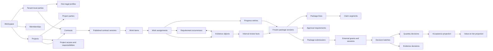

# Canonical domain model

**Status:** Approved

**Applies to:** v0.1

**Last reviewed:** 2026-07-30

**Related decisions:** [ADR-001](../decisions/ADR-001-product-boundary.md),
[ADR-002](../decisions/ADR-002-tenancy-parties-and-contracts.md),
[ADR-003](../decisions/ADR-003-evidence-packages-and-acceptance.md)

## Modeling rules

1. Relational facts are authoritative for business identity and constraints.
2. Published/frozen contents are immutable snapshots.
3. Corrections append and reference; they do not overwrite history.
4. Current queues, statuses, acceptance, and value at risk are projections.
5. Audit records command activity but is not a substitute for domain history.
6. Every domain relation is tenant-safe by construction and test.
7. Table count follows distinct identity, lifecycle, constraints, query, and
   retention needs; it is not a target.

## Relationship overview



Arrows describe ownership or material input, not automatic access. A project
party relation never grants application visibility.

## Aggregate boundaries

### Workspace and access

**Owns:** workspace settings, memberships, invitations, parties, legal profiles,
contacts, project identities, project access, responsibility assignments.

**Authority:** workspace governance role for workspace/project creation;
explicit project access for project-scoped follow-on commands.

**Invariants:**

- every row carries or derives one workspace identity;
- at least one active owner remains;
- first-owner bootstrap is serialized;
- project creation atomically creates the project and explicit project-admin
  access for its creator, resolving the initial-access bootstrap;
- own legal profiles require stronger permission than ordinary party edits;
- responsibility assignment never grants access by itself;
- project access never implies a construction responsibility.

### Contract baseline

**Owns:** contract identity, versions, party snapshots, commercial terms, work
items, units, locations, import provenance.

**Authority:** authorized contract editor within project access.

**Invariants:**

- contract own party is marked as an own legal entity in the same workspace;
- customer party belongs to the same workspace;
- contract belongs to one project, but a project may contain different own
  parties across contracts;
- published versions and work items are immutable;
- reimport creates a new version and explicit lineage;
- contract number uniqueness includes own party and normalized number;
- source amount discrepancies are resolved before publication, never hidden.

### Execution

**Owns:** assignments, append-only root measurements and signed adjustment
entries, plus allocation balance heads.

**Authority:** project access plus applicable responsibility/permission.

**Invariants:**

- assignment references a work item in the same contract/project/workspace;
- performer party and location remain tenant/project safe;
- every adjustment references one non-adjustment root measurement;
- adjustments do not form predecessor chains or mutable current heads;
- a mistaken adjustment is offset by another signed adjustment to the same root;
- effective quantity is root quantity plus all valid adjustments;
- progress cannot be allocated beyond its available quantity.

### Requirements

**Owns:** template versions, occurrences, and exceptions.

**Authority:** requirement owner for publication/assignment; authorized actor for
exceptions.

**Invariants:**

- published templates are immutable allowlisted configurations;
- occurrence pins the exact template version and acceptance scope;
- waiver, not-applicable, and accept-risk are explicit append-only facts;
- an exception never mutates the occurrence into a second truth.

### Evidence

**Owns:** capture events, upload intents, evidence content identity, provenance,
derivatives/corrections, and requirement links.

**Authority:** authenticated member with evidence command permission; narrowly
scoped service principals may finalize storage, scan, or derive content.

**Invariants:**

- original bytes, hash, and storage key are immutable;
- claimed capture time and server receipt time are distinct;
- one object may satisfy many occurrences and vice versa;
- derivative/correction identifies its source;
- pending mobile original remains until server-confirmed integrity receipt;
- recorder/source/custodian fields are provenance/accountability, never
  permission grants.

### Internal review

**Owns:** immutable normalized review target sets and append-only decisions about
those exact evidence/occurrence facts.

**Authority:** internal verifier with project access and responsibility.

**Invariants:**

- decision references one immutable target set whose normalized items are
  tenant-safe and versioned;
- correction supersedes rather than edits;
- readiness is a projection, not an editable status row;
- internal readiness does not become external acceptance.

### Package

**Owns:** stable package, versions, lines, claim scope lineages, claim segments,
source allocations, evidence sources, artifacts, and approval requirements.

**Authority:** package compiler/verifier/submitter according to explicit
permissions and pinned policy.

**Invariants:**

- package belongs to one contract;
- frozen package version and generated artifacts are immutable;
- line is acceptance-homogeneous;
- claim segments do not overlap and reconcile through partition;
- immutable allocation ledger plus locked allocation heads prevent source
  progress from being overclaimed across packages and versions;
- every material input and renderer/template version is pinned.

### External review

**Owns:** submissions, access grants, external sessions, decision batches,
quantity decisions, evidence decisions, and issues.

**Authority:** exact grant scope and pinned approval requirement.

**Invariants:**

- observer cannot decide;
- grant/session cannot cross package version or scope;
- GET cannot receive or consume the bearer token;
- revoked, expired, replaced, or wrong-version access fails closed;
- a submit is idempotent and immutable;
- quantity/evidence decisions remain separate.

### Acceptance and value at risk

**Owns:** no editable business facts. These are reconstructable projections.

**Inputs:** derived acceptance exposure slices, claim segments, approval
requirements, quantity decisions, valid prior acceptance references,
progress/readiness/package/submission state, and contract valuation policy.

**Invariants:**

- every in-scope segment belongs to exactly one current workflow state;
- all required quantity approvals resolve the same active-leaf coverage;
- earlier decisions cover exact partition descendants through immutable
  decision-coverage facts, so reviewer order cannot change the result;
- evidence return has no automatic monetary effect;
- currencies are never silently converted or combined;
- rounded children reconcile to parent/line totals;
- missing, zero-priced, and over-contract scopes remain distinct.

### Operational foundation

**Owns:** audit events, idempotency, transaction outbox, jobs, attempts, dead
letters, message deliveries, and notifications.

Operational records support delivery and proof. They do not become authorities
for contract, evidence, package, or acceptance meaning.

## Fact, snapshot, and projection matrix

| Concept | Kind | Mutable? | Correction |
|---|---|---:|---|
| Draft contract/package | Working aggregate | Yes, before publish/freeze | Direct edit with optimistic version |
| Published contract version | Snapshot | No | Publish successor version |
| Progress entry | Fact | No | Append correcting entry |
| Requirement exception | Fact | No | Append superseding exception |
| Evidence original | Fact/content identity | No | Successor correction or derivative |
| Internal review decision | Fact | No | Append superseding decision |
| Frozen package version | Snapshot | No | Freeze successor version |
| Package artifact | Snapshot product | No | New artifact under new renderer/version identity |
| External decision batch | Fact/receipt | No | New batch where policy permits |
| Prior acceptance reference | Fact/reference | No | New package version/reference |
| Readiness | Projection | Recomputed | Correct source facts |
| Acceptance | Projection | Recomputed | New exact quantity decision |
| Value at risk | Projection | Recomputed | Correct authoritative quantity/valuation facts |

## Cross-boundary reference rule

Every cross-aggregate reference is validated at write time using tenant-safe
composite constraints or an equivalent database-enforced invariant. Application
checks and RLS are defense in depth, not substitutes for relational integrity.

The minimum identity chain for package decisions is:

```text
workspace
→ project
→ contract
→ package
→ package version
→ approval requirement
→ package line
→ claim segment or evidence target
```

No client-supplied identifier may skip validation of that chain.

## Deferred Project Commercials

Project Commercials may later consume finalized acceptance facts through a
versioned subledger/export boundary. It does not own or mutate contract
versions, evidence, packages, external decisions, or acceptance history.

No receivable, invoice, retention, payment, allocation, reconciliation, journal,
or accounting-period object belongs in v0.1.
