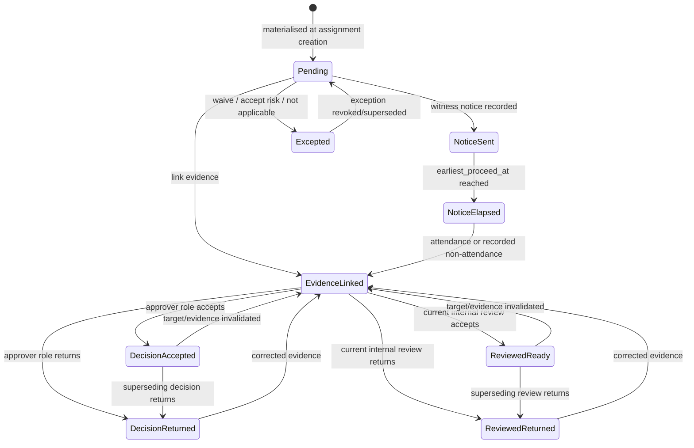
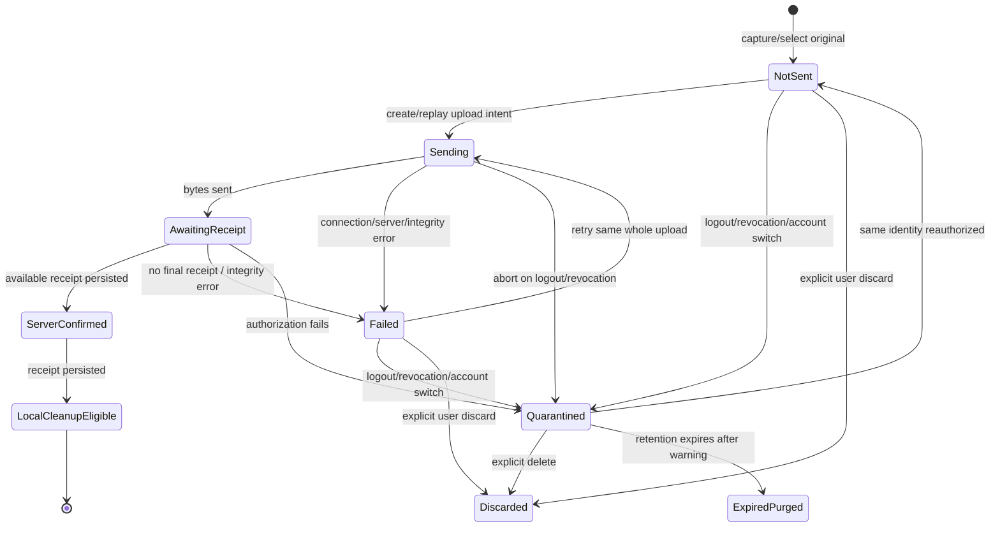

# Execution, requirements, and evidence

**Status:** Approved

**Applies to:** v0.1, v0.2 and v0.3

**Last reviewed:** 2026-08-08

**Related decisions:** [ADR-001](../decisions/ADR-001-product-boundary.md),
[ADR-002](../decisions/ADR-002-tenancy-parties-and-contracts.md),
[ADR-003](../decisions/ADR-003-evidence-packages-and-acceptance.md),
[ADR-004](../decisions/ADR-004-roadmap-demo-and-documentation.md),
[ADR-005](../decisions/ADR-005-readiness-gate-and-hidden-works.md),
[ADR-006](../decisions/ADR-006-pilot-shaped-v0.1.md),
[ADR-007](../decisions/ADR-007-pilot-field-client.md),
[ADR-008](../decisions/ADR-008-valuation-carves-at-admission.md)

> **Version note (2026-08-08) — two decisions taken after this document was
> last reviewed. Both change what v0.1 means, and both are recorded in every
> document that states v0.1 scope.**
>
> 1. **The valuation carve happens at admission, not at recording.**
>    [ADR-008](../decisions/ADR-008-valuation-carves-at-admission.md) (Approved,
>    2026-08-07) moves it out of `progress.record` and into the **stage closure**,
>    which is v0.1's admission event. Performed quantity is recorded **unvalued**;
>    only admitted quantity competes for the work item's pool; admission is a
>    deliberate authorised act and not a side effect of measurement (INV-089, P0).
>    Until 2026-08-08 this ADR was named in no document but the glossary.
>    **What is built is not yet what it decided:** `progress.adjust` still carves
>    at measurement time whenever the root already holds an allocation — no
>    closure, `admitted_by_closure_id` NULL — and that is an open P0, not a
>    nuance.
> 2. **The work type's carrier is a column on the work line, and it needed no
>    ADR.** Settled by the owner on 2026-08-08. Migration `0050` adds
>    `public.work_items.work_type_key`, so the requirement-rule predicate's first
>    argument has a left-hand side at last and a **hand-typed** baseline
>    materialises obligations. Two things it did not settle: the **owning
>    entity** — a table that defines the set of work types — still needs an ADR
>    ([glossary.md](glossary.md) «Work type»), so a work type is validated as *a real one* and not as *the
>    right one*; and an **imported** baseline carries no work type at all, which
>    is permanent for the life of that contract version.
>
> **Neither decision is deployed, and neither is anything else.** Migrations
> `0041`–`0050` are ten files written on an uncommitted branch and **none has
> been applied anywhere**. Against applied history (`0001`–`0040`) the runtime is
> **33 tables**, of which **9** are among the 26 that ADR-006 decision 4 builds
> in v0.1. Nothing in this package may be described as green, verified, or
> confirmed working.


> **Rebuild note (2026-08-05).** The requirement sections of this document were
> rebuilt to carry [ADR-005](../decisions/ADR-005-readiness-gate-and-hidden-works.md).
> Requirement rules replace the single pinned template; occurrences gain
> intervention type, blocking scope, and a closed timing vocabulary; stage
> closure, the closure-without-evidence fact, and the inspection notice become
> first-class facts; readiness gains a written predicate. Everything ADR-005
> does not change is preserved as written — actor separation, the append-only
> progress ledger and its allocation bounds, evidence identity, custody and
> capture, the upload protocol, derivative and correction lineage, and the
> internal-review head discipline.

> **Re-cut note (2026-08-06), and why it is the most consequential edit in this
> file.** [ADR-006](../decisions/ADR-006-pilot-shaped-v0.1.md) re-cut v0.1 to six
> steps a pilot customer can use unaided and moved forty-seven entities out of
> the v0.1 build list, of which thirty-six now carry `v0.2` — eleven were
> restored to their deployed milestone because they already exist in the
> runtime;
> [ADR-007](../decisions/ADR-007-pilot-field-client.md) made the v0.1 field
> client a PWA and withdrew four provenance claims. Neither re-cut reached this
> document at the time, and under [docs/README.md](../README.md) §"Source of
> truth" the domain layer is precedence **level 2** while ADRs are **level 5** —
> so every un-recut sentence here **outranked** both ADRs and stood as canonical
> domain truth. This revision closes that. **Nothing in the approved design is
> deleted or weakened**: what changes is that each obligation now names the
> version that owes it. Where a section is marked **v0.2** or **v0.3**, its text
> is the approved target design and is unchanged; it is simply not v0.1.
>
> The four assertions this file carried that were false as canonical v0.1 truth,
> and where each is now corrected: the `intervention_type` release conditions
> ([Intervention types](#intervention-types)), the `blocks_both` publication rule
> ([Blocking scope](#blocking-scope)), the v0.1 notice event
> ([Inspection notice and attendance — v0.2](#inspection-notice-and-attendance--v02)), and
> the whole native-capture section describing Expo as the v0.1 path
> ([Native online capture — v0.3](#native-online-capture--v03)).
>
> **v0.1 ships the stage-closure half of the gate and not the payment half.**
> `can_close_stage` is in v0.1; `is_package_eligible` needs packages and is v0.2
> (ADR-006 decision 5). Every statement below about package eligibility, freeze
> refusal, internal review, claim segments, the notice event, `witness`,
> `review`, `commercial_decision`, the closure-without-evidence bypass, and the
> seven-state projection is v0.2 target design and is labelled as such.

## What is runtime and what is target

`Approved` does not mean deployed ([docs/README.md](../README.md) status
meanings). Everything below is **approved target design**; the version column
says which release owes it, and the state column says whether it exists. The
runtime is **33 tables** defined by 40 migrations through `0040`, and
`0036`–`0040` create no table.

*(Qualified 2026-08-08 — «deployed» and «written» have come apart, and every sentence above
is about the first. All of it is still exactly true of the **applied** migrations, `0001`–`0040`,
which define 33 tables. Migrations `0041`–`0050` are ten files written on an uncommitted branch and
**applied nowhere**; between them they carry `create table` for **seventeen of the twenty-six** v0.1
tables, plus every CHECK, trigger, policy and grant the readiness gate is made of. Having DDL is not
existing, and none of the ten files has ever been executed.)*

**Read every «Target — no table exists» cell below as «no table exists in an
APPLIED migration».** Twelve of them now have DDL in `0041`–`0050`; none of that
DDL has run. The cells are left as written rather than re-worded one by one,
because the distinction belongs in one place and this is it.

| Area | Version | State | Evidence |
|---|---|---|---|
| Assignments | v0.1-M2 | Implemented (v0.1-M1/M2-A) | `supabase/migrations/0015_execution_evidence_module.sql:73` |
| Append-only progress entries | v0.1-M2 | Implemented | `0015:124` |
| Allocation heads and valuation allocations | **v0.2** (ADR-006 decision 5 — the allocation ledger) | Implemented and deployed; not extended in v0.1 | `0015:167`, `0015:192` |
| Upload intents, evidence objects | v0.1-M2 | Implemented (server half) | `0015:246`, `0015:299` |
| Capture events | **v0.2** (ADR-006 decision 5 — capture telemetry) | Implemented and deployed; not extended in v0.1 | `0015:358` |
| Requirement template versions | v0.0 — retired model | Implemented as a table only; the model it serves is replaced by requirement rules (ADR-005 decision 2) | `0015:36`; `multiplicity`, `timing` and `severity` at `0015:44-46` are frozen into the template hash and read by no application code. ADR-005 retires the assignment pin and the `severity` axis. **Disposition, recorded 2026-08-06 and not yet resolved:** the table is not dropped — `0015` created it and applied migrations are append-only history — but the authoring path is **still live in the runtime**, not merely in a catalog: `apps/app/app/v1/workspaces/[workspaceId]/requirement-templates/route.ts`, `apps/app/app/v1/requirement-templates/[templateVersionId]/publish/route.ts`, the `requirement_templates.manage` capability in `packages/domain/src/authz.ts`, and the `requirement_owner` row of `technical/permissions/responsibility-presets.csv`. So v0.1 today ships a way to author a model the glossary retires. Retiring it is a slice of its own (route removal, capability removal, contracts change, preset change); the catalogs record the runtime rather than pretending it away |
| `work_assignments.requirement_template_version_id` | v0.0 — retired | Implemented, nullable, retired by ADR-005 decision 2 | `0015:85`; pinned-status guard added at `supabase/migrations/0023_evidence_binding_hardening.sql:40-48` |
| Rule versions and contract-version rule bindings | v0.1-M1 | **Target — no table exists** | absent from all applied migrations |
| `requirement_rules` — workspace-authored rule drafting | **v0.2** (ADR-006 decision 4.1) | **Target — no table exists** | absent from all applied migrations |
| Requirement occurrences | v0.1-M2 (ADR-006 decision 4) | **Target — no table exists** | only the placeholder column `upload_intents.requirement_occurrence_id`, FK deferred, `0015:251` |
| Evidence links as a many-to-many table | **v0.2** ([version-0.1.md](../delivery/version-0.1.md)) | **Target — no table exists** | absent from all applied migrations |
| Work stages, stage closures | v0.1-M3 | **Target — no table exists** | absent from all applied migrations |
| Requirement exceptions, occurrence evidence decisions, `blocked_reasons`, `readiness_projection` | v0.1-M3 | **Target — no table exists** | absent from all applied migrations |
| `requirement_exception_heads`, `requirement_evidence_decision_heads` | v0.1-M3 (moved in 2026-08-06 by owner decision; ADR-006 decision 4, amendment note — INV-035 makes a lineage without a head unable to enforce root uniqueness, and `can_close_stage` reads both lineages) | **Target — no table exists** | absent from all applied migrations |
| Closure without evidence and its clearances | **v0.2** (ADR-006 decision 4 — there is no bypass in v0.1) | **Target — no table exists** | absent from all applied migrations |
| Requirement notices and attendance outcomes | **v0.2** (ADR-006 decision 5) | **Target — no table exists** | absent from all applied migrations |
| Internal review target sets, decisions, heads | **v0.2** (ADR-006 decision 5) | **Target — no table exists** | absent from all applied migrations |
| Readiness — `can_close_stage` | v0.1-M3 | **Target — projection with no source facts** | classified `Projection \| Recomputed` in [domain-model.md](domain-model.md) |
| Readiness — `is_package_eligible` | **v0.2** (ADR-006 decision 5) | **Target — projection with no source facts** | requires packages, which have no table |
| Statutory acts and act versions | v0.1-M4 | **Target — no table exists** | absent from all applied migrations |
| `external_decision_batches` | v0.1-M5 (moved in 2026-08-06 by owner decision; ADR-006 decision 4, amendment note — it carries the receipt, the confirmation-text version and the idempotency record, and the decision CHECK requires it on every externally submitted decision) | **Target — no table exists** | absent from all applied migrations |
| Packages, package versions, lines, claim segments, submissions, decision issues, decision coverage, `commercial_decision` | **v0.2** (ADR-006 decision 5) | **Target — no table exists** | absent from all applied migrations |

Milestone attribution follows [ADR-006](../decisions/ADR-006-pilot-shaped-v0.1.md)
decision 4 and [version-0.1.md](../delivery/version-0.1.md), which supersede the
earlier reading that put occurrences, evidence links, exceptions, internal review
and readiness together in **v0.1-M3**. Occurrence materialisation is now **M2**
(the phone); exceptions, occurrence evidence decisions, stages, closures,
`blocked_reasons` and `readiness_projection` are **M3** (the refusal); the act is
**M4**; the occurrence-scoped external grant is **M5**; internal review and
evidence links are **v0.2**. The deferred FK comment at `0015:251` still names
M3 and is stale by one milestone; it is an applied migration and is not
rewritten.

No test count, green baseline, or delivery claim is made by this document, and
nothing here has been executed. As of 2026-08-06 there is no customer validation
behind any of it: 21 evidenced sends, 0 replies, zero interviews, and **zero
customer documents of any kind**
([validated-assumptions.md](../discovery/validated-assumptions.md)). The
authority for the ADR-006 re-cut is the owner's instruction of 2026-08-06, not a
market signal; the founder-reported signal of 2026-08-05 is unnamed and undated
and drives nothing in this document.

## Actor distinctions

| Actor fact | Meaning |
|---|---|
| Performer party | Organization accountable for performing the work |
| Member assignee | Person expected to act on an assignment; optional in v0.1 |
| Progress recorder | Member who submits measured quantity |
| Evidence recorder | Member who captures/uploads the evidence |
| Source party | Party from which the evidence originated |
| Custodian | Party/member accountable for the authoritative original |
| Internal verifier | Member who decides evidence/requirement readiness. **v0.2** — internal review moves with packages (ADR-006 decision 5) |
| Requirement performer role | Role named by the rule that must satisfy the requirement |
| Requirement approver role | Role named by the rule whose accepting decision releases a `hold`; internal or external. **In v0.1 the deciding approver is the external технагляд on a personal link** |
| Notice recipient | Party contact invited to witness, recorded on the notice event. **v0.2** |
| Closure actor | Member who records that a stage was closed |
| Bypass actor and claimed authority | Member who records a closure without evidence, plus the authority they claim to act under. **v0.2** — there is no bypass in v0.1 |
| Clearing reviewer | Internal reviewer who restores package eligibility against named substitute evidence. **v0.2** |
| System actor | Parser, storage receipt, projection, or delivery worker |

These values may identify the same real person or organization, but the system
records them separately because accountability differs.

Only an authenticated member/service principal with an explicit command
permission is an authorization actor. Performer, source party, custodian,
recorder, verifier, `performer_role`, `approver_role`, and claimed authority
preserve provenance/accountability and do not grant permissions by themselves.
A rule naming `approver_role = технагляд` states who owes the decision; it does
not let that person into the workspace. System commands are allowlisted and
narrowly scoped; every storage finalization, scan, derivative, or projection
action records its service identity and the originating user command/fact.

## Assignment lifecycle

A work assignment is operational scope, not a copy of the contract row.

Required:

- workspace, project, contract, and work item;
- lifecycle state;
- version for optimistic concurrency.

Optional in v0.1:

- location;
- performer party;
- member assignee;
- planned quantity;
- due date.

`requirement_template_version_id` is **retired** (ADR-005 decision 2). A single
optional template pinned per assignment cannot express an ordered set, cannot
vary by stage or location node, and is absent by default — which is the same as
having no gate. Requirement occurrences are materialised from the bound rule
set when the assignment is created, with no evidence yet linked, and are visible in the
field client **before work starts**. A placeholder that appears only after the
work is covered is not advance notice.

Assignment changes append assignment events or versions where historical
meaning changes. Reassignment does not rewrite earlier progress/evidence actors,
and does not re-materialise or silently withdraw existing occurrences.

## Progress entries

A root progress measurement records a positive decimal quantity in the work
item's canonical unit. A correction is a signed adjustment that references one
exact root measurement and states the reason.

Rules:

- the root and every adjustment are immutable;
- an adjustment must reference a non-adjustment root in the same
  workspace/assignment/work item;
- adjustments never reference other adjustments, so no predecessor chain,
  branch, cycle, or mutable head exists;
- a mistaken adjustment is offset by another adjustment to the same root;
- effective performed quantity is root quantity plus the sum of all valid signed
  adjustments and is independent of append order;
- an adjustment quantity is always a signed delta, never a replacement;
- multiple adjustments may reference the same root; the remaining negative
  correction bound is the current effective root quantity minus the allocation
  head's single `reserved_quantity` balance;
- effective root quantity and effective assignment/work-item quantity may never
  become negative;
- zero quantity is rejected unless the command has a distinct non-quantity
  meaning;
- precision follows the unit definition;
- concurrent duplicate submission is absorbed by idempotency;
- the root's allocation head is locked for both adjustment and allocation
  (**v0.2** — the allocation ledger moves with packages, ADR-006 decision 5);
- an adjustment that would reduce effective quantity below
  `reserved_quantity` is rejected as a standalone command; reducing returned or
  pending reserved scope uses the atomic corrected-successor command, while
  accepted quantity cannot be reduced (**v0.2**);
- allocation to package claim segments never exceeds available effective
  quantity (**v0.2**).

**In v0.1 nothing is allocated to anything.** Packages, claim segments and the
`progress_claim_allocations` ledger are v0.2 (ADR-006 decision 5), so a v0.1
progress entry has no reservation to cross and the four rules above have no v0.1
form. What survives unchanged in v0.1 is the append-only root-plus-adjustment
model itself: immutability, one non-adjustment root per adjustment, no
predecessor chains, order independence, non-negativity, and unit precision.
`progress_allocation_heads` and `valuation_allocations` exist in the runtime
(`0015:167`, `0015:192`) and are not dropped; ADR-006 moves the **work**, not the
row.

The rest of this section is **v0.2 target design**, stated here because it is the
model the v0.2 allocation ledger implements and it is unchanged by the re-cut:

> Adjustment and allocation commands serialize on the same root allocation head,
> so concurrent attempts observe one balance. An accepted allocation cannot be
> reduced. A valid adjustment invalidates derived readiness and unfrozen
> draft/candidate validations, but never edits a frozen package. A successor
> package is required when active submitted scope must change.
>
> For a negative adjustment that crosses only
> `current_unaccepted_reserved_quantity`, the user prepares a deterministic
> correction draft. It is not yet a progress fact. The package command then
> appends the adjustment and creates/installs the corrected successor in the one
> atomic transaction defined in
> [Packages and acceptance](packages-and-acceptance.md#atomic-corrected-successor).
> This avoids requiring either the adjustment or successor to exist first.

### The gate never refuses to record a fact

ADR-005 decision 1 sub-rule, restated here because it constrains every command
in this document:

- recording performed quantity is always permitted;
- capturing and uploading evidence is always permitted;
- recording that a stage was in fact covered is always permitted, with or
  without satisfied requirements.

The gate refuses a **conclusion** — that a stage closed with its evidence
satisfied — and a **presentation** — that scope may be claimed for payment. The
append-only ledger must always be able to record what actually happened,
including what happened wrongly; a ledger that refuses inconvenient reality is
worth nothing as evidence.

**v0.1 ships the conclusion half and not the presentation half.** `can_close_stage`
refuses the closure; `is_package_eligible` needs package versions and is v0.2
([ADR-006](../decisions/ADR-006-pilot-shaped-v0.1.md) decision 5). A v0.1 refusal
is a refused stage closure, and nothing else.

The positioning sentence fixed by ADR-005, used verbatim wherever positioning
is stated:

> «Ми не блокуємо роботу на майданчику — ми не даємо її пред'явити до оплати,
> поки доказ не отримано і не погоджено.»

Until packages ship in v0.2 that sentence may be used **only alongside an
explicit statement that payment-presentation eligibility is not in v0.1**, and
**no demonstration may show a payment-presentation refusal that does not exist**
([ADR-006](../decisions/ADR-006-pilot-shaped-v0.1.md) Consequences). This is the
main cost of the re-cut and no document, screen, demo or sales sentence may
discover it later.

`progress.record` in the runtime opens the allocation head and carves minor units
out of the work-item pool with no reference to evidence or readiness. That
ordering stays legal under ADR-005 decision 7, because eligibility is a
precondition of *freeze*, not of *recording*. **In v0.1 there is no freeze and no
allocation to a claim**, so the consequence is narrower than ADR-005 states it:
performed quantity is recorded, and the money on the lines under a blocked stage
is reported as blocked by the M6 sum — a query over `blocked_reasons` and
`work_items`, not an allocation balance. The allocation-shaped statement above is
the v0.2 form.

## Requirement rules and their binding

A **requirement rule** is a predicate over `(work type, location node, stage)`
that yields an **ordered set** of requirements. It is not a property of a
person, a visit, or a checklist someone remembered to attach.

**In v0.1 the predicate is `(work type, stage)`, and `stage` is its second
argument** ([ADR-006](../decisions/ADR-006-pilot-shaped-v0.1.md) decision 4.2).
`locations` and the location-node axis move to v0.2 together with location scope
on assignments and occurrences. The three-argument form above is the v0.2 target;
wherever a location node appears below, read it as a v0.2 axis.

**In v0.1 the only rule source is the shipped Додаток Н library.**
`requirement_rules` — workspace-authored rule drafting — is v0.2 (ADR-006
decision 4.1). Rule *versions* stay publish/retire-only and an occurrence still
stores `rule_version_id`, exactly as ADR-005 decision 2 requires.

Each requirement in the set carries:

- `evidence_kind` — photo, measurement (value, unit, tolerance), document, or
  checkbox;
- `acceptance_criterion` — what makes the evidence sufficient;
- `norm_ref` — the normative reference, subject to
  [hidden-works-content-rules.md](../product/hidden-works-content-rules.md);
- `performer_role` and `approver_role`;
- `intervention_type` and `blocking_scope`;
- `timing`;
- `multiplicity` — how many evidence objects satisfy it;
- allowed media/MIME and content rules for the evidence kind;
- structured form schema, where the evidence kind is a form, checkbox, or
  measurement;
- exception policy — who may waive or accept risk, within the prohibition on
  `not_applicable` for `hold`;
- ordinal position within the set.

Binding and versioning:

- rule versions are **publish/retire only, never update**. There is no draft
  mutation after publication and no in-place edit of a published rule;
- publication freezes the whole content above under a deterministic rule-version
  hash and version number; the contract-version binding pins those exact
  identities, so what was agreed can be reproduced and shown;
- rules are **bound at contract-baseline publication**. The published contract
  version pins the exact rule-version set, in the same way it pins party,
  currency, tax, terms, and approval-policy snapshots (ADR-002). A rule
  published after that baseline does not retroactively enter it;
- an occurrence stores `rule_version_id` — a pinned identity, not a live
  foreign key to something that can change under it;
- the stage vocabulary a rule may reference is pinned by the same binding, so a
  rule can never name a stage the contract version does not know.

### Bulk instantiation

Materialising occurrences across a location subtree is a single command with a
**dry run** that previews generated names, counts matches per rule, and prints
an **explicit list of uncovered lines**.

**In v0.1 there is no subtree.** Location-subtree bulk instantiation moves to
v0.2 with `locations` ([ADR-006](../decisions/ADR-006-pilot-shaped-v0.1.md)
decision 4.2). What survives in v0.1 is the **dry run over a published contract
version**: it reports the **uncovered work lines** of that version — a work type
with no matching rule must still be named in the command's output. Its path drops
`/bulk` ([version-0.1.md](../delivery/version-0.1.md)).

Silent non-coverage means there is no gate. The uncovered list is part of the
command's output, not a report someone may run afterwards — because a line with
no applicable occurrence satisfies every predicate in
[Readiness](#readiness-predicate) vacuously and sails through closure in v0.1 and
through freeze once packages exist.

## Requirement occurrences

A concrete **requirement occurrence** is materialised when an assignment is
created. It identifies the exact assignment, location node, stage, and
quantity scope, and it remains the obligation identity even as evidence links,
decisions, notices, or exceptions are appended. **In v0.1 it identifies the
assignment, the stage and the quantity scope**; location scope on assignments and
occurrences is v0.2 (ADR-006 decision 4.2).

An occurrence pins, from its rule version: `rule_version_id`,
`intervention_type`, `blocking_scope`, `timing`, `evidence_kind`,
`acceptance_criterion`, `norm_ref`, `performer_role`, `approver_role`, and
`multiplicity`.



The diagram describes a nonterminal current projection, not mutable row states.
New evidence links/corrections, evidence unavailability, superseding internal
decisions, superseding approver decisions, notice and attendance facts,
applicability changes, and revoked/superseded exceptions always recompute the
projection. Replacement evidence does not silently revoke a valid exception; an
authorized explicit exception successor/revocation must do that.
`DecisionAccepted`, `ReviewedReady`, and `Excepted` are not terminal facts.

`not_applicable` is absent from the diagram's `hold` path deliberately — see
[Exceptions](#exceptions).

**The reachable v0.1 projection is smaller than the diagram.** With
`intervention_type = hold` only and no notice event, no internal review and no
package, the states a v0.1 occurrence can reach are `Pending`, `EvidenceLinked`,
`DecisionAccepted`, `DecisionReturned` and `Excepted`, plus the transitions
between them. `NoticeSent`, `NoticeElapsed`, `ReviewedReady` and
`ReviewedReturned` are v0.2 (ADR-006 decisions 4.3 and 5).

### Intervention types

`intervention_type ∈ {hold, witness, review}` (ADR-005 decision 3). A boolean
is defeated in a week: if everything blocks, users learn to route around every
block.

**`intervention_type` is `hold` only in v0.1**
([ADR-006](../decisions/ADR-006-pilot-shaped-v0.1.md) decision 4.3). `witness`
needs the notice event and its attendance outcomes; `review`'s only blocking
scope is package inclusion, and there are no packages. Both move to v0.2. The
CHECK keeps all three values and **the publication command rejects the other
two**, so v0.2 is additive and no v0.1 record is reinterpreted.

The `hold` release condition below is also narrower in v0.1 than ADR-005 states
it: v0.1 has no package eligibility, so a released `hold` releases the **stage
closure** and nothing else.

| Type | Version | Meaning | Release condition |
|---|---|---|---|
| `hold` | **v0.1** | The strong point. **In v0.1 it blocks stage closure**; in v0.2 it blocks package eligibility as well (ADR-006 decision 4.4). | An accepting decision exists on the occurrence, from the role named by `approver_role`, with no current return. |
| `witness` | **v0.2** | The invited-inspection point. | A recorded notification event exists **and** its notice period has elapsed. Attendance with an accepting decision releases it; **non-attendance after the period is itself recorded** and becomes evidence of process in favour of the performer. |
| `review` | **v0.2** | A document obligation that must be satisfied **before the work starts**. | The required document is linked, available, and accepted by the current internal review head. |

A `review` requirement never bars the recording of performed quantity. It bars
presentation, and it raises a pre-start warning in the field client. **Both
halves of that sentence are v0.2**, including the pre-start warning: ADR-006
decision 5 moves `review` with internal review, and the non-package half of
ADR-005's `review` — the pre-start warning — moves with it rather than surviving
alone. No v0.1 screen raises a `review` pre-start warning, because no v0.1 rule
version may publish a `review` requirement.

### Blocking scope

`blocking_scope ∈ {none, blocks_stage_closure, blocks_package_inclusion,
blocks_both}` is stored on the rule and materialised onto the occurrence. It is
**never inferred from a severity word at read time**.

| Type | Permitted `blocking_scope` | Default |
|---|---|---|
| `hold` | `blocks_both` in the approved design; **in v0.1 the publication command admits `blocks_stage_closure` only** ([ADR-006](../decisions/ADR-006-pilot-shaped-v0.1.md) decision 4.4), and a v0.2 migration widens every v0.1 `hold` to `blocks_both` | `blocks_stage_closure` in v0.1; `blocks_both` from v0.2 |
| `witness` (**v0.2**) | `blocks_stage_closure` or `blocks_both` | `blocks_stage_closure` |
| `review` (**v0.2**) | `blocks_package_inclusion` or `blocks_both` | `blocks_package_inclusion` |
| any | `none` — advisory: recorded, surfaced, never blocking. **Unreachable in v0.1**: every v0.1 requirement is a `hold` and every v0.1 `hold` is `blocks_stage_closure`, so no publication path produces `none` | — |

The v0.2 widening migration is not optional and is not a cleanup task. Without
it, every requirement recorded during the pilot is permanently outside the
payment-eligibility half of the gate and nobody would notice
([ADR-006](../decisions/ADR-006-pilot-shaped-v0.1.md) Consequences); it needs a
test that fails if one v0.1 row is left behind.

The four-value scope is stored on the rule version and materialised onto the
occurrence in v0.1 exactly as in the approved design — v0.1 restricts what may be
*published*, never what the column may *hold*.

`none` is the successor of the implemented `severity = 'advisory'`
(`supabase/migrations/0015_execution_evidence_module.sql:46`). `severity` as a
free axis is **retired**: a requirement's consequence is its blocking scope,
and one column now says so. The current column is frozen into the template hash
and read by no application code, which is exactly the failure mode this
replaces.

### Timing

`timing` is a closed value set, restored from the five-value CHECK that the
canonical model lost when it degraded to `jsonb not null default '{}'` with no
constraint (`supabase/migrations/0015_execution_evidence_module.sql:45`):

```text
timing ∈ { before_work,
           during,
           before_concealment,
           after,
           before_package }
```

| Value | Meaning |
|---|---|
| `before_work` | Must be satisfied before work on the stage begins |
| `during` | Satisfied while the work is performed |
| `before_concealment` | Must be satisfied before the stage is covered — the hidden-works case |
| `after` | Satisfied after the work is complete, before the stage is closed |
| `before_package` | Satisfied before the scope may enter a package version. **v0.2** — v0.1 has no package version, so the value orders and prompts against nothing. Whether the v0.1 publication command should reject it is **not decided anywhere in the package**, and this document does not decide it |

Rules:

- `timing` is an **ordering and prompting axis only**. It decides when the field
  client raises the obligation and how the occurrence is sorted in the set. It
  does **not** decide consequence — `blocking_scope` does, alone;
- an occurrence with `timing = before_concealment` may only be materialised on a
  stage flagged concealed. Publication rejects the combination otherwise,
  because a requirement that must precede a covering that never happens is
  unreachable;
- `timing = before_work` is the natural pairing for `intervention_type =
  review`, but the two are independent and neither implies the other.

### Exceptions

One serialized exception head exists per `(workspace, occurrence,
exception_scope)`; v0.1 uses the whole occurrence as the only exception scope.
Appending an exception or revocation locks the head and requires its expected
version. The successor references the exact prior fact, and a uniqueness
constraint prevents two successors from the same predecessor. Readiness uses
only the head selected by this lineage.

Exception kinds are `waiver`, `accept_risk`, and `not_applicable`. All three
are append-only facts with authority, reason, and supersession. An exception
never mutates the occurrence into a second truth.

**A `hold` requirement may never be marked `not_applicable`** (ADR-005
decision 3). `waiver` and `accept_risk` remain available to an authorised
actor and remain visible, because an exception that hides itself is worse than
no exception. `not_applicable` — the exception that asserts the obligation
never existed — is rejected for `hold` **by the exception command itself**, not
by convention, not by a UI affordance, and not by a role that happens not to
have the button.

## Inspection notice and attendance — v0.2

**Scope limit, stated before anything else in this section.** The notice event,
`witness`, and the whole statutory notice apparatus are **v0.2**
([ADR-006](../decisions/ADR-006-pilot-shaped-v0.1.md) decision 5); v0.1 ships
neither, and no document may describe a v0.1 notice. Everything below is
approved v0.2 target design, unchanged in content by the re-cut.

A `witness` occurrence releases against a recorded notification event, not
against someone's memory of a phone call.

The **notice event** records:

- the occurrence it belongs to;
- recipients: party contacts, with the delivery channel used;
- server `sent_at` — never a client-claimed time;
- the configured `required_notice` duration;
- a server-computed `earliest_proceed_at = sent_at + required_notice`.

An **attendance outcome** is appended after the fact and records either
attendance — with the accepting or returning decision the attendee made — or
**recorded non-attendance**. Non-attendance is evidence of process in favour of
the performer, and is only appendable at or after `earliest_proceed_at`; the
server checks the clock, the client does not assert it.

**What the earlier revision of this document got wrong.** It read: «v0.1 ships
the notice **event**», deferring only the statutory apparatus around it. That was
ADR-005's split (ADR-005:690-691) and it no longer holds:
[ADR-006](../decisions/ADR-006-pilot-shaped-v0.1.md) decision 5 moves the notice
**and** its attendance outcome to v0.2, and `witness` with them. The sentence is
withdrawn rather than softened, and nothing in v0.1 records a notice.

Within v0.2, `required_notice` remains a workspace setting until the working-day
calendar ships, and it **must not be labelled as the five-working-day rule** of
the примітка to Додаток В/Г: calendar days and робочі дні produce different
dates, and presenting one as the other is exactly the class of quiet regulatory
error [hidden-works-content-rules.md](../product/hidden-works-content-rules.md)
exists to prevent.

## Stages and stage closure

A **work stage** is the closable unit: one assignment, one location node, one
stage from the vocabulary pinned by the published contract version, and a flag
recording whether the stage is concealed. **In v0.1 it is one assignment, one
stage and the concealed flag** — the location node is v0.2 (ADR-006 decision
4.2). Requirement occurrences attach to a stage; readiness for closure is
evaluated over that stage.

A **stage closure** is an append-only fact. It records:

- the stage and its assignment/location scope;
- the closure actor — an authenticated member with the closure capability;
- the server closure time;
- an optional claimed covering time with timezone offset, labelled untrusted in
  the same way as claimed capture time;
- the approver decisions relied on: the exact accepting
  `requirement_evidence_decisions` and, for witness occurrences, the notice and
  attendance facts (**the witness half is v0.2**);
- the evaluated closure predicate result and the exact occurrence set it
  quantified over, frozen into the fact.

Rules:

- a stage has **at most one current closure**. Double-covering the same stage is
  unrepresentable, preserving the legacy `concealment_events` guarantee;
- the closure is never edited. A closure recorded in error is corrected by an
  append-only successor that references the exact prior closure and states a
  reason, under the same head discipline as exceptions and internal review: one
  serialized head per stage, expected version required, uniqueness preventing
  two successors from one predecessor. Only after a correction may a new closure
  be recorded;
- closing a stage does **not** by itself close its occurrences, allocate money,
  or make scope eligible. It records that the physical opportunity to inspect
  has passed;
- a closure attempt that fails `can_close_stage` is refused with the
  [blocked reason object](#blocked-reason), never with a bare 409 and a status
  word.

## Closure without evidence, and its clearance — v0.2

**There is no bypass in v0.1** ([ADR-006](../decisions/ADR-006-pilot-shaped-v0.1.md)
decision 4). ADR-005 decision 5 is unchanged and unshipped: its price is that the
money waits, and in a version with no packages there is no money to make wait, so
`unevidenced_closures` and its clearance would ship a defeat that costs nothing.
**The v0.1 escape is the ADR-005 exception** — `waiver` and `accept_risk` by an
authorised actor, attributed and visible, with `not_applicable` still rejected on
a `hold` by the exception command itself. One attributed, visible escape exists,
which is what ADR-005's argument against an absolute lock actually requires.

Everything below is approved v0.2 target design, unchanged in content by the
re-cut.

An absolute lock is routed around outside the system, and then the product is
the enemy. A bypass whose only consequence is escalation to management teaches
that the gate is theatre. ADR-005 decision 5 therefore prices the bypass in
money instead of pricing it in escalation.

A **closure without evidence** is a first-class append-only fact. The command
records:

- the actor and the **claimed authority** under which they acted;
- a **mandatory** reason code plus free text, whose vocabulary is not yet enumerated anywhere and must not be described as closed or structured until it is (ADR-005 decision 5);
- the **exact set of unmet requirement occurrences at that moment**, frozen into
  the fact, not recomputed later;
- the expected remedy.

Consequences, all mechanical:

- the stage is recorded as closed — reality is recorded;
- the requirement occurrences are **not** satisfied and are not closed;
- every claim segment covering that scope becomes **ineligible for any package
  version**, with `blocked_reason.code = CLOSED_WITHOUT_ACT`;
- ineligibility is cleared only by an **internal reviewer** appending a
  clearance fact that names substitute evidence. The clearance does not delete,
  amend, or hide the bypass;
- the bypass appears in the frozen package manifest as a **named appendix**,
  with its value by currency.

The price of a bypass is that the money waits. That is the only price a product
can actually charge.

## Readiness predicate

Readiness remains a **projection**. It is never an editable status column, and
ADR-003's immutable-facts rule is untouched. What ADR-005 decision 7 changes is
that package freeze **refuses** ineligible scope instead of relying on the
compiler to filter it out silently.

**v0.1 ships `can_close_stage` and not `is_package_eligible`**
([ADR-006](../decisions/ADR-006-pilot-shaped-v0.1.md) decision 5). Both
predicates are written below because the domain defines them once; only the first
has a v0.1 command that consumes it. Freeze, its per-segment reason list, the
named ineligible-segment refusal and the internal-review conjunct all arrive with
packages in v0.2, and no v0.1 demonstration may show a freeze refusal.

### Applicable sets

```text
APPLICABLE_STAGE(s)
  = { o ∈ requirement_occurrences
      | o.work_stage_id = s.id }

APPLICABLE_SEGMENT(seg)
  = { o ∈ requirement_occurrences
      | ∃ p ∈ progress_sources(seg) :
            o.work_assignment_id = p.work_assignment_id
          ∧ o.location_node covers p.location_node
          ∧ o.quantity_scope covers p.allocated_scope }

STAGE_BLOCKING(s)
  = { o ∈ APPLICABLE_STAGE(s)
      | o.blocking_scope ∈ {blocks_stage_closure, blocks_both} }

PACKAGE_BLOCKING(seg)
  = { o ∈ APPLICABLE_SEGMENT(seg)
      | o.blocking_scope ∈ {blocks_package_inclusion, blocks_both} }

ADVISORY(x)
  = { o ∈ APPLICABLE_*(x) | o.blocking_scope = none }
```

`APPLICABLE_SEGMENT`, `PACKAGE_BLOCKING` and every use of `location_node` above
are **v0.2**: claim segments, their progress-source allocation and the location
axis all move with packages and `locations` (ADR-006 decisions 4.2 and 5). The
v0.1 sets are `APPLICABLE_STAGE(s)` and `STAGE_BLOCKING(s)`, and in v0.1
`STAGE_BLOCKING(s) = APPLICABLE_STAGE(s)` because every v0.1 occurrence is a
`hold` with `blocks_stage_closure`.

`ADVISORY(x)` is quantified out of both predicates below and is **reported
anyway**, on the stage screen and in the package manifest (INV-078). An advisory
requirement that is invisible is not advisory, it is deleted. **`ADVISORY(x)` is
empty in v0.1** and INV-078 has no v0.1 form: `blocking_scope = none` is
unreachable while every requirement is a `hold` that must be
`blocks_stage_closure` ([Blocking scope](#blocking-scope)). Any exit gate,
invariant or test that demands a v0.1 `none` occurrence demands evidence the
version cannot produce.

**There is no separate "applicability fact", and both definitions above are
free of one** (corrected 2026-08-06 — earlier revisions carried the clause «no
current applicability fact withdraws o» in both sets, and no entity, table,
operation, or invariant anywhere in the package ever gave it an existence,
which made both predicates unimplementable as written). Withdrawal is not a
second mechanism: it is a `requirement_exceptions` fact with action
`not_applicable`, selected through `requirement_exception_heads`, and it is
already carried inside `satisfied(o)` below, together with the prohibition that
a `hold` occurrence can never be made not-applicable (INV-063). An occurrence is
applicable if the scope matches; whether an exception has since withdrawn it is
a satisfaction question, not a membership question.

### Satisfaction

```text
satisfied(o) ⇔
     o.intervention_type = 'hold'
       ∧ ∃ current accepting evidence decision on o by o.approver_role
       ∧ no current return on o
  ∨  o.intervention_type = 'witness'
       ∧ ∃ notice event n for o ∧ now ≥ n.earliest_proceed_at
       ∧ (attendance recorded with an accepting decision
          ∨ non-attendance recorded after the period)
  ∨  o.intervention_type = 'review'
       ∧ linked evidence is available and meets multiplicity
       ∧ the current internal review head for its target set accepts
  ∨  ∃ current exception head on o with kind ∈ {waiver, accept_risk}
  ∨  ∃ current exception head on o with kind = not_applicable
       ∧ o.intervention_type ≠ 'hold'
```

**The v0.1 form of `satisfied(o)` is the first and fourth disjuncts only:**

```text
satisfied(o) ⇔                                   -- v0.1
     o.intervention_type = 'hold'
       ∧ ∃ current accepting evidence decision on o by o.approver_role
       ∧ no current return on o
  ∨  ∃ current exception head on o with kind ∈ {waiver, accept_risk}
```

`witness` and `review` cannot be published in v0.1 (ADR-006 decision 4.3), and
the `not_applicable` disjunct is unreachable because it excludes `hold` and
`hold` is the only v0.1 intervention type — which is the same prohibition
ADR-005 decision 3 states, arrived at from the other side.

"Current" always means the head selected by the serialized lineage — the
exception head for exceptions, the `internal_review_head` for internal review
(**v0.2**), the current decision for an approver decision. A superseded fact
never satisfies anything.

### Closure and eligibility

```text
can_close_stage(s) ⇔                              -- v0.1
     ∀ o ∈ STAGE_BLOCKING(s) : satisfied(o)

is_package_eligible(segment) ⇔                    -- v0.2
     ∀ o ∈ PACKAGE_BLOCKING(segment) : satisfied(o)
  ∧  no uncleared closure-without-evidence fact covers the segment's scope
  ∧  the current internal review head for the applicable target set accepts
  ∧  every pinned evidence object is in state `available`
```

`can_close_stage` is **the one predicate v0.1 ships**, and the closure command
consumes it as a precondition. Every conjunct of `is_package_eligible` is v0.2:
segments, the bypass fact and internal review all move with packages.

**Vacuous truth is a real risk, not a footnote.** `∀` over an empty set is
true, so a stage with no applicable blocking occurrence closes, and a segment
with none is eligible. That is correct behaviour and it is precisely why the
bulk-instantiation dry run must print uncovered lines
([Bulk instantiation](#bulk-instantiation)). Coverage is the gate; the predicate
only enforces what coverage produced. In v0.1 the dry run's uncovered list is
therefore the **only** thing standing between a hand-typed work line and a stage
that closes with no obligation on it.

### Consequences

- **Freeze refuses (v0.2).** The finalisation command returns a per-segment
  reason list built from `blocked_reason` objects, together with the sum included
  and the sum excluded by currency. It never assembles a package with a silent
  hole. **No such command exists in v0.1 and none exists in any migration**;
  v0.1's refusal is the stage closure, and a demonstration must not show a
  package-finalisation refusal.
- A **stale-source conflict** at freeze remains a stale-source conflict
  ([packages-and-acceptance.md](packages-and-acceptance.md)). An **ineligible
  segment** is a different, named refusal and must never be reported as a
  concurrency error — the two have different remedies and telling a user to
  refresh their draft when they need a supervisor's signature is a support cost.
  Both are v0.2.
- Readiness recomputes from: current applicable occurrences; current evidence
  links and object availability; current internal review decisions (**v0.2**);
  current approver decisions on occurrences; current notice and attendance facts
  (**v0.2**); current requirement exceptions; current stage closure and bypass
  (**v0.2**) facts; and exact progress quantity/location (**v0.2**) scope.
  Additional triggers: a new rule-version binding, a package claim or withdrawal
  (**v0.2**), and an external decision. **The v0.1 trigger set is:** a new or
  corrected quantity entry, a change in an occurrence's satisfaction, a new
  rule-version binding, an exception appended or revoked, an external evidence
  decision on an occurrence, and a stage closure.

## Blocked reason

A gate is worth what you can point at in a meeting with the general contractor.
`blocked_reason` is a structured object, not a UI state (ADR-005 decision 6):

```text
blocked_reason {
  requirement_occurrence_id
  rule_version_id            -- what was agreed, and in which version
  missing_evidence[]         -- by evidence_kind and acceptance_criterion
  awaiting_approver_role     -- who owes the decision
  since                      -- server time the block began
  blocked_value_by_currency  -- net, tax, gross minor units per currency
  code                       -- fixed, closed, versioned vocabulary
}
```

The code vocabulary is closed and versioned. It includes at minimum:
`ACT_NOT_SIGNED`, `TEST_REPORT_MISSING`, `MATERIAL_CERTIFICATE_MISSING`,
`SUPERVISION_SIGNATURE_MISSING`, `CUSTOMER_MOTIVATED_REFUSAL`,
`NOTICE_PERIOD_NOT_ELAPSED`, `CLOSED_WITHOUT_ACT`. Two of the seven have no v0.1
producer: `NOTICE_PERIOD_NOT_ELAPSED` needs the notice event and
`CLOSED_WITHOUT_ACT` needs the bypass, both v0.2. The vocabulary is not narrowed
for v0.1 — a closed vocabulary that changes shape between versions is not closed
— but no v0.1 record carries either code.

**All seven codes are enumerated as a `blocked_reason.code` `stored_vocabulary`
machine in `technical/states/state-catalog.csv:112-118`**, transcribed there on
2026-08-06 because roadmap.md §"v0.1-M3" makes the closed, versioned vocabulary
an M3 entry condition. That entry condition is met. What is still unenumerated
is the **bypass** reason-code vocabulary, which `state-catalog.csv:119` carries
as an explicit `NOT_ENUMERATED` gap row rather than an invented set. This document names
the seven codes; it does not create the catalog row that would make them
authoritative.

Two rules on the value:

- values follow the ADR-003 currency, tax, precision and rounding rules defined
  in [value-at-risk.md](value-at-risk.md); there is no cross-currency total;
- **blocked value is attributed once per assignment.** Several unmet
  requirements on one work reference the same assignment-scoped value and are
  deduplicated by assignment when summed. This preserves the legacy rule at
  [`38-business-logic-closure.md`](../legacy/38-business-logic-closure.md) §8
  and prevents the headline number from being inflated by counting the same
  money under three requirements.

**v0.2.** Every frozen package version renders these objects as an appendix,
«виключені позиції та підстави», next to the sum included and the sum excluded
by currency.

**v0.2.** Reporting: `evidence_blocked` outranks the packaging states in the
value-at-risk precedence (ADR-005 decision 8). No eighth state is added for the
bypass; `CLOSED_WITHOUT_ACT` is a `blocked_reason.code` inside
`evidence_blocked`. The seven-state projection and the corrected precedence move
to v0.2 with packages (ADR-006 decision 5); the correction stands and applies the
moment packages exist. See [value-at-risk.md](value-at-risk.md).

**v0.1 reporting is a sum, not a state machine.** Step 6 is the amount of the
work lines under a blocked stage, at the price on the published baseline,
attributed once per assignment, broken down by `blocked_reason.code`, summed
within one baseline and never across baselines in different currencies. It is a
query over `blocked_reasons` and `work_items` and adds no table. Missing price,
zero price and over-contract performance stay distinct and are reported beside
the sum. Blocked value is exposure, never a receivable.

## Evidence identity and provenance

An evidence object records:

- immutable content hash and byte size;
- validated media/MIME type and original filename as untrusted metadata;
- immutable storage key and storage provider/region;
- origin method: native camera, photo picker, file picker, form, import,
  generated derivative, or **`origin_not_distinguished`** — the mandatory value
  for any object captured through the v0.1 PWA, which cannot tell a sensor
  capture from a gallery file
  ([ADR-007](../decisions/ADR-007-pilot-field-client.md) decision 5). No PWA
  capture is ever recorded as `native_camera`.

  **`origin_not_distinguished` now exists in the design layer and not in the
  runtime.** ADR-007 decision 5 assigns the token to this document; it is
  carried by the target DDL (`technical/database/schema-v0.1.sql:97`), by
  `technical/states/state-catalog.csv` as a `capture.origin_method` stored
  vocabulary row, and by INV-086. It is still absent from the deployed CHECK
  (`supabase/migrations/0015_execution_evidence_module.sql:254-255`, six values)
  and from the request contract (`packages/contracts/src/uploads.ts:9`, the four
  of those six a client may submit), every one of which asserts a distinguished
  origin. **Until it lands in the DDL and the contract, no PWA
  capture may be recorded at all**, because the only values available —
  `photo_picker` and `file_picker` — each assert a distinguished origin that the
  browser cannot support. Adding it is owed to the v0.1-M2 schema slice; naming
  it here does not add it.
- recorder, performer, source party, and custodian where applicable;
- device-generated capture identifier;
- claimed capture time with timezone/offset and trust label;
- server receipt time;
- original, derivative, or correction relationship;
- source app version and upload-intent identity;
- malware/content inspection outcome where applicable.

Claimed device time is not authorization proof. Server receipt is not proof of
when the photo was taken. Both are retained and labeled.

EXIF/GPS is untrusted sensitive metadata. It is stored or exposed only under
explicit policy, with consent/permission and retention defined before real
pilot data.

One evidence object may satisfy many occurrences and one occurrence may be
satisfied by many objects. The link is a first-class many-to-many fact, not a
column. **The many-to-many link table is v0.2**
([version-0.1.md](../delivery/version-0.1.md)); the v0.1 binding between an
upload and its obligation is `upload_intents.requirement_occurrence_id`, whose
foreign key is deferred today (`0015:251`).

## What the v0.1 field client is, and what it may claim

The **v0.1 field client is a PWA served from `apps/app`**
([ADR-007](../decisions/ADR-007-pilot-field-client.md) decision 1) — an
authenticated member surface behind the same BFF boundary as the web product.
`apps/mobile` is not deleted and **is not on the v0.1 path** (decision 2). The
domain and the API are unchanged by that decision and stay client-agnostic: a
PWA-specific field on an evidence object, an upload intent or a requirement
occurrence is prohibited without an ADR (decision 3 and replacement rule 3).

Exactly two of the six steps live in the client: show the foreman what must be
photographed before covering, in the standard's own wording, with a reference
image, before work starts; and take the photo.

**What v0.1 may claim about a captured photo:**

- a **client-computed content hash**, verified at finalization against the bytes
  the server received. It binds the uploaded artifact, not the sensor output, and
  no document may describe it as binding the sensor output;
- a **server receipt time**, generated by the server and never by the client;
- a **device-claimed capture time**, stored beside the server time and explicitly
  labelled untrusted.

**What v0.1 may not claim, in the UI, in a package, in a demo, or in a sales
sentence** — withdrawn by ADR-007 decision 5, and re-asserting any of them
requires an ADR rather than a UI change:

- camera-only capture for blocking requirements;
- that a photo is distinguishable as camera-taken rather than gallery-supplied;
- tamper-evident provenance;
- verified capture-time GPS.

The client must upload the `File` bytes unmodified and must never draw a photo to
a canvas before upload. It can only promise that **it** did not transform the
bytes; it cannot promise the browser did not.

**Pending originals are not durable, and the client says so**
([ADR-007](../decisions/ADR-007-pilot-field-client.md) decision 6). The v0.1
client never reports success before the `available` receipt; uploads immediately
rather than presenting a durable local queue it cannot honour; and **warns rather
than silently losing bytes** — if an upload cannot complete, or the page is about
to be left with an in-flight or unsent original, the user is told plainly that
GoProceed has not saved the photo and that it must be retaken or kept by them. A
silent loss is the one outcome this decision must not produce. On logout,
revocation or account switch the PWA discards the in-memory original and says so.
*[2026-09-23, DEV-042 — this paragraph describes the retired web client.
Under [ADR-013](../decisions/ADR-013-native-field-client.md) the native field client keeps a durable encrypted pending queue,
quarantines on logout, revocation or account switch, and still never reports
success before the `available` receipt. Device evidence is NOT RUN ([DEV-042](../tasks/DEV-042-mobile-native.md)).]*

The client states the v0.1 PWA actually has are **`not_sent`, `sending`,
`awaiting_receipt`, `server_confirmed`, `failed` and `discarded`**, because a
user still needs to tell not-sent from sending from confirmed from failed.
`quarantined` and `expired_purged` are **native-client states**: v0.1 does not
claim the seven-day warned quarantine ladder, has no Keychain/Keystore-bound
wrapping key, and has no storage the OS will not reclaim. Two catalog facts are
recorded here rather than fixed here — `technical/copy-catalog.csv` carries a
`quarantined` label and **no `discarded` label**, and
`technical/states/state-catalog.csv` carries all eight states under
`mobile_pending_original` with none of them marked native-only.

**Push is not in v0.1** and no document may describe v0.1 as push-capable on
either platform ([ADR-007](../decisions/ADR-007-pilot-field-client.md) decision
7).

**Consequence of online-only capture for the gate.** The defining moment of this
workflow is a basement or a riser immediately before covering, and v0.1 requires
a live connection to start a capture. **Where connectivity fails, v0.1 has no
recorded answer.** The earlier revision of this document routed that case to a
closure without evidence that attributes the gap; there is **no bypass in v0.1**
([ADR-006](../decisions/ADR-006-pilot-shaped-v0.1.md) decision 4), so that remedy
does not exist here. What v0.1 has instead is the ADR-005 exception — an
attributed, visible `waiver` or `accept_risk` by an authorised actor — and it is
a different fact with a different meaning: it says an authorised person accepted
the risk, not that the connection failed. Whether the foreman's basement case
needs a v0.1 fact of its own is **open, and it is not answered here**; it is not
an excuse to weaken the predicate, and until it is answered the honest outcome is
a stage that cannot be closed.

## Native online capture — v0.3

`apps/mobile` is an Expo/React Native iOS/Android client and is **not on the v0.1
path** ([ADR-007](../decisions/ADR-007-pilot-field-client.md) decisions 2 and 8).
Everything in this section is a v0.3 obligation. The v0.1 field client is a PWA
whose capture is online-only and whose pending original is **not durable**;
INV-013, INV-014 and INV-053 are not claimed for it.
*[2026-09-23, DEV-042 — changed by [ADR-013](../decisions/ADR-013-native-field-client.md) (owner, 2026-09-22): the native client
is the v0.1 field client's internal beta, and this section's durable-pending
obligations apply to it now; offline tasks and background sync stay later.
Not merged; device evidence NOT RUN ([DEV-042](../tasks/DEV-042-mobile-native.md)).]*

Native capture requires current server authorization at start.



**None of the local requirements below is claimed for the v0.1 PWA path.** What
v0.1 claims instead is weaker and testable: no success is reported before the
`available` receipt, and the loss of a pending original is always surfaced and
never silent ([ADR-007](../decisions/ADR-007-pilot-field-client.md) decision 6).

Local requirements — v0.3:

- original and retry metadata persist in the OS-sandboxed app area;
- pending bytes are encrypted at rest with an installation/account/workspace
  bound key; another identity cannot enumerate or decrypt them;
- state survives an ordinary process/app restart;
- another signed-in identity cannot access the pending original;
- logout/revocation does not silently destroy a pending original; it quarantines
  it for up to seven days under an explicit recovery/deletion policy;
- UI always distinguishes not sent, sending, server-confirmed, failed, and
  quarantined;
- only reauthentication as the same subject in the same workspace may restore
  upload; account switching keeps the item hidden and quarantined;
- permanently revoked scope cannot be uploaded or exported by GoProceed in
  **v0.3**; the user may explicitly delete it, otherwise the app warns before the
  fixed retention expiry and records only non-content deletion metadata. The v0.1
  PWA discards the in-memory original on logout, revocation or account switch and
  says so;
- local deletion requires persisted server receipt and integrity match, or an
  explicit user deletion action with warning and audit-safe metadata;
- no new offline capture begins when current authorization cannot be checked.

This protection is not offline task access. v0.3 adds offline authorization,
scope bundles, conflict handling, background sync, and resumable chunks — and
ADR-007 decision 8 records the honest expectation that v0.3 **returns to
`apps/mobile`**, because the two properties an offline outbox cannot tolerate are
exactly the two a browser has: storage the OS may reclaim under a policy the page
does not control, and no hardware-backed key to bind the ciphertext to.

## Upload protocol

1. Client calculates hash and byte size locally.
2. Client requests an upload intent with a bounded idempotency key.
3. Server validates actor, assignment, the named requirement occurrence where
   one is given, expected type/size, and quota before issuing the destination.
4. Client uploads the whole original without transformation to an uncommitted
   staging key bound to the intent.
5. Finalization verifies the received size and content hash against the
   authorized values inside the same transaction that commits the terminal
   state; it records no separate `integrity_verified` row — the check result is
   consumed in-transaction and only the terminal state is written. Bytes
   sitting under the intent-bound staging key are not evidence and are not
   package-visible until that transaction commits `available`.
6. Server rechecks authorization, scans/inspects according to policy, then
   atomically creates/returns the evidence identity and `available` receipt.
7. Duplicate retry returns the same successful receipt when inputs match.
8. Same idempotency key with different hash/size is a conflict.
9. Integrity mismatch keeps the local original and names the failure.

Server processing states are distinct:

```text
intent_authorized
  ├──→ available
  ├──→ scan_blocked
  ├──→ orphaned_for_purge
  └──→ expired
```

`staged`, `integrity_verified`, and `scan_pending` exist in the enum but are
reserved for the v0.3 resumable protocol; v0.1 writes none of them
(supabase/migrations/0015 permits the values; no code writes them).

`upload_received` is not `evidence_available`. The client may clean up its
original only after the available receipt. Scan-blocked content remains
unavailable for packaging and follows restricted retention/remediation.
Objects orphaned by a failed authorization recheck — pinned to the
`intent_authorized` from-state in both commands that can write it
(`supabase/migrations/0031` and `0035`) — are inaccessible and purged within
24 hours by an idempotent job; purge failures enter an operational alert
queue.

`upload_intents.requirement_occurrence_id` exists today as a nullable
placeholder with its foreign key deferred until the occurrence table lands
(`supabase/migrations/0015_execution_evidence_module.sql:251`). Until then no
upload can be bound to an obligation, which is the mechanical reason the gate
has nothing to gate.

v0.1 does not promise background upload after the OS suspends the app or
resumable chunk transfer, and on the PWA path a discarded browser tab takes an
in-memory original with it. The upload protocol itself is **unchanged by
ADR-007** (decision 3): client-computed hash and size, bounded idempotency key,
whole-original upload to an intent-bound staging key, finalization verifying size
and hash inside the committing transaction, and `upload_received` never meaning
`evidence_available`. That is what makes the client replaceable without a
migration.

## Original, derivative, and correction

- Original content is never overwritten.
- Thumbnail/preview is a derivative with its own hash/storage key and source.
- Annotation/redaction is a derivative and never becomes the hidden original.
- Correction is a successor asserting that earlier evidence should not be used
  for a named purpose.
- Review decisions remain attached to what was actually reviewed.
- A package pins the exact evidence objects included at freeze time.
- Storage deletion follows retention/legal policy and never erases domain
  lineage silently.

There is no back-dating path anywhere in this chain. Server receipt time,
notice `sent_at`, `earliest_proceed_at`, closure time, and decision time are all
server-generated, and every claimed client time is stored beside its server
counterpart and labelled. A gate is only credible in a product that structurally
cannot reconstruct executive documentation for a past period.

## Internal review — v0.2

**Internal review is v0.2 entire** — `review_target_sets`,
`review_target_items`, `internal_review_decisions` and their heads
([ADR-006](../decisions/ADR-006-pilot-shaped-v0.1.md) decision 5). It is a
precondition of package eligibility and of the `review` intervention type, and
both move, so it moves with them. Its conjunct in `is_package_eligible` and its
clearance duty over the bypass move with it. **No v0.1 decision is an internal
review decision**: the v0.1 decision is the external evidence decision on one
occurrence, made by the технагляд through a personal link. Everything below is
approved v0.2 target design, unchanged in content by the re-cut.

An internal decision references one immutable `review_target_set`. The set has
one occurrence identity plus normalized `review_target_items`, each identifying
an exact evidence object and/or evidence-requirement link. All rows carry the
same workspace/project/assignment scope through database-enforced composite
references. The set stores a deterministic item-set hash and cannot change after
first use.

The decision records:

- exact review target set;
- exact reviewer and authority;
- outcome;
- reason/issues;
- timestamp and idempotency identity;
- exact superseded decision when replacing a prior outcome.

One `internal_review_head` exists per normalized review target set. A submit
locks the head and supplies its expected version; the new immutable decision
must reference the prior head decision, and a uniqueness constraint forbids
forks from one predecessor. The head advances in the same transaction.
Readiness uses only the head decision for the currently applicable target set;
when evidence/links change, a new target set needs its own review.

Internal outcomes do not accept contractual quantity. They make scope ready or
blocked for packaging.

Two additional internal-review duties arrive with ADR-005 and change nothing
about the head discipline above:

- the current internal review head is a conjunct of `is_package_eligible`, so an
  unreviewed target set blocks presentation rather than being filtered out of it;
- **clearing a closure without evidence** is an internal-review act. The
  clearance names substitute evidence, is append-only, and restores eligibility
  without deleting the bypass.

### Two decisions on a segment

ADR-005 decision 9 separates the authorities that ADR-003 already kept apart,
and names them:

| Decision | Version | Authority | Governs |
|---|---|---|---|
| `evidence_decision` | **v0.1** | технагляд / ГІП / internal verifier — quality and compliance | **Package eligibility** from v0.2. In v0.1 it is the decision on one requirement occurrence and it releases the `hold` that blocks the stage closure |
| `commercial_decision` | **v0.2** | замовник / кошторисник — quantity and value | **Value-at-risk buckets.** Accepted, returned, pending |

**The v0.1 decision is named `evidence_decision` from the first migration**, so
adding `commercial_decision` in v0.2 is additive and no v0.1 record has to be
reinterpreted ([ADR-006](../decisions/ADR-006-pilot-shaped-v0.1.md) decision 5).
Structured issues and decision coverage move to v0.2 with it. The decision
**batch** does not: `external_decision_batches` entered v0.1-M5 on 2026-08-06 by
owner decision (ADR-006 decision 4, amendment note), and every externally
submitted `evidence_decision` is recorded in one.

"Accepted on quality, disputed on quantity" is the most common real outcome and
a single-signature model cannot express it. **v0.1 cannot express it either**,
because it has only the first half — a version with no commercial decision cannot
dispute a quantity. That is a stated cost of the re-cut, not a defect in the
model. ADR-003's rule that **evidence
return never changes money automatically** holds unchanged for scope already
commercially decided. What is new is that an `evidence_decision` is a
**precondition of admission**, which is a different moment in time from a
monetary effect.

**Consequence for the protected link.** A `hold` whose `approver_role` is
external must be decidable *before any package version exists*, or eligibility
would wait for a decision that only exists after freeze. An external access
grant may therefore target a **requirement occurrence** as well as a package
version. **In v0.1 the occurrence-scoped grant is the only grant there is**
(v0.1-M5); the package-version-scoped grant arrives with packages in v0.2. The grant discipline of ADR-003 is unchanged in every respect — hashed
token, fragment-only delivery, POST exchange for a short-lived session, no
account, no code, GET never consumes — and grants still cannot cross workspace,
project, or contract boundaries. Only the scope kind is new.

The assurance recorded for an external evidence decision in v0.1 is
`LINK_CONFIRMATION`: email link, IP, server time. The UI and every printed page
state plainly that **it is not an electronic signature**. КЕП is v0.2 (ADR-005
assumption d).

## The statutory act as a by-product of closure

Closing a concealed stage whose requirements are satisfied produces a **draft
act** by the form of **Додаток В (обов'язковий)** ДБН А.3.1-5:2016, titled
«АКТ НА ЗАКРИТТЯ ПРИХОВАНИХ РОБІТ». The act for responsible structures uses
**Додаток Г** and is a separate template.

**v0.1 renders form В only; Додаток Г is v0.2**
([scope-and-boundaries.md](../product/scope-and-boundaries.md)). ADR-005
assumption **c** limits v0.1 to MEP / electrical installation, and prohibition
**H** of
[hidden-works-content-rules.md](../product/hidden-works-content-rules.md) forbids
calling electrical installations «відповідальні конструкції», so no v0.1 step
reaches form Г. Prohibition **G** binds unchanged even with one form on screen.

Domain rules:

- the act is **assembled only from already-recorded facts** — progress entries
  already on the line, evidence objects already `available`, occurrence
  decisions already made, party and certificate data already on the participant
  records;
- **there is no free-text quantity field**, anywhere, in any render. The
  composer offers only `quantity_entries` already recorded against the line,
  with a share selector. A quantity a human types into an act is literature;
- act versions are immutable. **In v0.1 the pin is the stage closure, not a
  package version** ([ADR-006](../decisions/ADR-006-pilot-shaped-v0.1.md)
  decision 4.5): ADR-005 decision 10 pins them to the package version that
  carries them, and in v0.2 the package version pins them **additionally**. The
  freeze discipline is unchanged — an act version is immutable and is assembled
  only from recorded facts — and v0.2 owes a migration that pins existing v0.1
  act versions to package versions once packages exist, with a test that fails if
  a v0.1 row is left behind;
- three typed signatory slots per п. 8.4.3.5 — будівельна організація,
  технічний нагляд замовника, авторський нагляд. The технагляд's
  кваліфікаційний сертифікат (ПКМУ № 903, п. 3) is held on the participant
  record. **Whether Додаток В has a field for its серія and номер is not
  established**, so nothing is printed into the form for it until
  [hidden-works-content-rules.md](../product/hidden-works-content-rules.md)
  allow-lists that field against the В.1/В.2 field list; prohibition E bans the
  adjacent «ким видана».

**Content authority.**
[hidden-works-content-rules.md](../product/hidden-works-content-rules.md)
governs every regulatory string, without exception. **This document names no
field of Додаток В and adds none.** The field list lives in the render template
and is sourced there.

Repeating the prohibitions that bear on this domain, because inventing a clause
number, a form field, or a Додаток Н item is the worst failure available here:

- never add a field to Додаток В that is not in it;
- never add an item to Н.15, which has exactly seven lines, or to Н.14, which
  has exactly five. The verified text is
  [`technical/requirements/dbn-a31-5-2016-dodatok-n.csv`](../../technical/requirements/dbn-a31-5-2016-dodatok-n.csv),
  twelve items, all `VERIFIED_PRIMARY`. Anything else ships in a separate block
  labelled «Додатково рекомендуємо (не з Додатка Н)» with no normative citation;
- never call Додаток Н an «орієнтовний перелік» or present it as mandatory. It
  is **довідковий**; the binding list for a site comes from робоча документація
  (п. 8.4.3.3), and the generated list carries that disclaimer uncollapsed;
- the mapping of a Н.14/Н.15 position to form В or form Г is **the product's
  assumption** and is labelled as such in the UI and in the render; no source
  establishes it;
- every normative string carries its `verification` tag and its source **in the
  data**. A string with no source must be **unrenderable**, so that a future
  contributor cannot add an unsourced line to Н.15 by editing a template.

The requirement library shipped in v0.1 covers Додаток Н positions Н.14 and
Н.15 only — MEP and electrical installation, matching the ICP fixed by ADR-005
assumption c. **The Додаток Н positions outside Н.14 and Н.15 are not shipped and
may not be improvised; how many such positions exist and what they cover is not
on the allow-list and is not asserted here**
([hidden-works-content-rules.md](../product/hidden-works-content-rules.md), item
1, which carries the verbatim contents of Н.14 and Н.15 only). The earlier
revision of this section asserted «Н.1–Н.13», which is a claim about the
appendix's structure that no allow-list row carries; it is withdrawn.

## Failure behavior

The **Durable result** column names what the *server* durably holds. On the v0.1
PWA path the client holds nothing durably, so every row below that mentions a
retained local original is a **v0.3 native-client** row and is marked.

| Failure | Version | Durable result | User sees |
|---|---|---|---|
| Camera permission denied | v0.1 | No evidence fact | Permission explanation and file/photo alternative. In a browser this is a permission prompt with different wording, not an absent problem |
| File too large/type blocked | v0.1 | Rejected intent with reason | Exact limit/type message |
| Connection drops before upload | **v0.3** | Local `not_sent`/`failed` original retained | Retry action and no success claim |
| Connection drops before upload | **v0.1 (PWA)** | **Nothing is retained** | An explicit warning that GoProceed has not saved the photo and that it must be retaken or kept by the user. Never a silent loss, and never a success claim |
| Connection drops after bytes sent | v0.1 | Same upload intent can reconcile/retry | “Checking receipt,” then confirmed or retry |
| Hash mismatch | v0.1 | No confirmed evidence object | Integrity failure named; on the v0.3 native path the original is retained, on the v0.1 PWA path the user is warned it is not |
| Duplicate submit | v0.1 | Same receipt returned | One evidence object, no duplicate |
| Authorization revoked mid-upload | v0.1 | No final acceptance of unauthorized command | Re-auth explanation. **Quarantine is v0.3**; the v0.1 PWA discards the in-memory original and says so |
| Malware scan blocks file | v0.1 | Evidence unavailable | Named blocked state and remediation. “Unavailable for packaging” is the v0.2 consequence |
| App restarts | **v0.3** | Pending state reloaded | Same retry/receipt status |
| Tab discarded, page left, or site storage evicted | **v0.1 (PWA)** | **Any pending original is gone** | The loss is surfaced before or at the moment it happens; nothing is marked recorded that was not receipted |
| Server receipt succeeds but local write fails | v0.1 | Receipt is re-fetched by upload identity | “Checking receipt”; no duplicate upload required |
| Stage closure attempted with an unsatisfied blocking occurrence | v0.1 | No closure fact | Per-occurrence `blocked_reason`: requirement, missing evidence, owed approver role, since, blocked value |
| Witness closure attempted before `earliest_proceed_at` | **v0.2** | No closure fact | `NOTICE_PERIOD_NOT_ELAPSED` with the computed earliest time and its `sent_at` basis |
| `not_applicable` requested on a `hold` | v0.1 | No exception fact | Command-level refusal naming the rule; `waiver` and `accept_risk` offered instead |
| `witness` or `review` submitted to the rule publication command | v0.1 | No rule version | Command-level refusal: v0.1 admits `hold` only |
| A `hold` submitted with any `blocking_scope` other than `blocks_stage_closure` | v0.1 | No rule version | Command-level refusal |
| Baseline publication attempted with no bound rule-version set | v0.1 | No published contract version | Command-level refusal: no baseline is published in v0.1 without a rule-version set |
| Closure recorded without evidence | **v0.2** | Bypass fact with actor, claimed authority, reason, frozen unmet set | Stage closed; covering scope marked ineligible with `CLOSED_WITHOUT_ACT` and its value |
| Freeze attempted over ineligible scope | **v0.2** | No frozen version | Per-segment reason list, sum included and sum excluded by currency — never reported as a stale-source conflict |
| Progress recorded on a stage with unmet requirements | v0.1 | Progress fact is recorded | Quantity accepted into the ledger; value reported as blocked by the M6 sum, not as an error |

No failure path reports server-confirmed evidence before the receipt and hash
are durable. No refusal reports a bare status word: every refusal names the
requirement, the missing evidence, the owed role, and the money, or the first
blocked user becomes a helpdesk ticket.

## Required invariant tests

New with ADR-005, alongside the existing execution and evidence tests in
[test-strategy.md](../delivery/test-strategy.md). Each names the version whose
milestone must prove it; a test written against a version's absent objects is
not a test.

**v0.1:**

- the rule publication command rejects `witness` and `review`, and the rejection
  is at the command, not the UI;
- the rule publication command rejects a `hold` whose `blocking_scope` is
  anything other than `blocks_stage_closure`;
- `contract_versions.publish` refuses a version with no bound rule-version set;
- the exception command rejects `not_applicable` on a `hold`, and the rejection
  is at the command, not the UI;
- `can_close_stage` refuses while any `STAGE_BLOCKING` occurrence is unsatisfied,
  and the refusal carries a `blocked_reason` per occurrence — a test that the
  command **refuses**, not a report;
- a stage cannot carry two current closures;
- blocked value is deduplicated per assignment across several unmet requirements;
- the dry run over a published contract version lists every uncovered work line;
- an occurrence pins its `rule_version_id` and is unaffected by a later rule
  publication or retirement;
- `timing = before_concealment` cannot be materialised on a stage not flagged
  concealed;
- an act version is pinned by its stage closure and is assembled only from
  already-recorded facts, with no free-text quantity field in any render;
- a normative string without a `verification` tag and source is unrenderable;
- **no success is reported before the `available` receipt, and the loss of a
  pending original is always surfaced and never silent** — the ADR-007
  decision-6 obligation, which needs an invariant of its own in
  [`invariant-catalog.csv`](../../technical/database/invariant-catalog.csv) and
  does not yet have one.

**v0.2** — each requires objects v0.1 does not build, and none may be written
against the v0.1 shape:

- a `hold` occurrence cannot be published with any `blocking_scope` other than
  `blocks_both`, after the widening migration has run;
- the widening migration leaves no v0.1 `hold` at `blocks_stage_closure`;
- a witness occurrence cannot be satisfied before `earliest_proceed_at`, and
  `earliest_proceed_at` is server-computed from server `sent_at`;
- recorded non-attendance after the period satisfies a witness occurrence and is
  itself a durable fact;
- a closure without evidence freezes the unmet occurrence set at that instant and
  does not recompute it later;
- a cleared bypass remains visible and remains in the package manifest appendix;
- freeze refuses ineligible scope and reports it distinctly from a stale-source
  conflict;
- an occurrence with `blocking_scope = none` never blocks and is always reported.
  **This has no v0.1 form**: `none` is unreachable while every requirement is a
  `hold` that must be `blocks_stage_closure`;
- a segment with no applicable blocking occurrence is eligible;
- act versions written during v0.1 are pinned to package versions by the v0.2
  migration, and the test fails if one is left behind.

## Decisions this document settles beyond ADR-005

ADR-005 is silent on the following. They are domain detail, not boundary, and
changing them needs a correction to this document rather than a superseding ADR.
They are listed so a reviewer can find them without diffing.

1. **The timing vocabulary is the legacy five-value set** — `before_work`,
   `during`, `before_concealment`, `after`, `before_package` — restored from
   `technical/schema.sql:480` rather than newly invented, and `timing` is
   declared an ordering axis with no effect on consequence.
2. **`timing = before_concealment` may only exist on a concealed stage**, and
   publication rejects the combination otherwise.
3. **The stage vocabulary is pinned by the same contract-version binding as the
   rule set**, so a rule cannot name a stage its baseline does not know. It is
   **not checked relationally** in the target DDL, so the publish command is the
   only thing that can enforce it — and no entity, operation or state machine in
   any catalog owns the vocabulary itself, which an M1 entry condition requires.
   That gap is recorded here, not closed here.
4. **A stage closure carries an optional claimed covering time** beside its
   server time, labelled untrusted, mirroring claimed capture time.
5. **A mistaken stage closure is corrected by an append-only successor** under
   the same serialized-head discipline as exceptions and internal review; only
   after a correction may a new closure be recorded. ADR-005 defines no reopen.
6. **Recorded non-attendance is appendable only at or after
   `earliest_proceed_at`**, checked by the server (**v0.2**, with the notice).
7. **`ADVISORY` occurrences must be rendered** on the stage screen and in the
   package manifest, though they are quantified out of both predicates
   (**v0.2** — `blocking_scope = none` is unreachable in v0.1).
8. **The applicability of an occurrence to a claim segment** is defined through
   the segment's exact progress sources, assignment, location node, and quantity
   scope (**v0.2** — segments and location nodes both move).
9. **The v0.1 field client is a PWA and the domain does not know it.** ADR-007
   decision 3 and replacement rule 3 keep the client behind the same contracts;
   no PWA-specific field exists on an evidence object, an upload intent, or a
   requirement occurrence. The one domain change ADR-007 requires is the
   `origin_not_distinguished` value of
   [Evidence identity and provenance](#evidence-identity-and-provenance), and it
   is a client-agnostic statement about what the record can honestly say.
10. **Where connectivity fails at the moment of covering, v0.1 has no recorded
    answer**, and this document does not invent one — see
    [What the v0.1 field client is](#what-the-v01-field-client-is-and-what-it-may-claim).
