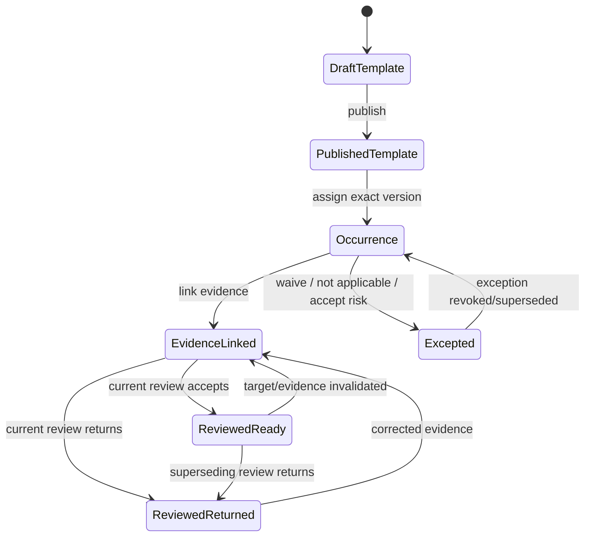
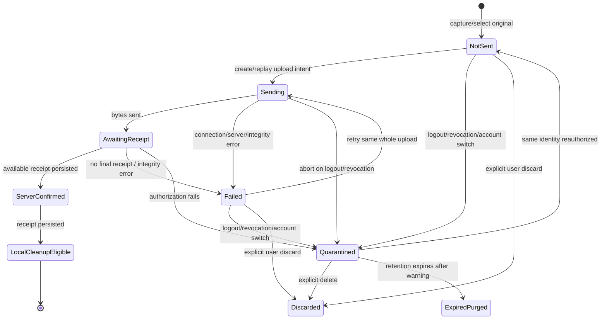

# Execution, requirements, and evidence

**Status:** Approved

**Applies to:** v0.1

**Last reviewed:** 2026-08-03

**Related decisions:** [ADR-001](../decisions/ADR-001-product-boundary.md),
[ADR-002](../decisions/ADR-002-tenancy-parties-and-contracts.md),
[ADR-003](../decisions/ADR-003-evidence-packages-and-acceptance.md),
[ADR-004](../decisions/ADR-004-roadmap-demo-and-documentation.md)

## Actor distinctions

| Actor fact | Meaning |
|---|---|
| Performer party | Organization accountable for performing the work |
| Member assignee | Person expected to act on an assignment; optional in v0.1 |
| Progress recorder | Member who submits measured quantity |
| Evidence recorder | Member who captures/uploads the evidence |
| Source party | Party from which the evidence originated |
| Custodian | Party/member accountable for the authoritative original |
| Internal verifier | Member who decides evidence/requirement readiness |
| System actor | Parser, storage receipt, projection, or delivery worker |

These values may identify the same real person or organization, but the system
records them separately because accountability differs.

Only an authenticated member/service principal with an explicit command
permission is an authorization actor. Performer, source party, custodian,
recorder, and verifier fields preserve provenance/accountability and do not
grant permissions by themselves. System commands are allowlisted and narrowly
scoped; every storage finalization, scan, derivative, or projection action
records its service identity and the originating user command/fact.

## Assignment lifecycle

A work assignment is operational scope, not a copy of the contract row.

Required:

- workspace, project, contract, and work item;
- lifecycle state;
- version for optimistic concurrency.

Optional in v0.1:

- location;
- performer party;
- member assignee;
- planned quantity;
- due date;
- published requirement-template version.

Assignment changes append assignment events or versions where historical
meaning changes. Reassignment does not rewrite earlier progress/evidence actors.

## Progress entries

A root progress measurement records a positive decimal quantity in the work
item's canonical unit. A correction is a signed adjustment that references one
exact root measurement and states the reason.

Rules:

- the root and every adjustment are immutable;
- an adjustment must reference a non-adjustment root in the same
  workspace/assignment/work item;
- adjustments never reference other adjustments, so no predecessor chain,
  branch, cycle, or mutable head exists;
- a mistaken adjustment is offset by another adjustment to the same root;
- effective performed quantity is root quantity plus the sum of all valid signed
  adjustments and is independent of append order;
- an adjustment quantity is always a signed delta, never a replacement;
- multiple adjustments may reference the same root; the remaining negative
  correction bound is the current effective root quantity minus the allocation
  head's single `reserved_quantity` balance;
- effective root quantity and effective assignment/work-item quantity may never
  become negative;
- zero quantity is rejected unless the command has a distinct non-quantity
  meaning;
- precision follows the unit definition;
- concurrent duplicate submission is absorbed by idempotency;
- the root's allocation head is locked for both adjustment and allocation;
- an adjustment that would reduce effective quantity below
  `reserved_quantity` is rejected as a standalone command; reducing returned or
  pending reserved scope uses the atomic corrected-successor command, while
  accepted quantity cannot be reduced in v0.1;
- allocation to package claim segments never exceeds available effective
  quantity.

Adjustment and allocation commands serialize on the same root allocation head,
so concurrent attempts observe one balance. An accepted allocation cannot be
reduced in v0.1. A valid adjustment invalidates derived readiness and unfrozen
draft/candidate validations, but never edits a frozen package. A successor
package is required when active submitted scope must change.

For a negative adjustment that crosses only
`current_unaccepted_reserved_quantity`, the user prepares a deterministic
correction draft. It is not yet a progress fact. The package command then
appends the adjustment and creates/installs the corrected successor in the one
atomic transaction defined in
[Packages and acceptance](packages-and-acceptance.md#atomic-corrected-successor).
This avoids requiring either the adjustment or successor to exist first.

## Requirement lifecycle



The diagram describes a nonterminal current projection, not mutable row states.
New evidence links/corrections, evidence unavailability, superseding internal
decisions, applicability changes, and revoked/superseded exceptions always
recompute the projection. Replacement evidence does not silently revoke a valid
exception; an authorized explicit exception successor/revocation must do that.
`ReviewedReady` and `Excepted` are not terminal facts.

One serialized exception head exists per `(workspace, occurrence,
exception_scope)`; v0.1 uses the whole occurrence as the only exception scope.
Appending an exception or revocation locks the head and requires its expected
version. The successor references the exact prior fact, and a uniqueness
constraint prevents two successors from the same predecessor. Readiness uses
only the head selected by this lineage.

Template publication freezes:

- evidence type and allowed MIME/content rules;
- multiplicity;
- timing;
- severity;
- conditional expression from an allowlist;
- structured form schema;
- who may satisfy, review, or except;
- template hash and version.

An occurrence identifies exact assignment and quantity/location scope. It
remains the obligation identity even as evidence links, decisions, or exceptions
are appended.

## Evidence identity and provenance

An evidence object records:

- immutable content hash and byte size;
- validated media/MIME type and original filename as untrusted metadata;
- immutable storage key and storage provider/region;
- origin method: native camera, photo picker, file picker, form, import, or
  generated derivative;
- recorder, performer, source party, and custodian where applicable;
- device-generated capture identifier;
- claimed capture time with timezone/offset and trust label;
- server receipt time;
- original, derivative, or correction relationship;
- source app version and upload-intent identity;
- malware/content inspection outcome where applicable.

Claimed device time is not authorization proof. Server receipt is not proof of
when the photo was taken. Both are retained and labeled.

EXIF/GPS is untrusted sensitive metadata. It is stored or exposed only under
explicit policy, with consent/permission and retention defined before real
pilot data.

## Native online capture

`apps/mobile` is an Expo/React Native iOS/Android client. v0.1 capture requires
current server authorization at start.



Local requirements:

- original and retry metadata persist in the OS-sandboxed app area;
- pending bytes are encrypted at rest with an installation/account/workspace
  bound key; another identity cannot enumerate or decrypt them;
- state survives an ordinary process/app restart;
- another signed-in identity cannot access the pending original;
- logout/revocation does not silently destroy a pending original; it quarantines
  it for up to seven days under an explicit recovery/deletion policy;
- UI always distinguishes not sent, sending, server-confirmed, failed, and
  quarantined;
- only reauthentication as the same subject in the same workspace may restore
  upload; account switching keeps the item hidden and quarantined;
- permanently revoked scope cannot be uploaded or exported by GoProceed in
  v0.1; the user may explicitly delete it, otherwise the app warns before the
  fixed retention expiry and records only non-content deletion metadata;
- local deletion requires persisted server receipt and integrity match, or an
  explicit user deletion action with warning and audit-safe metadata;
- no new offline capture begins when current authorization cannot be checked.

This protection is not offline task access. v0.3 adds offline authorization,
scope bundles, conflict handling, background sync, and resumable chunks.

## Upload protocol

1. Client calculates hash and byte size locally.
2. Client requests an upload intent with a bounded idempotency key.
3. Server validates actor, assignment, requirement, expected type/size, and
   quota before issuing the destination.
4. Client uploads the whole original without transformation to an uncommitted
   staging key bound to the intent.
5. Finalization verifies the received size and content hash against the
   authorized values inside the same transaction that commits the terminal
   state; it records no separate `integrity_verified` row — the check result is
   consumed in-transaction and only the terminal state is written. Bytes
   sitting under the intent-bound staging key are not evidence and are not
   package-visible until that transaction commits `available`.
6. Server rechecks authorization, scans/inspects according to policy, then
   atomically creates/returns the evidence identity and `available` receipt.
7. Duplicate retry returns the same successful receipt when inputs match.
8. Same idempotency key with different hash/size is a conflict.
9. Integrity mismatch keeps the local original and names the failure.

Server processing states are distinct:

```text
intent_authorized
  ├──→ available
  ├──→ scan_blocked
  ├──→ orphaned_for_purge
  └──→ expired
```

`staged`, `integrity_verified`, and `scan_pending` exist in the enum but are
reserved for the v0.3 resumable protocol; v0.1 writes none of them
(supabase/migrations/0015 permits the values; no code writes them).

`upload_received` is not `evidence_available`. The client may clean up its
original only after the available receipt. Scan-blocked content remains
unavailable for packaging and follows restricted retention/remediation.
Objects orphaned by a failed authorization recheck — pinned to the
`intent_authorized` from-state in both commands that can write it
(`supabase/migrations/0031` and `0035`) — are inaccessible and purged within
24 hours by an idempotent job; purge failures enter an operational alert
queue.

v0.1 does not promise background upload after the OS suspends the app or
resumable chunk transfer.

## Original, derivative, and correction

- Original content is never overwritten.
- Thumbnail/preview is a derivative with its own hash/storage key and source.
- Annotation/redaction is a derivative and never becomes the hidden original.
- Correction is a successor asserting that earlier evidence should not be used
  for a named purpose.
- Review decisions remain attached to what was actually reviewed.
- A package pins the exact evidence objects included at freeze time.
- Storage deletion follows retention/legal policy and never erases domain
  lineage silently.

## Internal review

An internal decision references one immutable `review_target_set`. The set has
one occurrence identity plus normalized `review_target_items`, each identifying
an exact evidence object and/or evidence-requirement link. All rows carry the
same workspace/project/assignment scope through database-enforced composite
references. The set stores a deterministic item-set hash and cannot change after
first use.

The decision records:

- exact review target set;
- exact reviewer and authority;
- outcome;
- reason/issues;
- timestamp and idempotency identity;
- exact superseded decision when replacing a prior outcome.

One `internal_review_head` exists per normalized review target set. A submit
locks the head and supplies its expected version; the new immutable decision
must reference the prior head decision, and a uniqueness constraint forbids
forks from one predecessor. The head advances in the same transaction.
Readiness uses only the head decision for the currently applicable target set;
when evidence/links change, a new target set needs its own review.

Internal outcomes do not accept contractual quantity. They make scope ready or
blocked for packaging.

Readiness is recomputed from:

- current applicable occurrences;
- current evidence links and object availability;
- current internal review decisions;
- current requirement exceptions;
- exact progress quantity/location scope.

## Failure behavior

| Failure | Durable result | User sees |
|---|---|---|
| Camera permission denied | No evidence fact | Permission explanation and file/photo alternative |
| File too large/type blocked | Rejected intent with reason | Exact limit/type message |
| Connection drops before upload | Local `not_sent`/`failed` original retained | Retry action and no success claim |
| Connection drops after bytes sent | Same upload intent can reconcile/retry | “Checking receipt,” then confirmed or retry |
| Hash mismatch | No confirmed evidence object | Integrity failure; original retained |
| Duplicate submit | Same receipt returned | One evidence object, no duplicate |
| Authorization revoked mid-upload | No final acceptance of unauthorized command | Quarantine/re-auth explanation |
| Malware scan blocks file | Evidence unavailable for packaging | Named blocked state and remediation |
| App restarts | Pending state reloaded | Same retry/receipt status |
| Server receipt succeeds but local write fails | Receipt is re-fetched by upload identity | “Checking receipt”; no duplicate upload required |

No failure path reports server-confirmed evidence before the receipt and hash
are durable.
