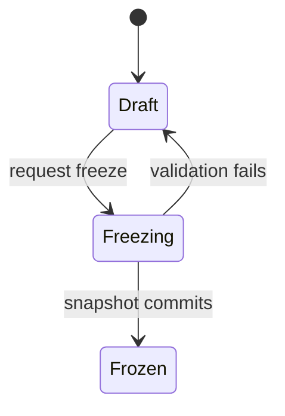

# Packages and acceptance

**Status:** Approved

**Applies to:** v0.1

**Last reviewed:** 2026-07-30

**Related decisions:** [ADR-002](../decisions/ADR-002-tenancy-parties-and-contracts.md),
[ADR-003](../decisions/ADR-003-evidence-packages-and-acceptance.md),
[ADR-004](../decisions/ADR-004-roadmap-demo-and-documentation.md)

## Authority separation

| Concern | Authority |
|---|---|
| Evidence ready for packaging | Current internal review facts and requirement exceptions |
| Exact contents sent | Frozen package version and immutable manifest |
| Who must review what | Pinned approval requirements |
| What external reviewer submitted | Immutable external decision batch |
| Quantity accepted/returned/pending | Projection from exact quantity decisions |
| Evidence accepted/returned | Exact evidence decisions |
| Monetary exposure | Projection from quantity state and contract valuation |

No editable package status or acceptance record may override these authorities.

## Package identity and versions

A package is a stable identity for:

- one workspace;
- one project;
- one contract;
- one package series;
- one reporting period or equivalent scope.

A draft version may change under optimistic concurrency. Freeze is a command
that validates all sources and atomically records an immutable snapshot.



The diagram is the package-version content lifecycle. `Submitted`,
`ActiveForReview`, `SupersededForReview`, and `Completed` are separate
submission/decision projections around immutable content. They are not mutable
columns on frozen source rows.

## Frozen snapshot

Freeze pins:

- contract and published contract version;
- references to the own/customer party snapshots pinned by the contract
  version;
- additional package-only presentation snapshots for project parties that are
  not contract parties, where needed;
- selected work-item versions;
- exact progress entries and allocated quantities;
- requirement occurrences, exceptions, and internal decisions;
- exact evidence objects and content hashes;
- package template version and hash;
- renderer version and configuration;
- approval requirements and policy version;
- author, command, freeze timestamp, and source manifest hash.

If any selected source changes between validation and commit, freeze fails with
a stale-source conflict and the user must refresh the draft.

Generated PDF, XLSX, ZIP, and manifest artifacts identify the same frozen
snapshot. Retries for the same renderer/version return or verify the same
artifact identity. A different renderer creates a distinct artifact; it never
overwrites an earlier key.

## Package lines

A package line contains only acceptance-homogeneous scope:

- one contract work item version;
- one location or equivalent acceptance scope;
- one canonical unit;
- one unit price state/value;
- one currency;
- one tax basis/rate;
- one approval-scope material set.

If any of those differ, the compiler creates another line.

## Claim segments and progress sources

A claim segment is the exact quantity decision target. It stores stable
identity, parent/line lineage, a cross-version claim-scope lineage identity,
canonical quantity, and allocation to exact progress sources.

A claim-scope lineage identifies one contract-local acceptance scope across
package versions. Its immutable definition includes exact progress-source
allocations plus homogeneous location, unit, price, tax, and approval material.
Partition children receive new lineage identities linked to their parent. An
unchanged successor version reuses the lineage identity through a prior
acceptance reference. A materially changed scope receives a new lineage
identity with an optional predecessor link for traceability; it cannot inherit
acceptance.

Initial segment:

```text
line quantity 10.000
└── segment S0: pending 10.000
```

Partial decision of 6.000:

```text
segment S0: partitioned 10.000
├── segment S1: decided scope 6.000
└── segment S2: remaining scope 4.000
```

Partition is one transaction:

1. lock the current pending parent and every affected progress-allocation head
   in stable `(workspace_id, root_progress_entry_id)` order;
2. validate requested quantity precision and bounds;
3. allocate exact progress-source quantities to children;
4. create non-overlapping children;
5. prove child quantities, source allocations, and coupled monetary minor units
   reconcile to the parent;
6. mark parent partitioned in lineage;
7. propagate prior decision coverage to both children without copying or
   changing the prior decisions;
8. attach the new decision only to its exact child segment;
9. commit the decision batch, coverage facts, and partition atomically.

Concurrent attempts on the same parent produce one winner; the other receives a
stale-segment conflict and current children.

### Allocation ledger

An immutable signed `progress_claim_allocation` ledger records reservation,
activation, release, partition, and accepted-reservation movements for each
root progress measurement. A locked `progress_allocation_head` is a
rebuildable balance projection, not the authority.

Every freeze, activation, partition, release, or progress adjustment locks all
affected heads in stable order and proves:

```text
0 <= reserved_quantity <= effective_progress_quantity
```

A `package_scope_head` selects exactly one current package version for a package
series/scope. The first successful freeze locks an empty head, installs that
version as `current_prepared`, and activates its allocations. Later freezes
create candidate successors whose allocations do not contribute to the current
balance or VaR until the head advances.

Advancing the head atomically releases the superseded version's unaccepted
allocations and activates the candidate allocations. Accepted allocations
remain reserved and are reused only through valid prior acceptance references;
they are never allocated a second time or silently released. Every release is
a signed ledger fact referencing the original movement.

The canonical balance term is:

```text
reserved_quantity
  = current_unaccepted_reserved_quantity
  + accepted_reserved_quantity
```

`current_unaccepted_reserved_quantity` includes the current prepared,
submitted-pending, and returned allocations exactly once. Such scope is
released only through the serialized package-head advance described below. A
negative progress adjustment that would cross `reserved_quantity` is rejected.

### Decision coverage after partition

External decisions are immutable and continue to cover the exact quantity they
covered when submitted. If another approver later partitions that segment, a
derived immutable coverage relation maps the earlier decision to every active
descendant whose quantities partition its original target. The earlier
decision is neither copied nor re-submitted.

For example, if approver A accepts `S0 = 10` and approver B later returns `6`,
the transaction creates `S1 = 6` and `S2 = 4`. A's original acceptance covers
both children; B's return covers only `S1`. If B acts first, A may later decide
`S1` and `S2` independently or together through one batch. Both orders produce
the same leaf-level acceptance projection.

Before a quantity decision commits, the server rejects any target that overlaps
quantity already terminally decided by the same approval requirement. An
ancestor decision therefore blocks another decision on its descendants for
that requirement; decisions on disjoint remaining leaves are allowed.

## Approval requirements

Each frozen package version pins one or more requirements with:

- required or observer classification;
- recipient role and intended recipient/contact;
- decision kind: quantity, evidence, or both;
- exact package/line/segment/evidence scope;
- parallel group/policy identity;
- confirmation text version;
- approval-scope hash inputs.

v0.1 supports parallel required approvers and observers. It does not implement a
general sequential workflow engine.

An observer can view only its granted scope and cannot submit a decision.

Freeze fails unless every claim segment is covered by at least one required
quantity approval requirement. Observer-only or evidence-only coverage cannot
make quantity acceptance vacuously true. v0.1 has no
`quantity_approval_not_required` shortcut.

## Protected access

### Grant creation

An external access grant records token hash, credential type
`bearer_email_link`, recipient/contact, exact package version, permissions,
expiry, state, revocation version, and reissue lineage. Raw token is emitted
once for delivery and never stored in logs or database.

The raw token contains 256 bits from a cryptographically secure random source,
encoded base64url without padding. The database stores only a keyed
HMAC-SHA-256 verifier plus key identifier. The initial link expires after seven
days or the package/version is superseded, whichever occurs first.

### Fragment exchange

```text
email URL fragment
→ public same-origin shell GET (fragment not sent)
→ remove fragment with history.replaceState
→ POST raw token in redacted body
→ validate grant/version/scope/expiry/revocation
→ set __Host- HttpOnly + Secure + SameSite=Lax session cookie
→ render exact review scope
```

The page has strict CSP, `Referrer-Policy: no-referrer`, no third-party resource
that can receive the URL, CSRF protection, and no raw-token analytics/tracing.

Exchange is single-use and atomic: one concurrent request consumes the token
and creates one session; later exchange attempts receive a generic invalid-link
response. The session identifier is generated server-side at exchange, rotates
after any privilege/scope revalidation, expires after 30 minutes idle and 12
hours absolute, and carries the grant revocation version and package review
epoch. The cookie has `Path=/` and no `Domain`. Reissue revokes the old grant
and all sessions. Ordinary email-prefetch GET cannot consume access.

Token exchange and decision endpoints are throttled by a privacy-preserving
combination of source network, opaque grant prefix, and package/workspace
bucket. Responses do not disclose whether a recipient, grant, or package
exists. Concurrent session revocation is checked under the same package review
epoch used by decision submission.

The assurance proves link possession, not verified identity or regulated
signature. Self-declared name/company/title and security telemetry are labeled
accordingly.

## Decision submission

One deliberate submit produces one immutable decision batch:

- external session and grant identity;
- package version;
- reviewer claims;
- confirmation-text version;
- submitted-at/server-received-at;
- bounded idempotency key/request hash;
- included quantity decisions;
- included evidence decisions;
- included structured issues;
- receipt identifier/hash.

At commit, server rechecks:

- session/grant active and unexpired;
- revocation version current;
- package version exact and still reviewable;
- approval requirement and target in grant scope;
- CSRF valid;
- segment current and not partitioned/replaced while holding its
  package/segment-lineage head lock;
- idempotency key unused or identical;
- decision completeness and reason requirements.

Same idempotency key and request returns the same receipt. Same key with
different request is rejected.

Decision submission and partition serialize on the same package/segment-lineage
head. If a decision commits first, a later partition propagates its coverage.
If partition commits first, the parent-target decision receives the new leaves
and a stale-segment conflict. Neither interleaving can lose coverage.

A quantity target has at most one terminal decision for the tuple
`(workspace, package_version, approval_requirement, claim_segment)`. An
evidence target has at most one terminal decision for
`(workspace, package_version, approval_requirement, evidence_object,
requirement_occurrence)`. Tenant-safe unique constraints enforce both rules.
Incremental batches may add only previously undecided, non-overlapping targets.
A different idempotency key cannot override a terminal decision and receives
`DECISION_ALREADY_FINAL`. Returned or still-pending scope is corrected through
a successor package version, never through a same-version "current decision"
pointer. v0.1 does not reverse accepted quantity.

## Quantity and evidence outcomes

Quantity decision targets `(approval requirement, claim segment)`.
Evidence decision targets `(approval requirement, evidence object,
requirement occurrence)`.

For a claim segment:

- accepted only if no required quantity requirement covering its active leaf
  has return coverage and every such requirement has either current accept
  coverage or a valid requirement-specific prior acceptance reference;
- returned if any required quantity requirement covering its active leaf has
  return coverage;
- submitted pending if submitted but neither condition above is complete;
- otherwise it remains in its earlier package/readiness state.

Evidence return cannot change quantity or money. If evidence is returned after
quantity acceptance, GoProceed creates a visible compliance exception. An
explicit valid quantity decision is required for monetary change.

## Return, correction, and resubmission

1. Structured issues identify exact quantity/evidence targets.
2. Corrected progress (within the accepted-reservation floor), evidence,
   exception, or review facts append successors. A negative progress correction
   that crosses current unaccepted reservation uses the atomic
   corrected-successor command below.
3. Compiler creates and freezes a new package version.
4. Earlier decisions remain attached to the earlier version forever.
5. Previously accepted unchanged scope is not claimed again.
6. New version may add a prior acceptance reference to the original decision.
7. Reference is valid only when claim-scope lineage, source allocations, and
   approval-scope hash match.
8. Materially changed scope requires a new external decision.

Approval-scope hash includes:

- quantity and unit;
- price, currency, tax basis/rate when quantity decision has monetary meaning;
- evidence/occurrences material to technical approval;
- applicable contract terms;
- approval policy and requirement.

Hash comparison is necessary but not sufficient: source identities and tenant /
contract / package lineage must also match.

A prior acceptance reference uses tenant-safe composite foreign keys to the
original package version, claim segment, approval requirement, and quantity
decision. The reference and original must resolve through the same workspace,
project, contract, and package series. The successor points to the original
decision; it does not create a copied decision row.

Prior acceptance is requirement-specific. For every required quantity
requirement in the successor, the active leaf must have either current accept
coverage or one valid reference to the corresponding earlier accepted
requirement. One earlier approver's reference can never satisfy another
required approver. A new or materially changed requirement always needs a new
decision.

### Accepted-quantity correction boundary

In v0.1, quantity accepted by all required external approvers is final inside
GoProceed. Its original decisions and reservation cannot be reversed, reduced,
or released by a successor package. If the parties later dispute that accepted
quantity, GoProceed records a visible `accepted_quantity_dispute` issue and
exports the original acceptance trail, but acceptance and VaR do not change.
Formal reversal, compensating acceptance, and the associated legal/commercial
authority are a later-version capability, to be designed only after pilot
discovery. They are not simulated with a negative progress adjustment or an
evidence return.

## Package-head advance and concurrency

Freezing a successor creates an immutable candidate but does not close the
current prepared/review version. Making an unsubmitted successor current or
submitting/activating it uses the same serialized head-advance transaction:

1. lock the package-series review head and all affected allocation heads;
2. revalidate source lineage, prior acceptance references, candidate
   allocations, and approval coverage;
3. optionally record the successor submission, set the head state to
   `current_prepared` or `active_for_review`, and increment the package review
   epoch;
4. revoke all grants and sessions for the previous active version;
5. release its pending/returned active allocations;
6. preserve accepted reservations and activate successor allocations without
   double allocation;
7. set the successor as the sole current package version.

A decision racing this transaction has only two valid outcomes. If the decision
commits first, head advance observes and revalidates it. If head advance commits
first, the old decision fails with `REVIEW_VERSION_SUPERSEDED`. No decision can
commit under an old review epoch. There is no separate release-only correction
path that bypasses the head, epoch, grant/session revocation, or allocation
swap.

### Atomic corrected successor

Reducing returned or pending reserved quantity cannot be split into
"adjustment first" or "successor first." GoProceed prepares a deterministic
correction/package payload against expected source hashes, but that draft is not
an authoritative progress fact or frozen package.

One transaction then:

1. locks the package scope head, segment-lineage heads, and affected
   progress-allocation heads in stable order;
2. revalidates the expected source, review epoch, accepted floor, correction
   delta, and complete successor payload;
3. releases only `current_unaccepted_reserved_quantity` from the old head;
4. appends the immutable signed adjustment and proves
   `accepted_reserved_quantity <= new_effective_progress_quantity`;
5. creates the immutable frozen successor snapshot and its candidate
   allocations from that exact post-adjustment state;
6. activates those allocations and installs the successor as
   `current_prepared`;
7. increments the review epoch and revokes old grants/sessions;
8. commits outbox work for artifact rendering and later submission.

Any failure rolls back the adjustment, release, successor, head, revocation,
and outbox together. Accepted reservations are never released by this command.
Concurrent old-version decisions serialize on the same review head and follow
the decision-versus-head-advance rule above.

## Invalid transitions

- frozen content update;
- artifact key overwrite;
- submission of a draft/unfrozen version;
- decision by observer;
- decision through revoked/expired/replaced grant;
- decision against another package version;
- decision on parent segment after partition;
- second or overlapping terminal decision by the same requirement;
- child quantities that do not reconcile;
- evidence decision silently producing quantity decision;
- copying a v1 decision as a v2 decision;
- reducing or releasing accepted quantity in v0.1;
- prior acceptance reference after material scope change;
- decision commit under a superseded package review epoch.

All invalid transitions fail explicitly and leave no partial business result.
