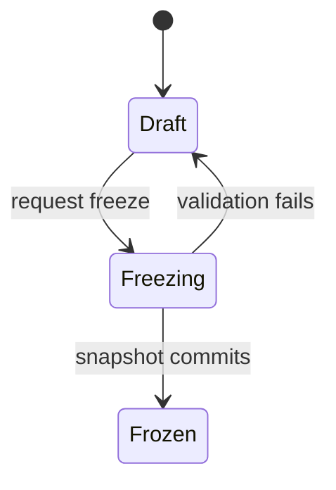

# Packages and acceptance

**Status:** Approved

**Applies to:** v0.2, except the occurrence-scoped external grant and the
occurrence-scoped evidence decision, which are v0.1

**Last reviewed:** 2026-08-08

**Related decisions:** [ADR-002](../decisions/ADR-002-tenancy-parties-and-contracts.md),
[ADR-003](../decisions/ADR-003-evidence-packages-and-acceptance.md),
[ADR-004](../decisions/ADR-004-roadmap-demo-and-documentation.md),
[ADR-005](../decisions/ADR-005-readiness-gate-and-hidden-works.md),
[ADR-006](../decisions/ADR-006-pilot-shaped-v0.1.md),
[ADR-008](../decisions/ADR-008-valuation-carves-at-admission.md)

> **Version note (2026-08-08) — two decisions taken after this document was
> last reviewed. Both change what v0.1 means, and both are recorded in every
> document that states v0.1 scope.**
>
> 1. **The valuation carve happens at admission, not at recording.**
>    [ADR-008](../decisions/ADR-008-valuation-carves-at-admission.md) (Approved,
>    2026-08-07) moves it out of `progress.record` and into the **stage closure**,
>    which is v0.1's admission event. Performed quantity is recorded **unvalued**;
>    only admitted quantity competes for the work item's pool; admission is a
>    deliberate authorised act and not a side effect of measurement (INV-089, P0).
>    Until 2026-08-08 this ADR was named in no document but the glossary.
>    **What is built is not yet what it decided:** `progress.adjust` still carves
>    at measurement time whenever the root already holds an allocation — no
>    closure, `admitted_by_closure_id` NULL — and that is an open P0, not a
>    nuance.
> 2. **The work type's carrier is a column on the work line, and it needed no
>    ADR.** Settled by the owner on 2026-08-08. Migration `0050` adds
>    `public.work_items.work_type_key`, so the requirement-rule predicate's first
>    argument has a left-hand side at last and a **hand-typed** baseline
>    materialises obligations. Two things it did not settle: the **owning
>    entity** — a table that defines the set of work types — still needs an ADR
>    ([glossary.md](glossary.md) «Work type»), so a work type is validated as *a real one* and not as *the
>    right one*; and an **imported** baseline carries no work type at all, which
>    is permanent for the life of that contract version.
>
> **Neither decision is deployed, and neither is anything else.** Migrations
> `0041`–`0050` are ten files written on an uncommitted branch and **none has
> been applied anywhere**. Against applied history (`0001`–`0040`) the runtime is
> **33 tables**, of which **9** are among the 26 that ADR-006 decision 4 builds
> in v0.1. Nothing in this package may be described as green, verified, or
> confirmed working.


> **Version note (2026-08-06) — read this before any section below.**
> [ADR-006](../decisions/ADR-006-pilot-shaped-v0.1.md) decision 5 moves the whole
> package apparatus to **v0.2**: package versions, lines, `package_scope_heads`,
> artifacts, approval requirements, claim segments and their lineage heads, the
> allocation ledger (`progress_allocation_heads`, `valuation_allocations`,
> `progress_claim_allocations`), per-segment partial acceptance, decision
> coverage, prior-acceptance references, structured
> issues, `commercial_decision`, `is_package_eligible`, and
> freeze-refuses-ineligible-scope. This document was labelled `Applies to: v0.1`
> until 2026-08-06 while specifying only those objects, and under
> [docs/README.md](../README.md) §"Source of truth" it sits at precedence
> **level 2** — above the ADRs — so that label made a v0.2 apparatus read as v0.1
> truth. It is corrected here.
>
> **Nothing below is cancelled.** Every object keeps its specification, its DDL
> and its catalog rows, and no migration drops a table for the move. What changes
> is when it is built.
>
> **Three things in this document are v0.1** and are marked where they appear:
> the **occurrence-scoped external access grant** and its session
> ([Grant scope kinds](#grant-scope-kinds), [Fragment exchange](#fragment-exchange)),
> the **occurrence-scoped evidence decision**
> ([Occurrence-scoped evidence decisions — v0.1](#occurrence-scoped-evidence-decisions--v01)),
> and the **immutable decision batch** that is the receipt for that submit
> ([Decision submission](#decision-submission)) — `external_decision_batches`
> entered **v0.1-M5** on 2026-08-06 by owner decision
> ([ADR-006](../decisions/ADR-006-pilot-shaped-v0.1.md) decision 4, amendment
> note), and it is the only object in this document whose version changed after
> the re-cut. Together they are step 5 of v0.1: технічний нагляд opens a personal
> link with no
> account and accepts or returns with a reason. The `LINK_CONFIRMATION` assurance
> and its negative statement are v0.1 too.
>
> **A reading rule for the rest of this document.** Several sentences below still
> say «v0.1» about an object that is now v0.2 — parallel required approvers and
> observers, the accepted-quantity correction boundary, the no-reversal rule, the
> absence of a `commercial_approval_not_required` shortcut. Each of those is a
> statement about **the first version that ships the object it constrains**, and
> that version is now v0.2. None of them describes anything v0.1 does.
>
> **Approved is not deployed, in either version.** The runtime is 33 tables plus
> migrations `0036`–`0040`, which create no table. **No package table exists in
> any migration and no package-finalisation command exists anywhere in the code**
> — `supabase/migrations/0029` finalises an evidence upload, not a package. No
> baseline state or test claim is made by this document.
>
> *(Qualified 2026-08-08 — «deployed» and «written» have come apart, and every sentence above
> is about the first. All of it is still exactly true of the **applied** migrations, `0001`–`0040`,
> which define 33 tables. Migrations `0041`–`0050` are ten files written on an uncommitted branch and
> **applied nowhere**; between them they carry `create table` for **seventeen of the twenty-six** v0.1
> tables, plus every CHECK, trigger, policy and grant the readiness gate is made of. Having DDL is not
> existing, and none of the ten files has ever been executed.)*
>
> **The package half of that sentence is unchanged even so**: `0041`–`0050` build
> the v0.1 gate, the act and the external plane, and **no package table**. Every
> package object in this document is still absent from every file in the tree.

## Authority separation

Every row below except the first two is a **v0.2** concern; in v0.1 there is no
package version to pin anything, and the only external authority is the
технагляд deciding on one requirement occurrence through a personal link.

| Concern | Authority |
|---|---|
| Evidence ready for packaging | Current internal review facts, requirement-occurrence satisfaction, and requirement exceptions |
| Whether scope may be presented at all | Package eligibility predicate over applicable requirement occurrences, stage-closure facts, and internal review heads |
| Why scope was not presented | Frozen `blocked_reason` objects pinned by the package version |
| Exact contents sent | Frozen package version and immutable manifest |
| Who must review what | Pinned approval requirements |
| What external reviewer submitted | Immutable external decision batch |
| Quantity accepted/returned/pending | Projection from exact commercial decisions |
| Evidence accepted/returned | Exact evidence decisions |
| Monetary exposure | Projection from quantity state and contract valuation |

No editable package status or acceptance record may override these authorities.
In particular, eligibility is a projection like readiness: never a column, never
an editable status, always recomputed from current facts. What
[ADR-005](../decisions/ADR-005-readiness-gate-and-hidden-works.md) changes is
that freeze **consumes** it as a precondition instead of using it as a silent
filter.

## Package identity and versions

A package is a stable identity for:

- one workspace;
- one project;
- one contract;
- one package series;
- one reporting period or equivalent scope.

A draft version may change under optimistic concurrency. Freeze is a command
that validates all sources and atomically records an immutable snapshot.



"Validation fails" covers three named and non-interchangeable refusals:
a stale-source conflict (sources moved under the draft), ineligible scope
(evidence obligations unmet — [Package composition and
eligibility](#package-composition-and-eligibility)), and missing approval
coverage ([Approval requirements](#approval-requirements)). Each names a
different remedy and none may be reported as another.

The diagram is the package-version content lifecycle. `Submitted`,
`ActiveForReview`, `SupersededForReview`, and `Completed` are separate
submission/decision projections around immutable content. They are not mutable
columns on frozen source rows.

## Frozen snapshot

Freeze pins:

- contract and published contract version;
- references to the own/customer party snapshots pinned by the contract
  version;
- additional package-only presentation snapshots for project parties that are
  not contract parties, where needed;
- selected work-item versions;
- exact progress entries and allocated quantities;
- the requirement rule-version set bound by the published contract version;
- requirement occurrences with their pinned `rule_version_id`,
  `intervention_type`, and `blocking_scope`, plus exceptions, notice events and
  attendance outcomes, occurrence evidence decisions, and internal decisions;
- stage closures covering the claimed scope, and every unevidenced closure and
  clearance covering it;
- excluded candidate scope with its frozen `blocked_reason` objects;
- statutory act versions carried by this package version. **In v0.1 an act
  version is pinned by its stage closure instead**
  ([ADR-006](../decisions/ADR-006-pilot-shaped-v0.1.md) decision 4.5); from v0.2
  the package version pins it additionally, and v0.2 owes the migration that
  pins the act versions written during the pilot;
- exact evidence objects and content hashes;
- package template version and hash;
- renderer version and configuration;
- approval requirements and policy version;
- author, command, freeze timestamp, and source manifest hash.

The eligibility evaluation is pinned with its inputs, not merely its verdict:
the frozen version can be re-derived and re-defended years later without asking
the runtime what the requirements were at the time.

If any selected source changes between validation and commit, freeze fails with
a stale-source conflict and the user must refresh the draft.

Generated PDF, XLSX, ZIP, and manifest artifacts identify the same frozen
snapshot. Retries for the same renderer/version return or verify the same
artifact identity. A different renderer creates a distinct artifact; it never
overwrites an earlier key.

## Package lines

A package line contains only acceptance-homogeneous scope:

- one contract work item version;
- one location or equivalent acceptance scope;
- one canonical unit;
- one unit price state/value;
- one currency;
- one tax basis/rate;
- one approval-scope material set.

If any of those differ, the compiler creates another line.

## Claim segments and progress sources

A claim segment is the exact commercial-decision target and the exact unit of
package eligibility. It stores stable identity, parent/line lineage, a
cross-version claim-scope lineage identity, canonical quantity, and allocation
to exact progress sources.

A claim-scope lineage identifies one contract-local acceptance scope across
package versions. Its immutable definition includes exact progress-source
allocations plus homogeneous location, unit, price, tax, and approval material.
Partition children receive new lineage identities linked to their parent. An
unchanged successor version reuses the lineage identity through a prior
acceptance reference. A materially changed scope receives a new lineage
identity with an optional predecessor link for traceability; it cannot inherit
acceptance.

Initial segment:

```text
line quantity 10.000
└── segment S0: pending 10.000
```

Partial decision of 6.000:

```text
segment S0: partitioned 10.000
├── segment S1: decided scope 6.000
└── segment S2: remaining scope 4.000
```

Partition is one transaction:

1. lock the current pending parent and every affected progress-allocation head
   in stable `(workspace_id, root_progress_entry_id)` order;
2. validate requested quantity precision and bounds;
3. allocate exact progress-source quantities to children;
4. create non-overlapping children;
5. prove child quantities, source allocations, and coupled monetary minor units
   reconcile to the parent;
6. mark parent partitioned in lineage;
7. propagate prior decision coverage to both children without copying or
   changing the prior decisions;
8. attach the new decision only to its exact child segment;
9. commit the decision batch, coverage facts, and partition atomically.

Concurrent attempts on the same parent produce one winner; the other receives a
stale-segment conflict and current children.

### Allocation ledger

An immutable signed `progress_claim_allocation` ledger records reservation,
activation, release, partition, and accepted-reservation movements for each
root progress measurement. A locked `progress_allocation_head` is a
rebuildable balance projection, not the authority.

Every freeze, activation, partition, release, or progress adjustment locks all
affected heads in stable order and proves:

```text
0 <= reserved_quantity <= effective_progress_quantity
```

A `package_scope_head` selects exactly one current package version for a package
series/scope. The first successful freeze locks an empty head, installs that
version as `current_prepared`, and activates its allocations. Later freezes
create candidate successors whose allocations do not contribute to the current
balance or VaR until the head advances.

Advancing the head atomically releases the superseded version's unaccepted
allocations and activates the candidate allocations. Accepted allocations
remain reserved and are reused only through valid prior acceptance references;
they are never allocated a second time or silently released. Every release is
a signed ledger fact referencing the original movement.

The canonical balance term is:

```text
reserved_quantity
  = current_unaccepted_reserved_quantity
  + accepted_reserved_quantity
```

`current_unaccepted_reserved_quantity` includes the current prepared,
submitted-pending, and returned allocations exactly once. Such scope is
released only through the serialized package-head advance described below. A
negative progress adjustment that would cross `reserved_quantity` is rejected.

### Decision coverage after partition

External decisions are immutable and continue to cover the exact quantity they
covered when submitted. If another approver later partitions that segment, a
derived immutable coverage relation maps the earlier decision to every active
descendant whose quantities partition its original target. The earlier
decision is neither copied nor re-submitted.

For example, if approver A accepts `S0 = 10` and approver B later returns `6`,
the transaction creates `S1 = 6` and `S2 = 4`. A's original acceptance covers
both children; B's return covers only `S1`. If B acts first, A may later decide
`S1` and `S2` independently or together through one batch. Both orders produce
the same leaf-level acceptance projection.

Before a commercial decision commits, the server rejects any target that
overlaps quantity already terminally decided by the same approval requirement.
An ancestor decision therefore blocks another decision on its descendants for
that requirement; decisions on disjoint remaining leaves are allowed.

## Package composition and eligibility

Freeze has two content preconditions. **Eligibility** (this section) refuses
scope whose evidence obligations are unmet. **Approval coverage** (INV-034,
next section) refuses a version that nobody is required to decide. They are
independent, they fail with different named refusals, and neither is a
concurrency error. A draft that fails both is told about both in one response;
the author should not have to fix one blocker to discover the next.

### Candidate scope and the two composition outcomes

The compiler enumerates **candidate scope** for a draft version: effective
performed quantity inside the version's workspace, project, contract, package
series, and period scope that is not already accepted and not reserved by
another active package lineage. Each candidate is acceptance-homogeneous in the
package-line sense above.

Every candidate has exactly one composition outcome:

- **included** — admitted as a claim segment of a package line;
- **excluded** — not admitted, carrying a frozen `blocked_reason` set that
  names why.

There is no third outcome, and compilation may not drop a candidate silently.
Selecting only ready progress and saying nothing about the rest is a filter;
this document requires a refusal plus a record.

### What makes a claim segment eligible

```text
is_package_eligible(segment) ⇔
     ∀ requirement occurrence o applicable to the segment's scope
       with blocking_scope ∈ {blocks_package_inclusion, blocks_both}
       : satisfied(o)
  ∧  no uncleared closure-without-evidence fact covers the segment's scope
  ∧  the current internal review head for the applicable target set accepts
  ∧  every pinned evidence object is in state `available`
```

`satisfied(o)` is defined once, in
[ADR-005](../decisions/ADR-005-readiness-gate-and-hidden-works.md) decision 7,
over `hold`, `witness`, and `review` occurrences and their exception heads.
Eligibility consumes that predicate; it never restates or weakens it.

Three consequences follow directly:

- an occurrence whose `blocking_scope` is `blocks_stage_closure` or `none`
  never affects eligibility. Blocking scope is read from the occurrence, never
  inferred from a severity word at read time;
- a `hold` occurrence can never be made eligible by a `not_applicable`
  exception, because the exception command rejects that kind for `hold`;
- an unevidenced closure makes every claim segment covering its scope
  ineligible with `blocked_reason.code = CLOSED_WITHOUT_ACT`, and only an
  internal reviewer's clearance naming substitute evidence restores
  eligibility. The clearance does not delete the closure fact, and no
  clearance is implied by later evidence arriving on its own.

### What freeze refuses

Freeze evaluates eligibility for every **included** claim segment against
current facts while already holding the package scope head and the affected
allocation heads, in the same stable order used by every other package
transaction. The evaluation is part of the commit, not a preflight the draft
can outrun.

If any included segment is ineligible, freeze fails with
`PACKAGE_SCOPE_INELIGIBLE`, writes no business result, and returns a
**per-segment reason list**. Each entry carries:

- claim segment and claim-scope lineage identity;
- package line, contract work-item version, and location or equivalent scope;
- claimed quantity in the canonical unit;
- the ordered set of `blocked_reason` objects for that segment;
- blocked value by currency as net, tax, and gross minor units, or `unvalued`.

Alongside the list, the refusal reports the sum that would have been included
and the sum that is blocked, separately by currency. A refusal that says only
"not ready" is a helpdesk ticket; a refusal that names the requirement, the
missing evidence, the owed role, and the money is a support surface.

`PACKAGE_SCOPE_INELIGIBLE` is not a stale-source conflict and must never be
reported as one. A stale-source conflict means the draft was built on sources
that have since moved and the remedy is to refresh the draft. An ineligible
segment means the draft is exactly right about scope that may not yet be
presented, and the remedies are to satisfy the requirement, append an
authorized exception, clear the closure with substitute evidence, or exclude
the scope from this version. Freeze never chooses one of those on the author's
behalf, and excluding scope stays a deliberate authoring act.

Nothing here refuses a **fact**. Recording performed quantity, capturing
evidence, recording that a stage was covered, and correcting any of them remain
permitted at all times; the append-only ledger must always be able to record
what actually happened, including what happened wrongly. Eligibility governs
presentation, not reality.

### The block reason object

A block reason is a structured object, not a UI state:

```text
blocked_reason {
  requirement_occurrence_id
  rule_version_id            -- what was agreed, and in which version
  missing_evidence[]         -- by evidence_kind and acceptance_criterion
  awaiting_approver_role     -- who owes the decision
  since                      -- server time the block began
  blocked_value_by_currency  -- net, tax, gross minor units per currency
  code                       -- closed, versioned vocabulary
}
```

The code vocabulary is closed and versioned. It includes at minimum
`ACT_NOT_SIGNED`, `TEST_REPORT_MISSING`, `MATERIAL_CERTIFICATE_MISSING`,
`SUPERVISION_SIGNATURE_MISSING`, `CUSTOMER_MOTIVATED_REFUSAL`,
`NOTICE_PERIOD_NOT_ELAPSED`, and `CLOSED_WITHOUT_ACT`. A free-text code, or a
reason rendered from a template string with no code, is invalid.

Value rules, which are the existing money rules and not new ones:

- blocked value uses the canonical valuation, currency, tax, precision, and
  rounding rules of [Acceptance value at risk](value-at-risk.md). Reports show
  net, tax, and gross separately and there is no cross-currency total;
- **blocked value is attributed once per assignment.** Several unmet
  occurrences on one assignment reference the same assignment-scoped value and
  are deduplicated by assignment when summed, so three missing requirements on
  one work can never inflate the blocked total to three times the money;
- scope whose price state is `missing` appears in the reason list and appendix
  as `unvalued` with its quantity, never as zero;
- a bypassed closure carries the value of the scope it covers under the same
  deduplication rule; it is not a second, separate sum.

### Manifest appendices

Every frozen package version's manifest renders two appendices, assembled only
from facts pinned at freeze:

1. **«Виключені позиції та підстави»** — one row per excluded candidate:
   contract work-item version, location or equivalent scope, quantity in the
   canonical unit, and its ordered `blocked_reason` objects. The appendix ends
   with the sum included and the sum excluded, separately by currency and
   separately as net, tax, and gross, with unvalued scope listed by quantity
   and excluded from the numeric totals.
2. **Unevidenced closures** — a named appendix listing every
   closure-without-evidence fact covering scope inside this version's scope:
   actor, claimed authority, reason code (vocabulary not yet enumerated), the requirement occurrences
   unmet at that moment, whether a clearance exists and who appended it, and
   the value by currency under the same deduplication rule.

Both appendices belong to the immutable manifest and are covered by the source
manifest hash. Omitting a non-empty appendix from a render is a defect, not a
presentation choice: the appendix is what makes the excluded money defensible
in a meeting with the counterparty, and hiding it converts a gate into a claim
nobody can check.

An empty appendix is still rendered, with an explicit "none" line. A silently
absent section and a genuinely empty one must not look alike.

### Prior acceptance and eligibility

Scope admitted to a successor version solely through a valid prior acceptance
reference is **not** re-tested for eligibility. Its approval-scope hash already
proves every approval-material fact is unchanged, and v0.1 cannot reduce
accepted quantity. Evidence invalidated after acceptance produces the visible
compliance exception described below, not a retroactive exclusion.

Scope newly claimed by a successor — including corrected scope after a return,
and scope whose claim-scope lineage changed materially — is a candidate like
any other and is tested like any other.

## Approval requirements

Each frozen package version pins one or more requirements with:

- required or observer classification;
- recipient role and intended recipient/contact;
- decision kind: `commercial_decision`, `evidence_decision`, or both;
- exact package/line/segment/evidence/occurrence scope;
- parallel group/policy identity;
- confirmation text version;
- approval-scope hash inputs.

v0.1 supports parallel required approvers and observers. It does not implement a
general sequential workflow engine.

An observer can view only its granted scope and cannot submit a decision.

Freeze fails unless every claim segment is covered by at least one required
commercial approval requirement. Observer-only or evidence-only coverage cannot
make quantity acceptance vacuously true. v0.1 has no
`commercial_approval_not_required` shortcut.

### Two decisions on a segment, not one

A segment carries two decision kinds with different authorities and different
consequences. They rename ADR-003's external quantity and evidence decisions;
the facts, targets, immutability, terminality, and uniqueness rules elsewhere in
this document are unchanged by the rename.

| Kind | Version | ADR-003 name | Authority | Governs |
|---|---|---|---|---|
| `commercial_decision` | **v0.2** | external quantity decision | замовник / кошторисник — quantity and value | Acceptance and the value-at-risk buckets: accepted, returned, pending |
| `evidence_decision` | **v0.1** | external evidence decision | технагляд / ГІП / internal verifier (**v0.2**) — quality and compliance | Package eligibility from v0.2. In v0.1 it targets one requirement occurrence and releases the `hold` that blocks the stage closure |

**v0.1 has only the evidence half**, so "accepted on quality, disputed on
quantity" is not representable in v0.1 either — a version with no commercial
decision cannot dispute a quantity. That is a stated cost of the re-cut, not a
defect in the model, and the two-decision separation is preserved by naming the
v0.1 decision `evidence_decision` from the first migration.

An `evidence_decision` is a **precondition of admission**, which is a different
moment in time from a monetary effect. A `commercial_decision` moves the money
state and never repairs an unmet evidence obligation. "Accepted on quality,
disputed on quantity" is the most common real outcome, and it is one segment
with two decisions — not one decision carrying two meanings.

Wherever this document previously said "quantity decision" it now says
"commercial decision", and "required quantity approver" is now "required
commercial approver". Nothing about the target grain
`(approval requirement, claim segment)` changes.

## Protected access

### Grant creation

An external access grant records token hash, credential type
`bearer_email_link`, recipient/contact, exact grant scope, permissions,
expiry, state, revocation version, and reissue lineage. Raw token is emitted
once for delivery and never stored in logs or database.

The raw token contains 256 bits from a cryptographically secure random source,
encoded base64url without padding. The database stores only a keyed
HMAC-SHA-256 verifier plus key identifier. For a package-scoped grant, the
initial link expires after seven days or the package/version is superseded,
whichever occurs first.

#### Grant scope kinds

A grant targets exactly one of:

- **one frozen package version** (**v0.2**) — the ordinary case, used for
  commercial and evidence decisions on packaged scope;
- **one requirement occurrence** (**v0.1-M5**) — used when a `hold` requirement,
  or a `witness` requirement from v0.2, names an external `approver_role` and
  must be decidable **before any package version exists**. Without this scope
  kind the model is circular: eligibility would wait for a decision that only
  becomes possible after freeze.

**In v0.1 the occurrence-scoped grant is the only grant there is**, and it is the
whole of step 5. Everything about grant discipline below applies to it unchanged:
hashed token, fragment-only delivery, POST exchange for a short-lived session, no
account and no separately entered code, GET never consumes, and no crossing of a
workspace, project or contract boundary.

Every other property of grants is unchanged: hashed token, fragment-only
delivery, POST exchange for a short-lived session, no account and no separately
entered code, GET never consumes, and no grant crosses a workspace, project, or
contract boundary. An occurrence-scoped grant exposes exactly that occurrence,
its acceptance criterion, its `norm_ref`, and its linked evidence — not the
contract price, not the package, not any other assignment.

An occurrence-scoped link expires after seven days, when the occurrence's
pinned rule version is superseded, or when the occurrence ceases to be
applicable, whichever occurs first. It is not attached to a package review
epoch: a package head advance neither revokes nor extends it, because the
occurrence it names is not part of any package version yet.

### Fragment exchange

```text
email URL fragment
→ public same-origin shell GET (fragment not sent)
→ remove fragment with history.replaceState
→ POST raw token in redacted body
→ validate grant/version/scope/expiry/revocation
→ set __Host- HttpOnly + Secure + SameSite=Lax session cookie
→ render exact review scope
```

The page has strict CSP, `Referrer-Policy: no-referrer`, no third-party resource
that can receive the URL, CSRF protection, and no raw-token analytics/tracing.

Exchange is single-use and atomic: one concurrent request consumes the token
and creates one session; later exchange attempts receive a generic invalid-link
response. The session identifier is generated server-side at exchange, rotates
after any privilege/scope revalidation, expires after 30 minutes idle and 12
hours absolute, and carries the grant revocation version and, for a
package-scoped grant, the package review epoch. An occurrence-scoped session
carries the occurrence's evidence-decision head version instead; it has no
package review epoch because it precedes every package version. The cookie has
`Path=/` and no `Domain`. Reissue revokes the old grant and all sessions.
Ordinary email-prefetch GET cannot consume access.

Token exchange and decision endpoints are throttled by a privacy-preserving
combination of source network, opaque grant prefix, and package/workspace
bucket. Responses do not disclose whether a recipient, grant, or package
exists. Concurrent session revocation is checked under the same package review
epoch used by decision submission.

**v0.1.** The assurance proves link possession, not verified identity or
regulated signature. Self-declared name/company/title and security telemetry are
labeled accordingly. v0.1 names this assurance `LINK_CONFIRMATION` — level 3 of
the assurance ladder in
[hidden-works-content-rules.md](../product/hidden-works-content-rules.md) — and
states plainly, in the review surface and on every printed render that carries
the decision, that it is not an electronic signature. **Every rendered decision
block prints its assurance level**, and a render that cannot state the level of a
decision it carries must not render that decision. Qualified electronic signature
is v0.2 ([ADR-005](../decisions/ADR-005-readiness-gate-and-hidden-works.md),
Explicitly deferred); no v0.1 render may imply it, and the word «підпис» or
«підписано» is never rendered for a record below level 4.

## Decision submission

One deliberate submit produces one immutable decision batch, and this is true of
**both** grant scope kinds: an occurrence-scoped submit precedes every package
version, so the batch carries an exclusive arc — a package version or a
requirement occurrence, never both and never neither — rather than a mandatory
package version. Without that, half the external plane would produce no receipt,
no confirmation-text version and no idempotency record, and the M5 exit gate in
[roadmap.md](../product/roadmap.md) would be unmeetable for it. The batch
records:

- external session and grant identity;
- grant scope: package version, or requirement occurrence;
- reviewer claims;
- confirmation-text version;
- submitted-at/server-received-at;
- bounded idempotency key/request hash;
- included commercial decisions;
- included evidence decisions;
- included structured issues;
- receipt identifier/hash.

At commit, server rechecks:

- session/grant active and unexpired;
- revocation version current;
- grant scope kind matches every submitted target kind;
- package version exact and still reviewable, for a package-scoped grant;
- occurrence applicable and its pinned rule version current, for an
  occurrence-scoped grant;
- approval requirement and target in grant scope;
- CSRF valid;
- segment current and not partitioned/replaced while holding its
  package/segment-lineage head lock;
- idempotency key unused or identical;
- decision completeness and reason requirements.

Same idempotency key and request returns the same receipt. Same key with
different request is rejected.

Decision submission and partition serialize on the same package/segment-lineage
head. If a decision commits first, a later partition propagates its coverage.
If partition commits first, the parent-target decision receives the new leaves
and a stale-segment conflict. Neither interleaving can lose coverage.

A commercial target has at most one terminal decision for the tuple
`(workspace, package_version, approval_requirement, claim_segment)`. A
package-scoped evidence target has at most one terminal decision for
`(workspace, package_version, approval_requirement, evidence_object,
requirement_occurrence)`. Tenant-safe unique constraints enforce both rules.
Incremental batches may add only previously undecided, non-overlapping targets.
A different idempotency key cannot override a terminal decision and receives
`DECISION_ALREADY_FINAL`. Returned or still-pending scope is corrected through
a successor package version, never through a same-version "current decision"
pointer. v0.1 does not reverse accepted quantity.

### Occurrence-scoped evidence decisions — v0.1

**This section and the occurrence-scoped grant above are the v0.1 half of this
document.** The v0.1 decision is **named `evidence_decision` from the first
migration**, so adding `commercial_decision` in v0.2 is additive and no v0.1
record has to be reinterpreted
([ADR-006](../decisions/ADR-006-pilot-shaped-v0.1.md) decision 5).

**An occurrence-scoped submit records a decision batch.**
`external_decision_batches` entered **v0.1-M5** on 2026-08-06 by owner decision
([ADR-006](../decisions/ADR-006-pilot-shaped-v0.1.md) decision 4, amendment
note), in the exclusive-arc shape described in
[Decision submission](#decision-submission); it carries the receipt, the
confirmation-text version and the idempotency record, and the M5 exit gate that
requires an immutable receipt is met by it. The requirement is not optional:
`requirement_evidence_decisions` carries a CHECK that admits an externally
submitted decision only with a `decision_batch_id` and an internal one only
without (`technical/database/schema-v0.1.sql:1278-1283`), and
`relationship-catalog.csv` records the same rule on the `recorded_in` edge. What
stays v0.2 is the commercial decision, the issue rows and the coverage relation
recorded against a batch.

An `evidence_decision` submitted through an occurrence-scoped grant has no
package version, so it cannot use the terminal-per-version rule. It is
append-only and head-shaped instead: one evidence-decision head exists per
`(workspace, requirement_occurrence, approver_role)`. A submit locks the head,
supplies its expected version, references the prior head decision, and advances
the head in the same transaction — the same lineage discipline as the internal
review head and the exception head. A uniqueness constraint forbids two
successors from one predecessor.

Head shape is what the eligibility predicate requires: it speaks of a *current*
accepting decision and *no current* return, so a return must be supersedable by
a later acceptance once corrected evidence exists. Without that, one early
return would make scope permanently unpresentable.

The two evidence-decision shapes never collide. They have different scope
kinds, different constraints, and different lifetimes, and neither may be
rendered, exported, or counted as the other.

## Commercial and evidence outcomes

A commercial decision targets `(approval requirement, claim segment)`.
A package-scoped evidence decision targets `(approval requirement, evidence
object, requirement occurrence)`. An occurrence-scoped evidence decision
targets `(requirement occurrence, approver_role)` and names **no approval
requirement at all** — approval requirements are pinned to a package version,
and this scope exists before any package version does. Its role is pinned from
the occurrence's own `approver_role` and is never typed into the decision. That
is the same grain as its head, `(workspace, requirement_occurrence,
approver_role)`.

For a claim segment:

- accepted only if no required commercial requirement covering its active leaf
  has return coverage and every such requirement has either current accept
  coverage or a valid requirement-specific prior acceptance reference;
- returned if any required commercial requirement covering its active leaf has
  return coverage;
- submitted pending if submitted but neither condition above is complete;
- otherwise it remains in its earlier package/readiness state.

Evidence return cannot change quantity or money. If evidence is returned after
quantity acceptance, GoProceed creates a visible compliance exception. An
explicit valid commercial decision is required for monetary change.

An evidence return does change **eligibility** for scope that is not yet
commercially accepted: the occurrence stops being satisfied, so every claim
segment covering that scope becomes ineligible and cannot enter a later package
version until the requirement is satisfied again or an authorized exception is
appended. That is a presentation effect, not a monetary one, and the difference
between the two is the entire reason the decisions are separate.

## Return, correction, and resubmission

1. Structured issues identify exact commercial/evidence targets.
2. Corrected progress (within the accepted-reservation floor), evidence,
   exception, or review facts append successors. A negative progress correction
   that crosses current unaccepted reservation uses the atomic
   corrected-successor command below.
3. Compiler creates and freezes a new package version.
4. Earlier decisions remain attached to the earlier version forever.
5. Previously accepted unchanged scope is not claimed again.
6. New version may add a prior acceptance reference to the original decision.
7. Reference is valid only when claim-scope lineage, source allocations, and
   approval-scope hash match.
8. Materially changed scope requires a new external decision.

Step 3 is subject to eligibility. Scope newly claimed by the successor — the
corrected scope, and anything returned that has since been remedied — must be
eligible at the moment of freeze, or freeze refuses it exactly as it refuses
any other ineligible segment. A return that was caused by missing evidence is
therefore cleared by supplying the evidence, not by re-freezing the same claim.

Approval-scope hash includes:

- quantity and unit;
- price, currency, tax basis/rate when the commercial decision has monetary
  meaning;
- evidence/occurrences material to technical approval;
- applicable contract terms;
- approval policy and requirement.

Hash comparison is necessary but not sufficient: source identities and tenant /
contract / package lineage must also match.

A prior acceptance reference uses tenant-safe composite foreign keys to the
original package version, claim segment, approval requirement, and quantity
decision. The reference and original must resolve through the same workspace,
project, contract, and package series. The successor points to the original
decision; it does not create a copied decision row.

Prior acceptance is requirement-specific. For every required commercial
requirement in the successor, the active leaf must have either current accept
coverage or one valid reference to the corresponding earlier accepted
requirement. One earlier approver's reference can never satisfy another
required approver. A new or materially changed requirement always needs a new
decision. A prior acceptance reference carries commercial acceptance only; it
never substitutes for an evidence decision on newly claimed scope.

### Accepted-quantity correction boundary

In v0.1, quantity accepted by all required external approvers is final inside
GoProceed. Its original decisions and reservation cannot be reversed, reduced,
or released by a successor package. If the parties later dispute that accepted
quantity, GoProceed records a visible `accepted_quantity_dispute` issue and
exports the original acceptance trail, but acceptance and VaR do not change.
Formal reversal, compensating acceptance, and the associated legal/commercial
authority are a later-version capability, to be designed only after pilot
discovery. They are not simulated with a negative progress adjustment or an
evidence return.

## Package-head advance and concurrency

Freezing a successor creates an immutable candidate but does not close the
current prepared/review version. Making an unsubmitted successor current or
submitting/activating it uses the same serialized head-advance transaction:

1. lock the package-series review head and all affected allocation heads;
2. revalidate source lineage, prior acceptance references, candidate
   allocations, approval coverage, and the eligibility of every included claim
   segment;
3. optionally record the successor submission, set the head state to
   `current_prepared` or `active_for_review`, and increment the package review
   epoch;
4. revoke all grants and sessions for the previous active version;
5. release its pending/returned active allocations;
6. preserve accepted reservations and activate successor allocations without
   double allocation;
7. set the successor as the sole current package version.

A decision racing this transaction has only two valid outcomes. If the decision
commits first, head advance observes and revalidates it. If head advance commits
first, the old decision fails with `REVIEW_VERSION_SUPERSEDED`. No decision can
commit under an old review epoch. There is no separate release-only correction
path that bypasses the head, epoch, grant/session revocation, or allocation
swap.

Scope that became ineligible between freeze and head advance — evidence
withdrawn, an exception revoked, a closure recorded without evidence — fails
the advance with `PACKAGE_SCOPE_INELIGIBLE` and its per-segment reason list.
The candidate stays frozen and unpresented; the remedy is a corrected successor,
not a weakened advance. Presenting scope the product already knows is blocked is
the exact failure the gate exists to prevent, and it is worse at submission time
than at freeze time.

### Atomic corrected successor

Reducing returned or pending reserved quantity cannot be split into
"adjustment first" or "successor first." GoProceed prepares a deterministic
correction/package payload against expected source hashes, but that draft is not
an authoritative progress fact or frozen package.

One transaction then:

1. locks the package scope head, segment-lineage heads, and affected
   progress-allocation heads in stable order;
2. revalidates the expected source, review epoch, accepted floor, correction
   delta, eligibility of every claim segment in the successor payload, and the
   completeness of that payload;
3. releases only `current_unaccepted_reserved_quantity` from the old head;
4. appends the immutable signed adjustment and proves
   `accepted_reserved_quantity <= new_effective_progress_quantity`;
5. creates the immutable frozen successor snapshot and its candidate
   allocations from that exact post-adjustment state;
6. activates those allocations and installs the successor as
   `current_prepared`;
7. increments the review epoch and revokes old grants/sessions;
8. commits outbox work for artifact rendering and later submission.

Any failure rolls back the adjustment, release, successor, head, revocation,
and outbox together. Accepted reservations are never released by this command.
Concurrent old-version decisions serialize on the same review head and follow
the decision-versus-head-advance rule above.

## Invalid transitions

- frozen content update;
- artifact key overwrite;
- submission of a draft/unfrozen version;
- decision by observer;
- decision through revoked/expired/replaced grant;
- decision against another package version;
- decision through a grant whose scope kind does not match the target kind;
- decision on parent segment after partition;
- second or overlapping terminal decision by the same requirement;
- child quantities that do not reconcile;
- an `evidence_decision` silently producing a `commercial_decision`;
- copying a v1 decision as a v2 decision;
- reducing or releasing accepted quantity in v0.1;
- prior acceptance reference after material scope change;
- decision commit under a superseded package review epoch;
- freezing a version whose draft still includes an ineligible claim segment;
- filtering ineligible scope out of a draft instead of refusing the freeze;
- reporting `PACKAGE_SCOPE_INELIGIBLE` as a stale-source or stale-segment
  conflict, or the reverse;
- rendering a manifest that omits a non-empty excluded-scope or
  unevidenced-closure appendix;
- restoring eligibility after a closure without evidence by anyone other than
  an internal reviewer, or without naming substitute evidence;
- deleting, editing, or superseding an unevidenced closure fact in place — a
  clearance is appended beside it, never over it;
- marking a `hold` occurrence not applicable in order to make scope eligible;
- summing blocked value across currencies, or counting one assignment's blocked
  value once per unmet requirement.

All invalid transitions fail explicitly and leave no partial business result.
