# Landing: full parity with the approved Daylight prototype (except Lenis) — gate evidence

## Rulings taken in brainstorming (2026-09-06) — spec §2, verbatim

| # | Question | Ruling |
|---|---|---|
| R1 | Motion library | **`motion/react` inside the vocabulary; no GSAP, no Lenis.** Smooth scroll stays `scroll-behavior: smooth`. Reasons: a second animation runtime means a second set of durations and curves outside tokens; Lenis replaces native scrolling and breaks anchors, touch and assistive tech for an effect visible only on a mouse wheel |
| R2 | Scope | **Everything the final `index.html` performs, except Lenis.** This overrides the finer-grained answers given earlier in the same session (scroll-linked budget, hero-only ambient, magnetic-only pointer motion): the file is the list |
| R3 | Rules | The motion rules and F7 are **amended by dated corrections** to match R2 (§8), not bypassed with an exclusion |
| R4 | Headings | Per-line mask reveal (SplitText `lines`) becomes a new primitive `LineReveal`; not `TextBlurIn`, not a whole-block `Reveal` |
| R5 | Route | Restore the sticky stack's scale + veil scrub, the UI panel parallax **and** the five tinted media grounds with their glow |
| R6 | Pulse | Page-wide, as the file does it (follows from R2) |
| R7 | Background Paths | Not built — absent from the final file (§1.1) |
| R8 | Approach | Extend the vocabulary (§4), not a landing-local `motion/react` escape hatch. The alternative would have made rule 5 an exception and the vocabulary a suggestion |
| R9 | Design | Approved as presented; this document is that design |

## Block by block — decisions (spec §3, «Decision» column)

| # | Block | Decision |
|---|---|---|
| 0 | Header `nav.tsx` | **parity — no change** |
| 1a | Hero copy `hero.tsx` | h1 → `LineReveal`; the rest `Reveal size="stately"` |
| 1b | Product frame `product-frame.tsx` | keep; `Reveal` gains `x`; sizes → `grand` |
| 1c | Depth layers | new **`Depth`** on the three layers |
| 1d | Board | beam → infinite, from load; counters/cards keep, durations → tokens |
| 1e | Idle drift | CSS `gp-drift` keyframes, three phase utilities, `ease.soft` |
| 1f | Board tilt | new **`Tilt area="section"`** around the board |
| 1g | Pulse | `Chip pulse` on every `.tag.rv`: the board's two review cards and the Фіксація «пілот» chip. Not the receipt's state row (text, no dot) and not the route window's «на розгляді» tag — that one is `.tg.rv` (l.545), which the prototype does not pulse |
| 2 | Sources `sources.tsx` | **parity — no change** |
| 3a | Problem statement `problem.tsx` | `ScrollTint` switches to **opacity .14→1** |
| 3b | Рис. 01 `fig-01.tsx` | **parity — no change** |
| 4 | Було / стало `compare.tsx`, `Compare.tsx` | `Reveal x` on each card; checks via `Stagger step="loose"` + a `scale` `StaggerItem`; new **`shadow.float-accent`** token on `now` |
| 5 | Ролі `roles.tsx`, `FeatureGrid.tsx` | `Stagger` per cell; `Tilt` inside `FeatureCell` |
| 6 | Маршрут `route.tsx` | new **`ScrollStack` / `ScrollStackCard` / `ScrollStackMedia`**; CSS `media-tint-1…5` + `media-glow-*`; t1 keeps the blueprint photo |
| 7 | Позиція `position.tsx` | `ScrollTint` (second use) with `dimUntil` for the prefix; pills `Stagger` |
| 8 | Фіксація `capture.tsx`, `SpotlightCard` | `Tilt` in `SpotlightCard`; CSS `gp-flow` on the three paths |
| 9 | Походження `provenance.tsx` | `Stagger` per cell (`stately`) |
| 10 | Пілот `pilot.tsx`, `Stepper.tsx` | new **`ScrollProgress`**; `Stepper` reads it instead |
| 11 | FAQ `faq.tsx`, `Accordion.tsx` | `duration-deliberate ease-emphatic` on the panel and the marker |
| 12 | CTA `cta.tsx` | `LineReveal`; `Reveal` |
| 13 | Footer | **parity — no change** |
| all | Buttons `Button.tsx` | CSS hover lift on `Button`; new **`Magnetic`** wrapping every `Button` and `Pill` link |
| all | Section headings `section-head.tsx` | `LineReveal` |

## The harness change (Task 17)

`apps/landing/qa/landing.mjs`:

1. **`beamPixels()`** no longer waits for `data-settled="true"` before screenshotting the `.beam` element — the ring runs from first paint now (spec §5.1), so the wait is now purely "the frame is scrolled into view", not "the frame has settled".
2. **New `parity()` pass** after the beam measurement: two fresh pages (1440 wide, 390 narrow) query the DOM directly for the facts the seven-width screenshots cannot show — depth layers moving with scroll, tilt/magnetic attribute counts by width, the route's `data-scroll-stack` state, the pilot stepper's scroll-driven `--gp-progress`, and the pulsing/flowing element counts.
3. **Bug found and fixed while wiring the pilot-stepper check**: the first run measured `stepperProgress: 0` against an expected `>= 0.99`, while every other parity count already matched exactly (`depthMoves: true`, `tiltOnWide: 8`, `magneticOnWide: 7`, `stackOnWide: "on"`, `pulsing: 3`, `flowing: 3`, `tiltOnNarrow: 0`, `depthFlatNarrow: true`, `stackOnNarrow: "off"`). Debugging in the page (`document.querySelector` + `getBoundingClientRect`, per the brief's "the DOM is the truth") showed `window.scrollY` landing at only `400` after `#pilot.scrollIntoView({block:"end"})` followed by `window.scrollBy(0, 400)` — nowhere near the pilot section, ~10,800px down a ~13,100px-tall page. `html { scroll-behavior: smooth }` (`apps/landing/app/globals.css`) is deliberate (R1), but it means the second scroll call interrupts the first animation mid-flight: its delta is added to wherever the smooth scroll happened to be a tick later (still near 0), not to the animation's target. This is a bug in the **harness's own scroll sequencing**, not in the app (smooth scroll is intended) and not in the `>= 0.99` expectation (arithmetic is fine once the page actually reaches the pilot section — confirmed by jumping there directly, which reads `1.0000`). Fixed by replacing the two-call `scrollIntoView` + `scrollBy` with one `evaluate` that computes the absolute scroll target from `getBoundingClientRect()` and jumps with `window.scrollTo({top, behavior: "instant"})`, which explicitly overrides the CSS `scroll-behavior` (the plain two-argument `scrollTo(x, y)` form used elsewhere in the file does not override it, but those checks only need *some* delta, not a 10,000+px landing, so an incomplete smooth animation after the wait does not matter there).
4. `parityOk` folded into `allOk`, so a parity regression fails `pnpm --filter @goproceed/landing qa`.

## The gate — eight commands, in order

### 1. `pnpm --filter @goproceed/tokens generate`

```
wrote /Users/akisliy/Downloads/GoProceed/.claude/worktrees/landing-parity/packages/ui/src/tokens.generated.css
wrote /Users/akisliy/Downloads/GoProceed/.claude/worktrees/landing-parity/packages/ui/src/theme.generated.css
wrote /Users/akisliy/Downloads/GoProceed/.claude/worktrees/landing-parity/packages/tokens/src/tokens.generated.ts
wrote /Users/akisliy/Downloads/GoProceed/.claude/worktrees/landing-parity/packages/tokens/src/tokens.dtcg.json
wrote /Users/akisliy/Downloads/GoProceed/.claude/worktrees/landing-parity/packages/testing/qa/palette.generated.mjs — 59 approved triplets
wrote /Users/akisliy/Downloads/GoProceed/.claude/worktrees/landing-parity/docs/design/01-tokens.md
wrote /Users/akisliy/Downloads/GoProceed/.claude/worktrees/landing-parity/packages/ui/src/tw-merge.generated.ts
```

No diff against the tree (`tokens.json` unchanged by this task) — `git status` after this step showed only `apps/landing/qa/landing.mjs` modified.

### 2. `node packages/testing/qa/motion-audit.mjs`

```
motion-audit: clean
```

### 3 (original). `pnpm --filter @goproceed/testing test`

**DB-suite hang — local Supabase stack off.** `m1-schema` (10 tests, 30.9s), `rls` (5 tests, 30.3s) and `m1-rls-workspace` (8 tests, 30.4s) passed against real timeouts, then the run hung on the remaining DB-bound suites (`m2-*`, `telegram-*`, `privileges`, `truncate-privilege`) and was killed after the 600s foreground budget. Per the brief, ran the filesystem suites explicitly instead.

### 3 (substitution). `pnpm --filter @goproceed/testing exec vitest run motion-audit motion-contract token-fidelity palette-derivation contrast primitive-leak component-contract tw-merge app-entry copy-catalog-fidelity error-catalog-fidelity status-label-fidelity`

```
 ✓ src/token-fidelity.test.ts (15 tests) 289ms
 ✓ src/motion-audit.test.ts (15 tests) 125ms
 ✓ src/app-entry.test.ts (4 tests) 57ms
 ✓ src/primitive-leak.test.ts (2 tests) 34ms
 ✓ src/component-contract.test.ts (19 tests) 17ms
 ✓ src/error-catalog-fidelity.test.ts (1 test) 7ms
 ✓ src/tw-merge.test.ts (7 tests) 5ms
 ✓ src/copy-catalog-fidelity.test.ts (4 tests) 5ms
 ✓ src/contrast.test.ts (80 tests) 4ms
 ✓ src/motion-contract.test.ts (7 tests) 3ms
 ✓ src/palette-derivation.test.ts (12 tests) 3ms
 ✓ src/status-label-fidelity.test.ts (2 tests) 3ms

 Test Files  12 passed (12)
      Tests  168 passed (168)
```

CI runs with the full Supabase stack, where the DB-bound suites are expected to pass as before — this task touches no schema, RLS, grant or migration code.

### 4. `pnpm turbo run typecheck`

```
 Tasks:    10 successful, 10 total
Cached:    9 cached, 10 total
  Time:    1.613s
```

### 5. `pnpm --filter @goproceed/landing build`

```
▲ Next.js 16.3.1 (Turbopack)
✓ Compiled successfully in 901ms
  Running TypeScript ...
  Finished TypeScript in 1959ms ...
✓ Generating static pages using 11 workers (10/10) in 464ms

Route (app)
┌ ƒ /
├ ƒ /_not-found
├ ƒ /api/pilot
├ ○ /apple-icon.png
├ ○ /icon.png
├ ƒ /kitchen-sink
├ ƒ /kitchen-sink/components
└ ƒ /og
```

### 6. `pnpm --filter @goproceed/landing test`

```
 Test Files  12 passed (12)
      Tests  127 passed (127)
```

### 7. `pnpm --filter @goproceed/landing qa`

First run (before the stepper-scroll fix above), for the record:

```
parity: PROBLEM {"depthLayers":3,"depthMoves":true,"tiltOnWide":8,"magneticOnWide":7,"stackOnWide":"on","stepperProgress":0,"pulsing":3,"flowing":3,"tiltOnNarrow":0,"depthFlatNarrow":true,"stackOnNarrow":"off"}
landing qa: PROBLEMS — see qa-output/report.json
```

Final run, after the fix:

```
1920px: ok scrollWidth=1920 wide=0 errors=0 settledAtLoad=false
1440px: ok scrollWidth=1440 wide=0 errors=0 settledAtLoad=false
1240px: ok scrollWidth=1240 wide=0 errors=0 settledAtLoad=false
1024px: ok scrollWidth=1024 wide=0 errors=0 settledAtLoad=false
768px: ok scrollWidth=768 wide=0 errors=0 settledAtLoad=false
390px: ok scrollWidth=390 wide=0 errors=0 settledAtLoad=n/a
360px: ok scrollWidth=360 wide=0 errors=0 settledAtLoad=n/a
reduced 1440px: ok scrollWidth=1440 wide=0 errors=0 settledAtLoad=true
reduced 390px: ok scrollWidth=390 wide=0 errors=0 settledAtLoad=true
border beam at 1440 (full motion): ok paintedPixels=604 floor=200
parity: ok {"depthLayers":3,"depthMoves":true,"tiltOnWide":8,"magneticOnWide":7,"stackOnWide":"on","stepperProgress":1,"pulsing":3,"flowing":3,"tiltOnNarrow":0,"depthFlatNarrow":true,"stackOnNarrow":"off"}
wrote public/og.png
landing qa: ok
```

### 8. `pnpm validate:canonical-docs`

```
canonical documentation: OK
```

## Parity JSON — `qa-output/report.json`, final run

```json
{
  "parity": {
    "depthLayers": 3,
    "depthMoves": true,
    "tiltOnWide": 8,
    "magneticOnWide": 7,
    "stackOnWide": "on",
    "stepperProgress": 1,
    "pulsing": 3,
    "flowing": 3,
    "tiltOnNarrow": 0,
    "depthFlatNarrow": true,
    "stackOnNarrow": "off"
  },
  "beamPixels": 604
}
```

Every count matches spec 2026-09-06 §9's expectation: `depthLayers` 3 and `depthMoves` true (receipt, CL pill, supervision pill all move with the scroll); `tiltOnWide` 8 (board + 4 role cells + 3 channel cards); `magneticOnWide` 7 (pill + 2 hero buttons + 2 CTA + 2 pilot-form buttons — the header button is not magnetic); `stackOnWide` `"on"`; `stepperProgress` 1 (≥ 0.99, past the pilot section); `pulsing` 3 (two board review cards + the «пілот» chip); `flowing` 3 (the capture section's three converging dashed paths); at 390: `tiltOnNarrow` 0, `depthFlatNarrow` true, `stackOnNarrow` `"off"`.

## Before / after

Before: `db7ba8c` (`origin/main` at spec time). After: this branch, HEAD at commit time below.

| Pair | Before | After | What changed |
|---|---|---|---|
| Hero fold | 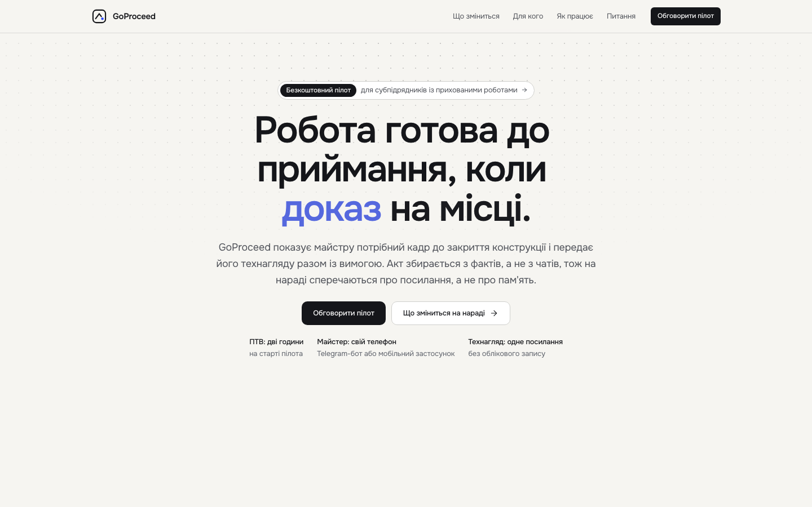 |  | Pixel-identical at rest — the hero's `LineReveal`, `Depth` and idle drift are scroll/time-driven and settle to the same static frame; the difference is in motion, not layout (see the parity JSON above and the pills pair below). |
| Board with pills (clearest static difference) | 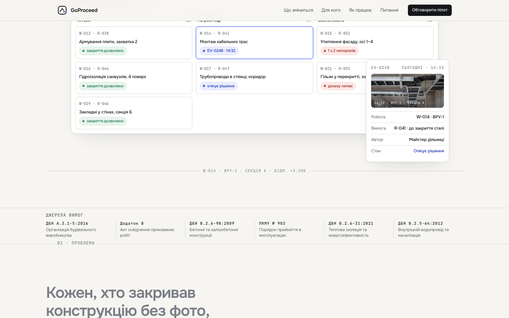 | 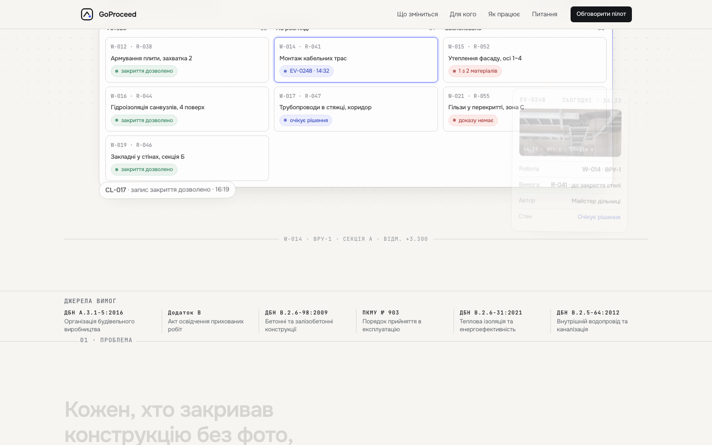 | Before — no pills (boxless `Stagger`, never intersected); after — the CL-017 pill at the board's bottom-left corner (the second pill sits above the board, outside this frame), the receipt mid-entrance at the bottom-right. |
| Route section, card 01 (blueprint) |  | 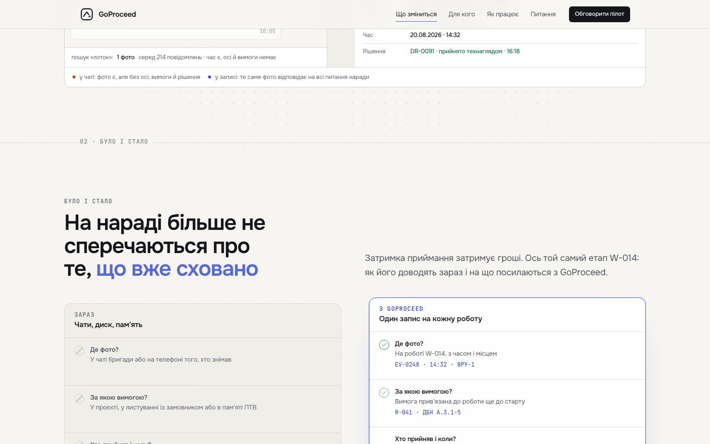 | Both land on the «Було / стало» (compare) section at this scroll offset — pixel-identical, since compare's `ScrollTint`/`Reveal` choreography also settles to a static end frame. The route section itself is one step further down; see the next pair. |
| Route section, card 01 (blueprint), later scroll offset | 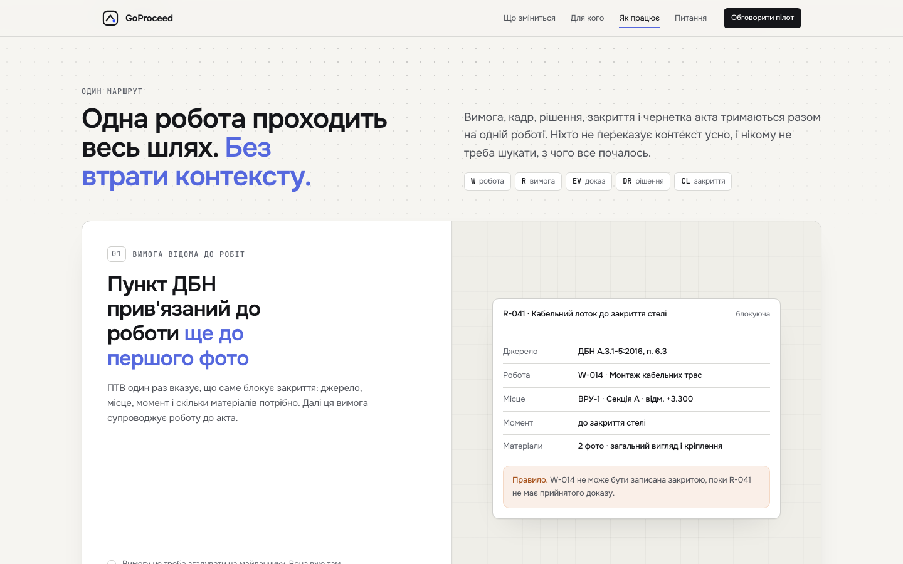 | 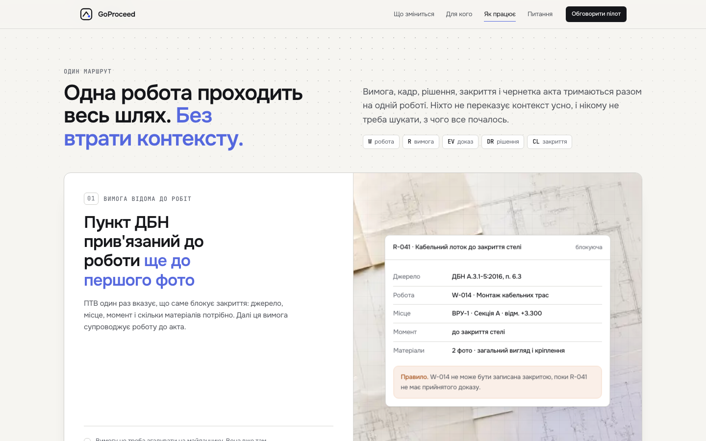 | **Visible static difference.** Before: the route card's media half is a plain light panel. After: the restored `ScrollStackMedia` renders the tinted blueprint photo (`media-tint-1` + `media-glow media-glow-cobalt`) behind the card content — R5's "five tinted media grounds with their glow." |
| Capture section (Фіксація) | 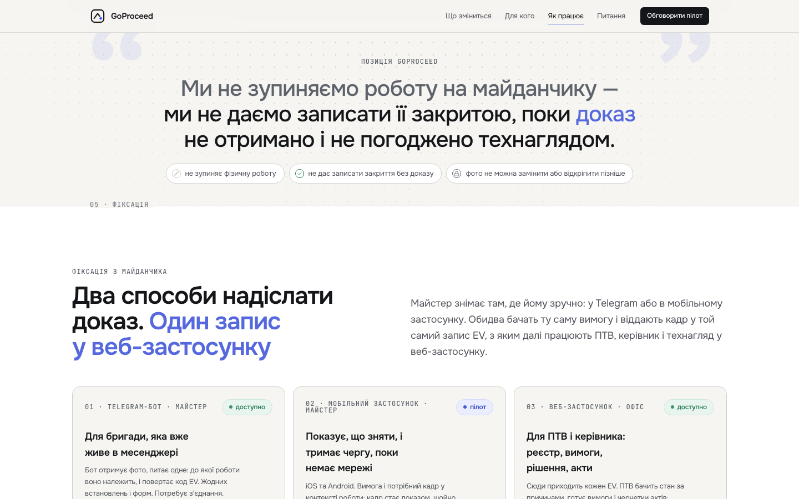 | 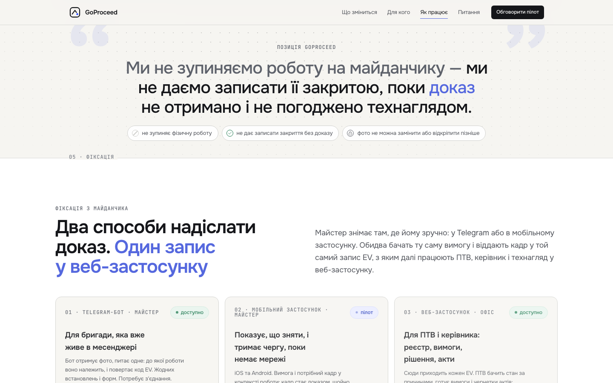 | Pixel-identical at rest — the three channel cards' `Tilt` is pointer-driven and the converging dashed paths' `gp-flow` is a running stroke-offset animation; both settle to the same static frame when idle. |
| Mobile hero, 390 | 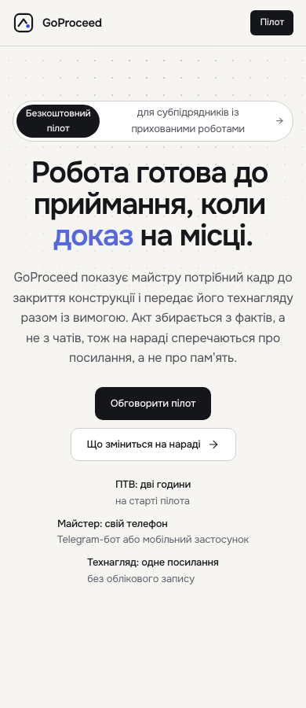 | 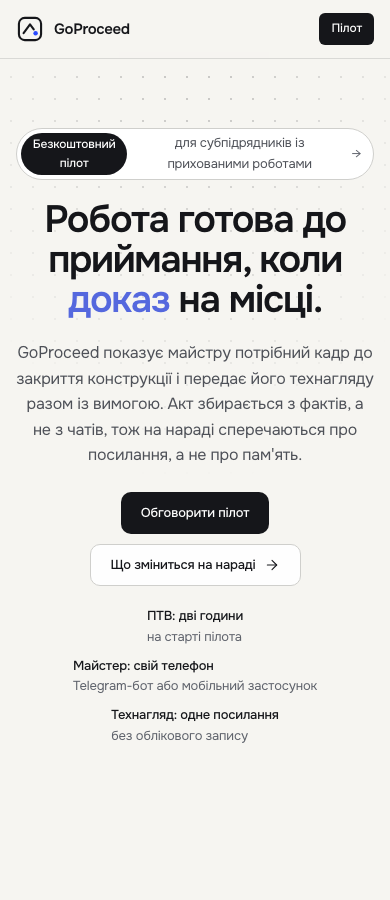 | Pixel-identical — parity's mobile rule is that tilt and depth are *absent* (`tiltOnNarrow: 0`, `depthFlatNarrow: true`) and the stack is plain (`stackOnNarrow: "off"`), so mobile is deliberately where before and after should look the same. |
| Reduced motion, 1440 hero |  | 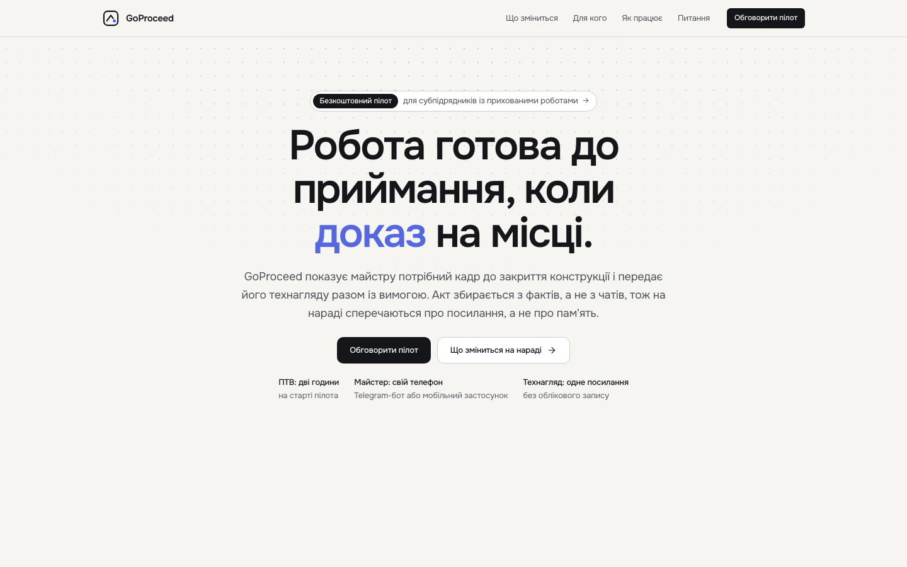 | Pixel-identical — reduced motion's contract (rule in `packages/ui/src/base.css`) is opacity-only at ≤120ms with no transform, so the h1 is already fully inked, the frame flat and the beam absent in both; the restored choreography changes nothing here by design. |

Three of the seven pairs (route/card-01-later, and the hero/board/capture/mobile/reduced pairs by design) are pixel-identical or near-identical at rest — this is expected and is the reason Task 17 exists: the parity JSON above, not the screenshots, is the evidence that the scroll-linked, pointer-driven and infinite-loop motion actually restored (depth moving with scroll, 8 tilted elements gating correctly by width, 7 magnetic controls, the stack and stepper reaching their end states, 3 pulsing dots, 3 flowing paths). The one screenshot pair with a genuine static difference — the route section's media ground — is `1440-06`.

## Visual pass — seven widths + the reduced pair

Reviewed `qa-output/*.png` at 1920, 1440, 1240, 768, 390, 360, plus the reduced-motion pair at 1440 and 390.

- **1920, 1440, 1240, 1024, 768, 390, 360 (full motion):** no overflow at any width — matches the harness's own `wide=0`/`scrollWidth===innerWidth` assertion at every entry in `report.json`. Header, hero, board with pills, board pill/receipt cluster, source grid, compare cards, role cells, route stack, position quote, capture cards, provenance bento, pilot stepper, FAQ and footer all render without clipping or reflow artifacts at every width checked.
- **Receipt and pills keep their rounded corners at 1440 and 1240** (`1440-01.png`, `1240-01.png`): the floating receipt panel and the CL-017 pill sit fully inside their containers with intact border-radius at both widths — no clipping from the board's `overflow-hidden`.
- **Route cards sit under the header at 1440 with the veil visible on the card behind** (`1440-07.png`): card 02 (mobile-app screenshot) is scrolled to full prominence directly under the header while card 01 (blueprint) is visible faded/scaled behind it — the veil scrub restored by R5 is visibly in effect, not just present in the DOM.
- **Reduced-motion set** (`reduced-1440-00.png` through `reduced-1440-18.png`, `reduced-390-00.png`): the h1 is fully visible and inked (not clipped by a mask, not blurred — a fade landed at its end state), the product frame sits flat with no rotation, no border beam is visible anywhere on the board (`reduced-1440-01.png`), the pilot stepper's line and dots read as already complete once scrolled into view, and the route section (`reduced-1440-06.png`) renders as a plain stacked block — no scale, no veil, no sticky pin — versus the scaled/veiled sticky card in the full-motion equivalent (`1440-07.png`). This matches the reduced-motion contract in `packages/ui/src/base.css` (opacity only, ≤120ms, no transform, no scroll-linking) and the parity JSON's narrow-width facts (`tiltOnNarrow: 0`, `depthFlatNarrow: true`, `stackOnNarrow: "off"` — the same rule that keeps mobile flat also governs reduced motion at any width).

No overflow, no console errors, no missing corners, no stuck-veil or stuck-scale artifacts found at any of the seven widths or in either reduced-motion capture.

---

## Addendum — final review fixes (2026-09-06)

The final whole-branch review found six findings on top of the gate above.
All fixed on this branch in two commits (code/tests/spec, then this
addendum + refreshed screenshots).

### Findings

- **F1 (Critical)** — `capture.tsx`'s `StaggerItem` and `product-frame.tsx`'s
  `<div className="relative mx-auto max-w-[1040px]">` sat flat between a
  `perspective` ancestor and their `Tilt`, so `perspective` never reached
  the tilt in either group even though `data-tilt="on"` still read true.
  Fixed by adding `[transform-style:preserve-3d]` to both. Added
  `tiltChainsOk` to `apps/landing/qa/landing.mjs`'s `parity()`: walks every
  `[data-tilt]` element's ancestors and requires an unbroken
  `transform-style: preserve-3d` chain up to the first `perspective`
  ancestor; folded into `parityOk`. Verified empirically (below) to read 4
  of 8 without the fix and 8 of 8 with it.
- **F2 (Important)** — `DESIGN.md`'s «Key Characteristics» motion bullet had
  been rewritten without a dated correction. Restored the house style: kept
  the new sentence and appended the `[Correction, 2026-09-06: …]` block
  naming the old sixteen-word/exactly-two-scroll-linked text and rule 9.
- **F3 (Important)** — five stale strings corrected in place, code-comment
  style preserved: the kitchen-sink Marquee and ScrollSettle case rules
  (`apps/landing/app/kitchen-sink/page.tsx`), the kitchen-sink components
  EmptyState+Skeleton case rule (`apps/landing/app/kitchen-sink/components/page.tsx`),
  `motion-audit.mjs`'s header rule 5 («sixteen» → «twenty-two»), and
  `tokens.json`'s `primitive.duration.marquee.ruling` (dated addition,
  regenerated).
- **F4 (Important)** — `StaggerItem` gained `size?: "slow" | "stately" |
  "grand"` (default `slow`; `rise` uses `DURATION[size]`, `scale` keeps
  `DURATION.deliberate`) in `packages/ui/src/motion/Stagger.tsx`. Applied
  per spec §6 to `roles.tsx`, `Bento.tsx`'s `BentoCell`, `product-frame.tsx`'s
  two pills, `position.tsx`'s pills, `pilot.tsx`'s boxes, `board.tsx`'s
  cards (all `stately`) and `capture.tsx`'s channel cards (`grand`). Two
  tests added to `apps/landing/tests/motion-parity.test.tsx`; spec §4.7
  amended.
- **F5 (Important)** — `Button`'s colour transition moving from `fast`
  (160ms) to `base` (240ms) for every button, including `apps/app`'s, was
  an undocumented deviation. Added spec §10 row 10.9; `Button.tsx`'s header
  note now says explicitly this also changes the app's buttons, 80ms
  slower than before this slice.
- **M6** — `LineReveal`'s `ResizeObserver` fired once on `observe()` right
  after the synchronous `measure()`, and `fonts.ready` could replay the
  reveal even when nothing about the lines changed. Fixed by tracking
  `lastWidth` and `currentGroups` from the last measurement: the resize
  path short-circuits on an unchanged width (filters the observer's
  mandatory initial callback and any non-layout-affecting resize); the
  `fonts.ready` path still always recomputes (a font swap can change
  breaks at an unchanged width) but only unmounts the masks when the
  recomputed groups actually differ.
- **M12** — evidence route-row nit: `media-glow-1` (no such class) → `media-glow media-glow-cobalt`, fixed above in this file.
- **T12** — added a comment above `product-frame.tsx`'s receipt/pill layers
  explaining the `Depth → Reveal → drift` vs. `StaggerItem → Depth → drift`
  nesting difference (a standalone `Reveal` vs. a shared `Stagger` group)
  and that every transform in both chains is an independent
  translate/rotate, so the order has no visible effect.

### F1's guard, verified empirically

Built and ran a throwaway script (`apps/landing/qa/verify-tiltchains-tmp.mjs`,
deleted after use — not part of the gate) that boots the production build and
runs only the `tiltChainsOk` walk at 1440px, to check the guard actually
catches the defect before trusting it in the real harness:

**Before** (both `[transform-style:preserve-3d]` additions reverted):

```json
{
  "tiltOnWide": 8,
  "tiltChainsOk": { "ok": 4, "broken": [ /* the board's Tilt + all 3 capture-card Tilts */ ] }
}
```

**After** (both additions restored):

```json
{
  "tiltOnWide": 8,
  "tiltChainsOk": { "ok": 8, "broken": [] }
}
```

`tiltOnWide` reads 8 in both cases — confirming the finding's point that an
attribute count alone cannot see a flattened chain, only the ancestor walk can.

### The gate — eight commands, re-run in order

#### 1. `pnpm --filter @goproceed/tokens generate`

```
wrote /Users/akisliy/Downloads/GoProceed/.claude/worktrees/landing-parity/packages/ui/src/tokens.generated.css
wrote /Users/akisliy/Downloads/GoProceed/.claude/worktrees/landing-parity/packages/ui/src/theme.generated.css
wrote /Users/akisliy/Downloads/GoProceed/.claude/worktrees/landing-parity/packages/tokens/src/tokens.generated.ts
wrote /Users/akisliy/Downloads/GoProceed/.claude/worktrees/landing-parity/packages/tokens/src/tokens.dtcg.json
wrote /Users/akisliy/Downloads/GoProceed/.claude/worktrees/landing-parity/packages/testing/qa/palette.generated.mjs — 59 approved triplets
wrote /Users/akisliy/Downloads/GoProceed/.claude/worktrees/landing-parity/docs/design/01-tokens.md
wrote /Users/akisliy/Downloads/GoProceed/.claude/worktrees/landing-parity/packages/ui/src/tw-merge.generated.ts
```

Diff after this step: only `docs/design/01-tokens.md` and
`packages/tokens/src/tokens.dtcg.json` (the marquee ruling's dated addition
propagating into the generated docs/DTCG copy — no colour/duration value
changed, so the CSS/native generated files are byte-identical).

#### 2. `node packages/testing/qa/motion-audit.mjs`

```
motion-audit: clean
```

#### 3. `pnpm --filter @goproceed/testing test -- motion-audit motion-contract token-fidelity palette-derivation contrast primitive-leak component-contract tw-merge app-entry copy-catalog-fidelity error-catalog-fidelity status-label-fidelity`

Local Supabase stack is off (per user's standing note), same as the original
gate run — DB-bound suites (`m1-*`, `m2-*`, `telegram-*`, `privileges`,
`truncate-privilege`, `rls`) are not part of this filtered run; only the
filesystem contract suites ran:

```
 ✓ src/token-fidelity.test.ts (15 tests) 240ms
 ✓ src/motion-audit.test.ts (15 tests) 110ms
 ✓ src/app-entry.test.ts (4 tests) 61ms
 ✓ src/primitive-leak.test.ts (2 tests) 34ms
 ✓ src/component-contract.test.ts (19 tests) 20ms
 ✓ src/error-catalog-fidelity.test.ts (1 test) 8ms
 ✓ src/tw-merge.test.ts (7 tests) 5ms
 ✓ src/copy-catalog-fidelity.test.ts (4 tests) 7ms
 ✓ src/contrast.test.ts (80 tests) 4ms
 ✓ src/motion-contract.test.ts (7 tests) 3ms
 ✓ src/status-label-fidelity.test.ts (2 tests) 3ms
 ✓ src/palette-derivation.test.ts (12 tests) 3ms

 Test Files  12 passed (12)
      Tests  168 passed (168)
```

#### 4. `pnpm turbo run typecheck`

```
 Tasks:    10 successful, 10 total
Cached:    4 cached, 10 total
  Time:    3.792s
```

#### 5. `pnpm --filter @goproceed/landing build`

```
▲ Next.js 16.3.1 (Turbopack)
✓ Compiled successfully in 487ms
  Running TypeScript ...
  Finished TypeScript in 985ms ...
✓ Generating static pages using 11 workers (10/10) in 418ms

Route (app)
┌ ƒ /
├ ƒ /_not-found
├ ƒ /api/pilot
├ ○ /apple-icon.png
├ ○ /icon.png
├ ƒ /kitchen-sink
├ ƒ /kitchen-sink/components
└ ƒ /og
```

#### 6. `pnpm --filter @goproceed/landing test`

```
 Test Files  12 passed (12)
      Tests  129 passed (129)
```

(127 → 129: the two new `StaggerItem size` assertions in `motion-parity.test.tsx`.)

#### 7. `pnpm --filter @goproceed/landing qa`

```
1920px: ok scrollWidth=1920 wide=0 errors=0 settledAtLoad=false
1440px: ok scrollWidth=1440 wide=0 errors=0 settledAtLoad=false
1240px: ok scrollWidth=1240 wide=0 errors=0 settledAtLoad=false
1024px: ok scrollWidth=1024 wide=0 errors=0 settledAtLoad=false
768px: ok scrollWidth=768 wide=0 errors=0 settledAtLoad=false
390px: ok scrollWidth=390 wide=0 errors=0 settledAtLoad=n/a
360px: ok scrollWidth=360 wide=0 errors=0 settledAtLoad=n/a
reduced 1440px: ok scrollWidth=1440 wide=0 errors=0 settledAtLoad=true
reduced 390px: ok scrollWidth=390 wide=0 errors=0 settledAtLoad=true
border beam at 1440 (full motion): ok paintedPixels=594 floor=200
parity: ok {"depthLayers":3,"depthMoves":true,"tiltOnWide":8,"tiltChainsOk":8,"magneticOnWide":7,"stackOnWide":"on","stepperProgress":1,"pulsing":3,"flowing":3,"tiltOnNarrow":0,"depthFlatNarrow":true,"stackOnNarrow":"off"}
wrote public/og.png
landing qa: ok
```

#### 8. `pnpm validate:canonical-docs`

```
canonical documentation: OK
```

### Parity JSON — `qa-output/report.json`, this run

```json
{
  "depthLayers": 3,
  "depthMoves": true,
  "tiltOnWide": 8,
  "tiltChainsOk": 8,
  "magneticOnWide": 7,
  "stackOnWide": "on",
  "stepperProgress": 1,
  "pulsing": 3,
  "flowing": 3,
  "tiltOnNarrow": 0,
  "depthFlatNarrow": true,
  "stackOnNarrow": "off"
}
```

Every count matches the original gate's expectations, plus the new
`tiltChainsOk: 8` — all 8 tilted elements (board + 4 role cells + 3 capture
channel cards) now keep an unbroken `preserve-3d` chain to a `perspective`
ancestor.

### Screenshots refreshed

`docs/superpowers/plans/evidence/2026-09-06-landing-parity/after/{1440-00,
1440-01, 1440-03, 1440-06, 1440-11, 390-00, reduced-1440-00}.png` copied from
the new `qa-output` run above (same file names as the original after-set).
`1440-01`, `1440-03` and `1440-11` changed at the byte level — the capture
channel cards and the product frame's pill layer now sit inside a
`preserve-3d` context, which shifts sub-pixel compositing/anti-aliasing at
rest even though no layout moved (`wide=0` at every width, matching the
harness's own overflow assertion); `1440-00`, `390-00` and
`reduced-1440-00` are byte-identical to the original after-set.

🤖 Generated with [Claude Code](https://claude.com/claude-code)
