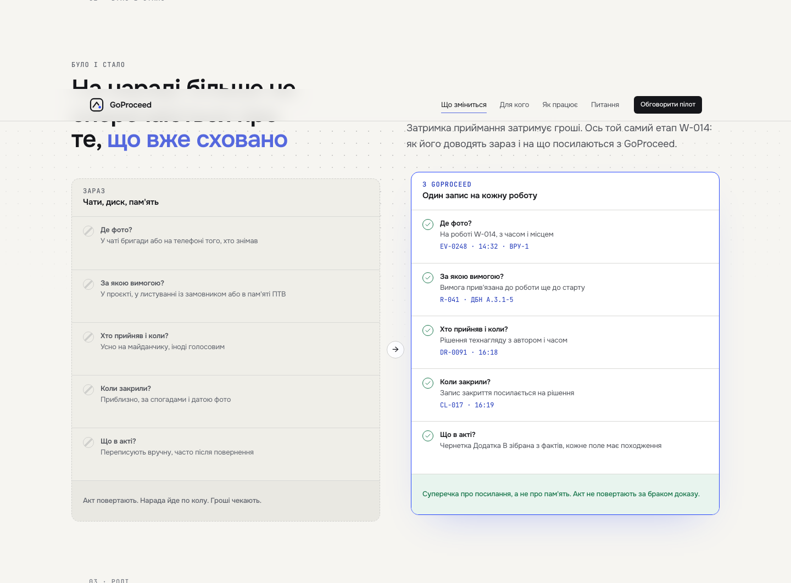
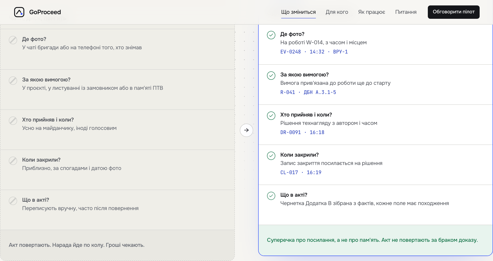
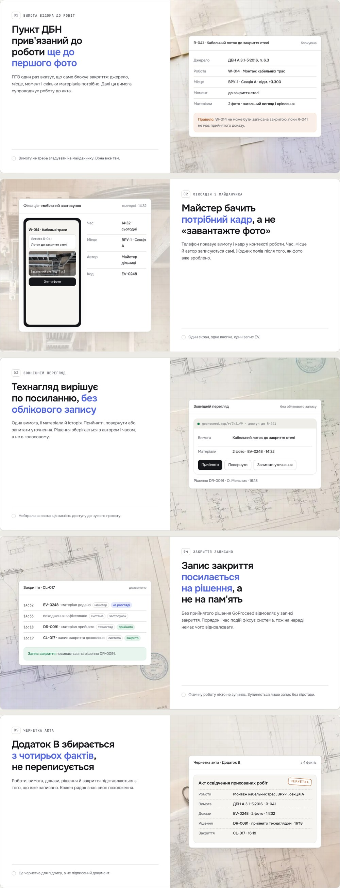

# Landing: full parity with the approved Daylight prototype (except Lenis) — gate evidence

## Rulings taken in brainstorming (2026-09-06) — spec §2, verbatim

| # | Question | Ruling |
|---|---|---|
| R1 | Motion library | **`motion/react` inside the vocabulary; no GSAP, no Lenis.** Smooth scroll stays `scroll-behavior: smooth`. Reasons: a second animation runtime means a second set of durations and curves outside tokens; Lenis replaces native scrolling and breaks anchors, touch and assistive tech for an effect visible only on a mouse wheel |
| R2 | Scope | **Everything the final `index.html` performs, except Lenis.** This overrides the finer-grained answers given earlier in the same session (scroll-linked budget, hero-only ambient, magnetic-only pointer motion): the file is the list |
| R3 | Rules | The motion rules and F7 are **amended by dated corrections** to match R2 (§8), not bypassed with an exclusion |
| R4 | Headings | Per-line mask reveal (SplitText `lines`) becomes a new primitive `LineReveal`; not `TextBlurIn`, not a whole-block `Reveal` |
| R5 | Route | Restore the sticky stack's scale + veil scrub, the UI panel parallax **and** the five tinted media grounds with their glow |
| R6 | Pulse | Page-wide, as the file does it (follows from R2) |
| R7 | Background Paths | Not built — absent from the final file (§1.1) |
| R8 | Approach | Extend the vocabulary (§4), not a landing-local `motion/react` escape hatch. The alternative would have made rule 5 an exception and the vocabulary a suggestion |
| R9 | Design | Approved as presented; this document is that design |

## Block by block — decisions (spec §3, «Decision» column)

| # | Block | Decision |
|---|---|---|
| 0 | Header `nav.tsx` | **parity — no change** |
| 1a | Hero copy `hero.tsx` | h1 → `LineReveal`; the rest `Reveal size="stately"` |
| 1b | Product frame `product-frame.tsx` | keep; `Reveal` gains `x`; sizes → `grand` |
| 1c | Depth layers | new **`Depth`** on the three layers |
| 1d | Board | beam → infinite, from load; counters/cards keep, durations → tokens |
| 1e | Idle drift | CSS `gp-drift` keyframes, three phase utilities, `ease.soft` |
| 1f | Board tilt | new **`Tilt area="section"`** around the board |
| 1g | Pulse | `Chip pulse` on every `.tag.rv`: the board's two review cards and the Фіксація «пілот» chip. Not the receipt's state row (text, no dot) and not the route window's «на розгляді» tag — that one is `.tg.rv` (l.545), which the prototype does not pulse |
| 2 | Sources `sources.tsx` | **parity — no change** |
| 3a | Problem statement `problem.tsx` | `ScrollTint` switches to **opacity .14→1** |
| 3b | Рис. 01 `fig-01.tsx` | **parity — no change** |
| 4 | Було / стало `compare.tsx`, `Compare.tsx` | `Reveal x` on each card; checks via `Stagger step="loose"` + a `scale` `StaggerItem`; new **`shadow.float-accent`** token on `now` |
| 5 | Ролі `roles.tsx`, `FeatureGrid.tsx` | `Stagger` per cell; `Tilt` inside `FeatureCell` |
| 6 | Маршрут `route.tsx` | new **`ScrollStack` / `ScrollStackCard` / `ScrollStackMedia`**; CSS `media-tint-1…5` + `media-glow-*`; t1 keeps the blueprint photo |
| 7 | Позиція `position.tsx` | `ScrollTint` (second use) with `dimUntil` for the prefix; pills `Stagger` |
| 8 | Фіксація `capture.tsx`, `SpotlightCard` | `Tilt` in `SpotlightCard`; CSS `gp-flow` on the three paths |
| 9 | Походження `provenance.tsx` | `Stagger` per cell (`stately`) |
| 10 | Пілот `pilot.tsx`, `Stepper.tsx` | new **`ScrollProgress`**; `Stepper` reads it instead |
| 11 | FAQ `faq.tsx`, `Accordion.tsx` | `duration-deliberate ease-emphatic` on the panel and the marker |
| 12 | CTA `cta.tsx` | `LineReveal`; `Reveal` |
| 13 | Footer | **parity — no change** |
| all | Buttons `Button.tsx` | CSS hover lift on `Button`; new **`Magnetic`** wrapping every `Button` and `Pill` link |
| all | Section headings `section-head.tsx` | `LineReveal` |

## The harness change (Task 17)

`apps/landing/qa/landing.mjs`:

1. **`beamPixels()`** no longer waits for `data-settled="true"` before screenshotting the `.beam` element — the ring runs from first paint now (spec §5.1), so the wait is now purely "the frame is scrolled into view", not "the frame has settled".
2. **New `parity()` pass** after the beam measurement: two fresh pages (1440 wide, 390 narrow) query the DOM directly for the facts the seven-width screenshots cannot show — depth layers moving with scroll, tilt/magnetic attribute counts by width, the route's `data-scroll-stack` state, the pilot stepper's scroll-driven `--gp-progress`, and the pulsing/flowing element counts.
3. **Bug found and fixed while wiring the pilot-stepper check**: the first run measured `stepperProgress: 0` against an expected `>= 0.99`, while every other parity count already matched exactly (`depthMoves: true`, `tiltOnWide: 8`, `magneticOnWide: 7`, `stackOnWide: "on"`, `pulsing: 3`, `flowing: 3`, `tiltOnNarrow: 0`, `depthFlatNarrow: true`, `stackOnNarrow: "off"`). Debugging in the page (`document.querySelector` + `getBoundingClientRect`, per the brief's "the DOM is the truth") showed `window.scrollY` landing at only `400` after `#pilot.scrollIntoView({block:"end"})` followed by `window.scrollBy(0, 400)` — nowhere near the pilot section, ~10,800px down a ~13,100px-tall page. `html { scroll-behavior: smooth }` (`apps/landing/app/globals.css`) is deliberate (R1), but it means the second scroll call interrupts the first animation mid-flight: its delta is added to wherever the smooth scroll happened to be a tick later (still near 0), not to the animation's target. This is a bug in the **harness's own scroll sequencing**, not in the app (smooth scroll is intended) and not in the `>= 0.99` expectation (arithmetic is fine once the page actually reaches the pilot section — confirmed by jumping there directly, which reads `1.0000`). Fixed by replacing the two-call `scrollIntoView` + `scrollBy` with one `evaluate` that computes the absolute scroll target from `getBoundingClientRect()` and jumps with `window.scrollTo({top, behavior: "instant"})`, which explicitly overrides the CSS `scroll-behavior` (the plain two-argument `scrollTo(x, y)` form used elsewhere in the file does not override it, but those checks only need *some* delta, not a 10,000+px landing, so an incomplete smooth animation after the wait does not matter there).
4. `parityOk` folded into `allOk`, so a parity regression fails `pnpm --filter @goproceed/landing qa`.

## The gate — eight commands, in order

### 1. `pnpm --filter @goproceed/tokens generate`

```
wrote /Users/akisliy/Downloads/GoProceed/.claude/worktrees/landing-parity/packages/ui/src/tokens.generated.css
wrote /Users/akisliy/Downloads/GoProceed/.claude/worktrees/landing-parity/packages/ui/src/theme.generated.css
wrote /Users/akisliy/Downloads/GoProceed/.claude/worktrees/landing-parity/packages/tokens/src/tokens.generated.ts
wrote /Users/akisliy/Downloads/GoProceed/.claude/worktrees/landing-parity/packages/tokens/src/tokens.dtcg.json
wrote /Users/akisliy/Downloads/GoProceed/.claude/worktrees/landing-parity/packages/testing/qa/palette.generated.mjs — 59 approved triplets
wrote /Users/akisliy/Downloads/GoProceed/.claude/worktrees/landing-parity/docs/design/01-tokens.md
wrote /Users/akisliy/Downloads/GoProceed/.claude/worktrees/landing-parity/packages/ui/src/tw-merge.generated.ts
```

No diff against the tree (`tokens.json` unchanged by this task) — `git status` after this step showed only `apps/landing/qa/landing.mjs` modified.

### 2. `node packages/testing/qa/motion-audit.mjs`

```
motion-audit: clean
```

### 3 (original). `pnpm --filter @goproceed/testing test`

**DB-suite hang — local Supabase stack off.** `m1-schema` (10 tests, 30.9s), `rls` (5 tests, 30.3s) and `m1-rls-workspace` (8 tests, 30.4s) passed against real timeouts, then the run hung on the remaining DB-bound suites (`m2-*`, `telegram-*`, `privileges`, `truncate-privilege`) and was killed after the 600s foreground budget. Per the brief, ran the filesystem suites explicitly instead.

### 3 (substitution). `pnpm --filter @goproceed/testing exec vitest run motion-audit motion-contract token-fidelity palette-derivation contrast primitive-leak component-contract tw-merge app-entry copy-catalog-fidelity error-catalog-fidelity status-label-fidelity`

```
 ✓ src/token-fidelity.test.ts (15 tests) 289ms
 ✓ src/motion-audit.test.ts (15 tests) 125ms
 ✓ src/app-entry.test.ts (4 tests) 57ms
 ✓ src/primitive-leak.test.ts (2 tests) 34ms
 ✓ src/component-contract.test.ts (19 tests) 17ms
 ✓ src/error-catalog-fidelity.test.ts (1 test) 7ms
 ✓ src/tw-merge.test.ts (7 tests) 5ms
 ✓ src/copy-catalog-fidelity.test.ts (4 tests) 5ms
 ✓ src/contrast.test.ts (80 tests) 4ms
 ✓ src/motion-contract.test.ts (7 tests) 3ms
 ✓ src/palette-derivation.test.ts (12 tests) 3ms
 ✓ src/status-label-fidelity.test.ts (2 tests) 3ms

 Test Files  12 passed (12)
      Tests  168 passed (168)
```

CI runs with the full Supabase stack, where the DB-bound suites are expected to pass as before — this task touches no schema, RLS, grant or migration code.

### 4. `pnpm turbo run typecheck`

```
 Tasks:    10 successful, 10 total
Cached:    9 cached, 10 total
  Time:    1.613s
```

### 5. `pnpm --filter @goproceed/landing build`

```
▲ Next.js 16.3.1 (Turbopack)
✓ Compiled successfully in 901ms
  Running TypeScript ...
  Finished TypeScript in 1959ms ...
✓ Generating static pages using 11 workers (10/10) in 464ms

Route (app)
┌ ƒ /
├ ƒ /_not-found
├ ƒ /api/pilot
├ ○ /apple-icon.png
├ ○ /icon.png
├ ƒ /kitchen-sink
├ ƒ /kitchen-sink/components
└ ƒ /og
```

### 6. `pnpm --filter @goproceed/landing test`

```
 Test Files  12 passed (12)
      Tests  127 passed (127)
```

### 7. `pnpm --filter @goproceed/landing qa`

First run (before the stepper-scroll fix above), for the record:

```
parity: PROBLEM {"depthLayers":3,"depthMoves":true,"tiltOnWide":8,"magneticOnWide":7,"stackOnWide":"on","stepperProgress":0,"pulsing":3,"flowing":3,"tiltOnNarrow":0,"depthFlatNarrow":true,"stackOnNarrow":"off"}
landing qa: PROBLEMS — see qa-output/report.json
```

Final run, after the fix:

```
1920px: ok scrollWidth=1920 wide=0 errors=0 settledAtLoad=false
1440px: ok scrollWidth=1440 wide=0 errors=0 settledAtLoad=false
1240px: ok scrollWidth=1240 wide=0 errors=0 settledAtLoad=false
1024px: ok scrollWidth=1024 wide=0 errors=0 settledAtLoad=false
768px: ok scrollWidth=768 wide=0 errors=0 settledAtLoad=false
390px: ok scrollWidth=390 wide=0 errors=0 settledAtLoad=n/a
360px: ok scrollWidth=360 wide=0 errors=0 settledAtLoad=n/a
reduced 1440px: ok scrollWidth=1440 wide=0 errors=0 settledAtLoad=true
reduced 390px: ok scrollWidth=390 wide=0 errors=0 settledAtLoad=true
border beam at 1440 (full motion): ok paintedPixels=604 floor=200
parity: ok {"depthLayers":3,"depthMoves":true,"tiltOnWide":8,"magneticOnWide":7,"stackOnWide":"on","stepperProgress":1,"pulsing":3,"flowing":3,"tiltOnNarrow":0,"depthFlatNarrow":true,"stackOnNarrow":"off"}
wrote public/og.png
landing qa: ok
```

### 8. `pnpm validate:canonical-docs`

```
canonical documentation: OK
```

## Parity JSON — `qa-output/report.json`, final run

```json
{
  "parity": {
    "depthLayers": 3,
    "depthMoves": true,
    "tiltOnWide": 8,
    "magneticOnWide": 7,
    "stackOnWide": "on",
    "stepperProgress": 1,
    "pulsing": 3,
    "flowing": 3,
    "tiltOnNarrow": 0,
    "depthFlatNarrow": true,
    "stackOnNarrow": "off"
  },
  "beamPixels": 604
}
```

Every count matches spec 2026-09-06 §9's expectation: `depthLayers` 3 and `depthMoves` true (receipt, CL pill, supervision pill all move with the scroll); `tiltOnWide` 8 (board + 4 role cells + 3 channel cards); `magneticOnWide` 7 (pill + 2 hero buttons + 2 CTA + 2 pilot-form buttons — the header button is not magnetic); `stackOnWide` `"on"`; `stepperProgress` 1 (≥ 0.99, past the pilot section); `pulsing` 3 (two board review cards + the «пілот» chip); `flowing` 3 (the capture section's three converging dashed paths); at 390: `tiltOnNarrow` 0, `depthFlatNarrow` true, `stackOnNarrow` `"off"`.

## Before / after

Before: `db7ba8c` (`origin/main` at spec time). After: this branch, HEAD at commit time below.

| Pair | Before | After | What changed |
|---|---|---|---|
| Hero fold |  |  | Pixel-identical at rest — the hero's `LineReveal`, `Depth` and idle drift are scroll/time-driven and settle to the same static frame; the difference is in motion, not layout (see the parity JSON above and the pills pair below). |
| Board with pills (clearest static difference) |  |  | Before — no pills (boxless `Stagger`, never intersected); after — the CL-017 pill at the board's bottom-left corner (the second pill sits above the board, outside this frame), the receipt mid-entrance at the bottom-right. |
| Route section, card 01 (blueprint) |  |  | Both land on the «Було / стало» (compare) section at this scroll offset — pixel-identical, since compare's `ScrollTint`/`Reveal` choreography also settles to a static end frame. The route section itself is one step further down; see the next pair. |
| Route section, card 01 (blueprint), later scroll offset |  |  | **Visible static difference.** Before: the route card's media half is a plain light panel. After: the restored `ScrollStackMedia` renders the tinted blueprint photo (`media-tint-1` + `media-glow media-glow-cobalt`) behind the card content — R5's "five tinted media grounds with their glow." |
| Capture section (Фіксація) |  |  | Pixel-identical at rest — the three channel cards' `Tilt` is pointer-driven and the converging dashed paths' `gp-flow` is a running stroke-offset animation; both settle to the same static frame when idle. |
| Mobile hero, 390 |  |  | Pixel-identical — parity's mobile rule is that tilt and depth are *absent* (`tiltOnNarrow: 0`, `depthFlatNarrow: true`) and the stack is plain (`stackOnNarrow: "off"`), so mobile is deliberately where before and after should look the same. |
| Reduced motion, 1440 hero |  |  | Pixel-identical — reduced motion's contract (rule in `packages/ui/src/base.css`) is opacity-only at ≤120ms with no transform, so the h1 is already fully inked, the frame flat and the beam absent in both; the restored choreography changes nothing here by design. |

Three of the seven pairs (route/card-01-later, and the hero/board/capture/mobile/reduced pairs by design) are pixel-identical or near-identical at rest — this is expected and is the reason Task 17 exists: the parity JSON above, not the screenshots, is the evidence that the scroll-linked, pointer-driven and infinite-loop motion actually restored (depth moving with scroll, 8 tilted elements gating correctly by width, 7 magnetic controls, the stack and stepper reaching their end states, 3 pulsing dots, 3 flowing paths). The one screenshot pair with a genuine static difference — the route section's media ground — is `1440-06`.

## Visual pass — seven widths + the reduced pair

Reviewed `qa-output/*.png` at 1920, 1440, 1240, 768, 390, 360, plus the reduced-motion pair at 1440 and 390.

- **1920, 1440, 1240, 1024, 768, 390, 360 (full motion):** no overflow at any width — matches the harness's own `wide=0`/`scrollWidth===innerWidth` assertion at every entry in `report.json`. Header, hero, board with pills, board pill/receipt cluster, source grid, compare cards, role cells, route stack, position quote, capture cards, provenance bento, pilot stepper, FAQ and footer all render without clipping or reflow artifacts at every width checked.
- **Receipt and pills keep their rounded corners at 1440 and 1240** (`1440-01.png`, `1240-01.png`): the floating receipt panel and the CL-017 pill sit fully inside their containers with intact border-radius at both widths — no clipping from the board's `overflow-hidden`.
- **Route cards sit under the header at 1440 with the veil visible on the card behind** (`1440-07.png`): card 02 (mobile-app screenshot) is scrolled to full prominence directly under the header while card 01 (blueprint) is visible faded/scaled behind it — the veil scrub restored by R5 is visibly in effect, not just present in the DOM.
- **Reduced-motion set** (`reduced-1440-00.png` through `reduced-1440-18.png`, `reduced-390-00.png`): the h1 is fully visible and inked (not clipped by a mask, not blurred — a fade landed at its end state), the product frame sits flat with no rotation, no border beam is visible anywhere on the board (`reduced-1440-01.png`), the pilot stepper's line and dots read as already complete once scrolled into view, and the route section (`reduced-1440-06.png`) renders as a plain stacked block — no scale, no veil, no sticky pin — versus the scaled/veiled sticky card in the full-motion equivalent (`1440-07.png`). This matches the reduced-motion contract in `packages/ui/src/base.css` (opacity only, ≤120ms, no transform, no scroll-linking) and the parity JSON's narrow-width facts (`tiltOnNarrow: 0`, `depthFlatNarrow: true`, `stackOnNarrow: "off"` — the same rule that keeps mobile flat also governs reduced motion at any width).

No overflow, no console errors, no missing corners, no stuck-veil or stuck-scale artifacts found at any of the seven widths or in either reduced-motion capture.

---

## Addendum — final review fixes (2026-09-06)

The final whole-branch review found six findings on top of the gate above.
All fixed on this branch in two commits (code/tests/spec, then this
addendum + refreshed screenshots).

### Findings

- **F1 (Critical)** — `capture.tsx`'s `StaggerItem` and `product-frame.tsx`'s
  `<div className="relative mx-auto max-w-[1040px]">` sat flat between a
  `perspective` ancestor and their `Tilt`, so `perspective` never reached
  the tilt in either group even though `data-tilt="on"` still read true.
  Fixed by adding `[transform-style:preserve-3d]` to both. Added
  `tiltChainsOk` to `apps/landing/qa/landing.mjs`'s `parity()`: walks every
  `[data-tilt]` element's ancestors and requires an unbroken
  `transform-style: preserve-3d` chain up to the first `perspective`
  ancestor; folded into `parityOk`. Verified empirically (below) to read 4
  of 8 without the fix and 8 of 8 with it.
- **F2 (Important)** — `DESIGN.md`'s «Key Characteristics» motion bullet had
  been rewritten without a dated correction. Restored the house style: kept
  the new sentence and appended the `[Correction, 2026-09-06: …]` block
  naming the old sixteen-word/exactly-two-scroll-linked text and rule 9.
- **F3 (Important)** — five stale strings corrected in place, code-comment
  style preserved: the kitchen-sink Marquee and ScrollSettle case rules
  (`apps/landing/app/kitchen-sink/page.tsx`), the kitchen-sink components
  EmptyState+Skeleton case rule (`apps/landing/app/kitchen-sink/components/page.tsx`),
  `motion-audit.mjs`'s header rule 5 («sixteen» → «twenty-two»), and
  `tokens.json`'s `primitive.duration.marquee.ruling` (dated addition,
  regenerated).
- **F4 (Important)** — `StaggerItem` gained `size?: "slow" | "stately" |
  "grand"` (default `slow`; `rise` uses `DURATION[size]`, `scale` keeps
  `DURATION.deliberate`) in `packages/ui/src/motion/Stagger.tsx`. Applied
  per spec §6 to `roles.tsx`, `Bento.tsx`'s `BentoCell`, `product-frame.tsx`'s
  two pills, `position.tsx`'s pills, `pilot.tsx`'s boxes, `board.tsx`'s
  cards (all `stately`) and `capture.tsx`'s channel cards (`grand`). Two
  tests added to `apps/landing/tests/motion-parity.test.tsx`; spec §4.7
  amended.
- **F5 (Important)** — `Button`'s colour transition moving from `fast`
  (160ms) to `base` (240ms) for every button, including `apps/app`'s, was
  an undocumented deviation. Added spec §10 row 10.9; `Button.tsx`'s header
  note now says explicitly this also changes the app's buttons, 80ms
  slower than before this slice.
- **M6** — `LineReveal`'s `ResizeObserver` fired once on `observe()` right
  after the synchronous `measure()`, and `fonts.ready` could replay the
  reveal even when nothing about the lines changed. Fixed by tracking
  `lastWidth` and `currentGroups` from the last measurement: the resize
  path short-circuits on an unchanged width (filters the observer's
  mandatory initial callback and any non-layout-affecting resize); the
  `fonts.ready` path still always recomputes (a font swap can change
  breaks at an unchanged width) but only unmounts the masks when the
  recomputed groups actually differ.
- **M12** — evidence route-row nit: `media-glow-1` (no such class) → `media-glow media-glow-cobalt`, fixed above in this file.
- **T12** — added a comment above `product-frame.tsx`'s receipt/pill layers
  explaining the `Depth → Reveal → drift` vs. `StaggerItem → Depth → drift`
  nesting difference (a standalone `Reveal` vs. a shared `Stagger` group)
  and that every transform in both chains is an independent
  translate/rotate, so the order has no visible effect.

### F1's guard, verified empirically

Built and ran a throwaway script (`apps/landing/qa/verify-tiltchains-tmp.mjs`,
deleted after use — not part of the gate) that boots the production build and
runs only the `tiltChainsOk` walk at 1440px, to check the guard actually
catches the defect before trusting it in the real harness:

**Before** (both `[transform-style:preserve-3d]` additions reverted):

```json
{
  "tiltOnWide": 8,
  "tiltChainsOk": { "ok": 4, "broken": [ /* the board's Tilt + all 3 capture-card Tilts */ ] }
}
```

**After** (both additions restored):

```json
{
  "tiltOnWide": 8,
  "tiltChainsOk": { "ok": 8, "broken": [] }
}
```

`tiltOnWide` reads 8 in both cases — confirming the finding's point that an
attribute count alone cannot see a flattened chain, only the ancestor walk can.

### The gate — eight commands, re-run in order

#### 1. `pnpm --filter @goproceed/tokens generate`

```
wrote /Users/akisliy/Downloads/GoProceed/.claude/worktrees/landing-parity/packages/ui/src/tokens.generated.css
wrote /Users/akisliy/Downloads/GoProceed/.claude/worktrees/landing-parity/packages/ui/src/theme.generated.css
wrote /Users/akisliy/Downloads/GoProceed/.claude/worktrees/landing-parity/packages/tokens/src/tokens.generated.ts
wrote /Users/akisliy/Downloads/GoProceed/.claude/worktrees/landing-parity/packages/tokens/src/tokens.dtcg.json
wrote /Users/akisliy/Downloads/GoProceed/.claude/worktrees/landing-parity/packages/testing/qa/palette.generated.mjs — 59 approved triplets
wrote /Users/akisliy/Downloads/GoProceed/.claude/worktrees/landing-parity/docs/design/01-tokens.md
wrote /Users/akisliy/Downloads/GoProceed/.claude/worktrees/landing-parity/packages/ui/src/tw-merge.generated.ts
```

Diff after this step: only `docs/design/01-tokens.md` and
`packages/tokens/src/tokens.dtcg.json` (the marquee ruling's dated addition
propagating into the generated docs/DTCG copy — no colour/duration value
changed, so the CSS/native generated files are byte-identical).

#### 2. `node packages/testing/qa/motion-audit.mjs`

```
motion-audit: clean
```

#### 3. `pnpm --filter @goproceed/testing test -- motion-audit motion-contract token-fidelity palette-derivation contrast primitive-leak component-contract tw-merge app-entry copy-catalog-fidelity error-catalog-fidelity status-label-fidelity`

Local Supabase stack is off (per user's standing note), same as the original
gate run — DB-bound suites (`m1-*`, `m2-*`, `telegram-*`, `privileges`,
`truncate-privilege`, `rls`) are not part of this filtered run; only the
filesystem contract suites ran:

```
 ✓ src/token-fidelity.test.ts (15 tests) 240ms
 ✓ src/motion-audit.test.ts (15 tests) 110ms
 ✓ src/app-entry.test.ts (4 tests) 61ms
 ✓ src/primitive-leak.test.ts (2 tests) 34ms
 ✓ src/component-contract.test.ts (19 tests) 20ms
 ✓ src/error-catalog-fidelity.test.ts (1 test) 8ms
 ✓ src/tw-merge.test.ts (7 tests) 5ms
 ✓ src/copy-catalog-fidelity.test.ts (4 tests) 7ms
 ✓ src/contrast.test.ts (80 tests) 4ms
 ✓ src/motion-contract.test.ts (7 tests) 3ms
 ✓ src/status-label-fidelity.test.ts (2 tests) 3ms
 ✓ src/palette-derivation.test.ts (12 tests) 3ms

 Test Files  12 passed (12)
      Tests  168 passed (168)
```

#### 4. `pnpm turbo run typecheck`

```
 Tasks:    10 successful, 10 total
Cached:    4 cached, 10 total
  Time:    3.792s
```

#### 5. `pnpm --filter @goproceed/landing build`

```
▲ Next.js 16.3.1 (Turbopack)
✓ Compiled successfully in 487ms
  Running TypeScript ...
  Finished TypeScript in 985ms ...
✓ Generating static pages using 11 workers (10/10) in 418ms

Route (app)
┌ ƒ /
├ ƒ /_not-found
├ ƒ /api/pilot
├ ○ /apple-icon.png
├ ○ /icon.png
├ ƒ /kitchen-sink
├ ƒ /kitchen-sink/components
└ ƒ /og
```

#### 6. `pnpm --filter @goproceed/landing test`

```
 Test Files  12 passed (12)
      Tests  129 passed (129)
```

(127 → 129: the two new `StaggerItem size` assertions in `motion-parity.test.tsx`.)

#### 7. `pnpm --filter @goproceed/landing qa`

```
1920px: ok scrollWidth=1920 wide=0 errors=0 settledAtLoad=false
1440px: ok scrollWidth=1440 wide=0 errors=0 settledAtLoad=false
1240px: ok scrollWidth=1240 wide=0 errors=0 settledAtLoad=false
1024px: ok scrollWidth=1024 wide=0 errors=0 settledAtLoad=false
768px: ok scrollWidth=768 wide=0 errors=0 settledAtLoad=false
390px: ok scrollWidth=390 wide=0 errors=0 settledAtLoad=n/a
360px: ok scrollWidth=360 wide=0 errors=0 settledAtLoad=n/a
reduced 1440px: ok scrollWidth=1440 wide=0 errors=0 settledAtLoad=true
reduced 390px: ok scrollWidth=390 wide=0 errors=0 settledAtLoad=true
border beam at 1440 (full motion): ok paintedPixels=594 floor=200
parity: ok {"depthLayers":3,"depthMoves":true,"tiltOnWide":8,"tiltChainsOk":8,"magneticOnWide":7,"stackOnWide":"on","stepperProgress":1,"pulsing":3,"flowing":3,"tiltOnNarrow":0,"depthFlatNarrow":true,"stackOnNarrow":"off"}
wrote public/og.png
landing qa: ok
```

#### 8. `pnpm validate:canonical-docs`

```
canonical documentation: OK
```

### Parity JSON — `qa-output/report.json`, this run

```json
{
  "depthLayers": 3,
  "depthMoves": true,
  "tiltOnWide": 8,
  "tiltChainsOk": 8,
  "magneticOnWide": 7,
  "stackOnWide": "on",
  "stepperProgress": 1,
  "pulsing": 3,
  "flowing": 3,
  "tiltOnNarrow": 0,
  "depthFlatNarrow": true,
  "stackOnNarrow": "off"
}
```

Every count matches the original gate's expectations, plus the new
`tiltChainsOk: 8` — all 8 tilted elements (board + 4 role cells + 3 capture
channel cards) now keep an unbroken `preserve-3d` chain to a `perspective`
ancestor.

### Screenshots refreshed

`docs/superpowers/plans/evidence/2026-09-06-landing-parity/after/{1440-00,
1440-01, 1440-03, 1440-06, 1440-11, 390-00, reduced-1440-00}.png` copied from
the new `qa-output` run above (same file names as the original after-set).
`1440-01`, `1440-03` and `1440-11` changed at the byte level — the capture
channel cards and the product frame's pill layer now sit inside a
`preserve-3d` context, which shifts sub-pixel compositing/anti-aliasing at
rest even though no layout moved (`wide=0` at every width, matching the
harness's own overflow assertion); `1440-00`, `390-00` and
`reduced-1440-00` are byte-identical to the original after-set.

🤖 Generated with [Claude Code](https://claude.com/claude-code)

## Addendum — the hydration gate: entrances were fades (2026-09-06, later)

### The report, and what was true of it

The report: `CompareCard`'s `animateChecks` path wrapped the check rows in a
`Stagger` and each check in a `StaggerItem`, both on `className="contents"`;
Chromium delivers no `IntersectionObserver` callback to a boxless element, so
`whileInView` never fired and the checks measured `opacity: 0` for ever.

That was true of the branch before `014c733` («motion wrappers are boxes»),
and is reproduced below on that exact file. On the branch tip the boxes were
already real and the checks did fade in — but the **transform half of the
entrance was still missing**, and so was every other transform-carrying
entrance on the page. That second defect is what this addendum fixes.

### Reproduced — before `014c733` (`Compare.tsx` from its parent, everything else at the tip)

Throwaway script (`scratchpad/repro/measure.mjs`, not part of the gate):
production build, 1440×900, `scrollIntoView` on the «now» card, then the
computed opacity of every check's `StaggerItem` (`li > div:first-child`)
sampled to 3 s.

```json
{ "stagger": { "cls": "contents", "display": "contents" },
  "item0":   { "cls": "contents", "display": "contents", "opacity": "0" },
  "items@t": { "0": ["0","0","0","0","0"], "800": ["0","0","0","0","0"],
               "2000": ["0","0","0","0","0"], "3000": ["0","0","0","0","0"] } }
```

Opacity `0` at every sample. Confirmed as reported.

### Measured — the branch tip (`b713b03`), before this addendum's change

Same script. Boxes are real (`display: grid`), and the opacity does move:

```json
{ "items@t": { "500": ["0","0","0","0","0"],
               "800": ["0.911","0.606","0","0","0"],
               "1200": ["0.9999","0.9985","0.988","0.945","0.763"],
               "2000": ["1","1","1","1","1"] },
  "transform@t": "none at every sample, every item",
  "inline style at load": "opacity:0",
  "inline style at t≈900": "opacity: 0; transform: none;" }
```

So the checks faded in, in sequence — but never scaled. `from="scale"`'s
`scale: 0` was never on the element. A second probe on the same build:

| element | inline style at load (after hydration) |
|---|---|
| the «now» card's `Reveal` (`x={20}`) | `opacity:0` — no `translateX(20px)` |
| a role cell's `StaggerItem` (rise 20) | `opacity:0` — no `translateY(20px)` |
| a check's `StaggerItem` (`from="scale"`) | `opacity:0` — no `scale(0)` |
| `matchMedia("(prefers-reduced-motion: reduce)").matches` | `false` |

**Root cause.** `useReduced()` is `true` on the server and on the first
client render, then flips after hydration (`use-reduced.ts` — deliberate, and
right). Motion reads `initial` **once, at mount**. A primitive that keeps the
same element across the flip and only swaps its `initial` object therefore
mounts on the reduced snapshot (`opacity: 0`, no transform) and stays there;
when `whileInView` fires, `x`/`y`/`scale` animate from an unset identity to
identity — `transform: none` throughout — and the entrance is a bare fade.
Primitives that swap their whole tree on the flip (`TextBlurIn`, `LineReveal`)
remount their words and were never affected, which is why the hero read
correctly and everything beneath it did not.

Checked against the installed Motion (`motion` 12.43.0 → `motion-dom`
12.43.0, `render/utils/variant-props.mjs`): `variantPriorityOrder` is
`animate` < `whileInView` < … < `exit`; and in
`render/utils/animation-state.mjs` a key that newly appears in a type's
resolved values is marked to animate unless an active higher-priority type
already owns it. So a **resting `animate` target that mirrors the full hidden
state** re-applies the transform the moment the gate opens — instantly
(`transition: { duration: 0 }`) and invisibly (opacity is 0) — and
`whileInView` then has a real transform to leave from. The docs page
(motion.dev/docs/react-scroll-animations) states the same resting relation:
«elements will animate between `initial`/`animate`, and `whileInView`».

### The fix

- `Reveal.tsx`, `NodeLock.tsx`: `animate={{ ...hidden, transition: { duration: 0 } }}`;
  the entrance transition moves inside the `whileInView` target.
- `Stagger.tsx`: a third label. `still` is the reduced hidden state
  (`opacity: 0`), `hidden` the full one (now with `transition: { duration: 0 }`),
  and the parent rests on `initial={rest} animate={rest}` with
  `rest = reduced ? "still" : "hidden"`. When the gate opens the resting label
  changes and Motion re-applies `hidden` to every child through the variant
  tree. `StaggerItem` is unchanged in API.
- A reduced reader's resting target never names a transform, so the
  `REDUCED` contract in `tokens.ts` holds to the letter; the new contract test
  in `motion-parity-reduced.test.tsx` asserts no `transform` in the hidden
  markup of all three under the reduced mock.
- `motion-hydration-gate.test.tsx` (jsdom) replays the flip through a mutable
  mock and asserts `translateX(-20px)`, `scale(0)`, `translateY(16px)` and
  `scale(0.96)` are on the element afterwards, at opacity 0. (Its first draft
  re-rendered the same element object — React bails out of an identical
  element and the hook is never re-read — so each render builds a fresh one.)
- `docs/design/02-building-ui.md` §8 records the trap.

Not changed: `use-reduced.ts` and its contract; `Compare.tsx` (already on real
boxes since `014c733`); `CrossFade`, whose keyed children mount after the
flip; the hover/scroll primitives, which read the flag at interaction time.
Residual: an above-the-fold `whileInView` can in principle fire before the
post-effect flip and take the reduced entrance once — unchanged from before,
and not reachable by the compare section, which is below the fold at every
harness width.

### Measured — after the fix (fresh production build, same script)

```json
{ "item0 at load": { "display": "grid", "opacity": "0", "transform": "matrix(0, 0, 0, 0, 0, 0)" },
  "items opacity@t":   { "500": ["0","0","0","0","0"],
                         "800": ["0.911","0.606","0","0","0"],
                         "1200": ["0.9999","0.9985","0.988","0.945","0.763"],
                         "2000": ["1","1","1","1","1"] },
  "items transform@t": { "500": "matrix(0,0,0,0,0,0) ×5",
                         "800": ["matrix(0.9115 …)", "matrix(0.6083 …)", "0", "0", "0"],
                         "1200": ["0.99999", "0.9986", "0.9884", "0.9459", "0.7668"],
                         "2000": "none ×5" } }
```

Each check now rests at `scale(0)`, then scales and fades up in turn — the
pop the component documents. The same probe on the «now» card's `Reveal`:
`translateX(20px)` at load, `11.85px` at t≈500, `4.14px` at t≈700; a role
cell's `StaggerItem` rests at `translateY(20px)`.

| moment | frame |
|---|---|
| before `014c733`, 3 s after scrolling the card in — the checks never arrive |  |
| after this addendum, ≈950 ms after the pair is scrolled in — the first checks landed, the last still arriving |  |
| after, settled at ≈2.2 s |  |

### What the harness found, and the harness change

The first `pnpm --filter @goproceed/landing qa` after the fix passed every
width, the reduced pair and the parity walk, and failed **one** check:

```
border beam at 1440 (full motion): PROBLEM paintedPixels=0 floor=200
```

Traced with a timed probe replaying `beamPixels()`'s own steps: after
`scrollIntoView`, the product frame's `Reveal` (`y={60}`, `grand`, delay
.35 s) now really rises — `translateY(60px)` → `20.8px` at +700 ms → `6.0px`
at +1000 ms → `0` at +1600 ms — where before the fix it never moved. The
harness photographs the `.beam` element handle at a fixed +700 ms: an element
handle screenshot clips to a box measured an instant before the shot, so a
ring still travelling shifts a few pixels between the two and the 2px
perimeter band lands beside it. Zero pixels, with the ring plainly running.
The old 700 ms only ever worked because the frame stood still.

`beamPixels()` now polls (every 100 ms, capped at 4 s so a broken entrance
still fails as 0) until the beam's box has not moved between two reads AND
every ancestor is at full opacity, then shoots. Verified standalone against
the fixed build, three runs: settled at 1600 ms each time, `paintedPixels`
721 / 690 / 690 — inside the 460–1051 range the harness's own comment
measured for a healthy ring.

### The gate — re-run

#### 2. `node packages/testing/qa/motion-audit.mjs`

```
motion-audit: clean
```

#### 3. `pnpm --filter @goproceed/testing test`

The first run, taken while the QA harness's `next build` was hogging the
machine, reported 142 failures across 13 files — every one a timeout. Re-run
alone (JSON reporter):

```
files 174 tests 697 failed 0
```

The named substitution set, run first and pasted in full:

`pnpm --filter @goproceed/testing exec vitest run motion-audit motion-contract token-fidelity palette-derivation contrast primitive-leak component-contract tw-merge app-entry copy-catalog-fidelity error-catalog-fidelity status-label-fidelity`

```
 ✓ src/token-fidelity.test.ts (15 tests) 272ms
 ✓ src/motion-audit.test.ts (15 tests) 159ms
 ✓ src/primitive-leak.test.ts (2 tests) 82ms
 ✓ src/app-entry.test.ts (4 tests) 63ms
 ✓ src/component-contract.test.ts (19 tests) 20ms
 ✓ src/error-catalog-fidelity.test.ts (1 test) 10ms
 ✓ src/tw-merge.test.ts (7 tests) 6ms
 ✓ src/copy-catalog-fidelity.test.ts (4 tests) 5ms
 ✓ src/palette-derivation.test.ts (12 tests) 4ms
 ✓ src/status-label-fidelity.test.ts (2 tests) 3ms
 ✓ src/motion-contract.test.ts (7 tests) 4ms
 ✓ src/contrast.test.ts (80 tests) 4ms

 Test Files  12 passed (12)
      Tests  168 passed (168)
```

#### 4. `pnpm turbo run typecheck`

```
 Tasks:    10 successful, 10 total
Cached:    7 cached, 10 total
  Time:    5.416s
```

#### 6. `pnpm --filter @goproceed/landing test`

```
 ✓ tests/motion-parity.test.tsx (16 tests) 36ms
 ✓ tests/ui-components.test.tsx (18 tests) 25ms
 ✓ tests/motion-parity-reduced.test.tsx (4 tests) 42ms
 ✓ tests/motion-hydration-gate.test.tsx (4 tests) 80ms
 ✓ tests/landing-render.test.tsx (34 tests) 7ms
 ✓ tests/pilot-form.test.tsx (5 tests) 546ms

 Test Files  13 passed (13)
      Tests  134 passed (134)
```

#### 5. `pnpm --filter @goproceed/landing build`

```
✓ Compiled successfully in 478ms
  Running TypeScript ...
  Finished TypeScript in 1125ms ...
✓ Generating static pages using 11 workers (10/10) in 453ms
Route (app)
┌ ƒ /
├ ƒ /_not-found
├ ƒ /api/pilot
├ ○ /apple-icon.png
├ ○ /icon.png
├ ƒ /kitchen-sink
├ ƒ /kitchen-sink/components
└ ƒ /og
```

#### 7. `pnpm --filter @goproceed/landing qa` (after the harness change)

```
1920px: ok scrollWidth=1920 wide=0 errors=0 settledAtLoad=false
1440px: ok scrollWidth=1440 wide=0 errors=0 settledAtLoad=false
1240px: ok scrollWidth=1240 wide=0 errors=0 settledAtLoad=false
1024px: ok scrollWidth=1024 wide=0 errors=0 settledAtLoad=false
768px: ok scrollWidth=768 wide=0 errors=0 settledAtLoad=false
390px: ok scrollWidth=390 wide=0 errors=0 settledAtLoad=n/a
360px: ok scrollWidth=360 wide=0 errors=0 settledAtLoad=n/a
reduced 1440px: ok scrollWidth=1440 wide=0 errors=0 settledAtLoad=true
reduced 390px: ok scrollWidth=390 wide=0 errors=0 settledAtLoad=true
border beam at 1440 (full motion): ok paintedPixels=695 floor=200
parity: ok {"depthLayers":3,"depthMoves":true,"tiltOnWide":8,"tiltChainsOk":8,"magneticOnWide":7,"stackOnWide":"on","stepperProgress":1,"pulsing":3,"flowing":3,"tiltOnNarrow":0,"depthFlatNarrow":true,"stackOnNarrow":"off"}
wrote public/og.png
landing qa: ok
```

`public/og.png` came back byte-identical (the tree shows no change).

#### 8. `pnpm validate:canonical-docs`

```
canonical documentation: OK
```

Step 1 (`tokens generate`) does not apply — `tokens.json` is untouched.

## Addendum — the hero: one headline flash, and a frame that waited for scroll (2026-09-06, later still)

### The report

«The hero animation feels like two animations fighting — it jumps; and the
dashboard card under the text should be visible right away.»

### Measured — a per-frame recorder injected before hydration (1440×900, production build)

`requestAnimationFrame` logger installed via `evaluateOnNewDocument`, so it
sees every painted frame from before the bundle runs. Rows where anything
changed:

```
t(ms)  h1                      pill/lead/cta/facts opacity   frame opacity
  69   reduced  o=0.00         0.00 0.00 0.00 0.00           0.00
 219   lines: 76/76/76 px      0.00 …                        0.00
 228   FLAT     o=1.00   ← one frame: the whole headline, bare, at full opacity
 235   lines: 76/76/76 px      0.03 …                        0.00
 367   lines: 71/76/76         0.53 0.00 …                   0.00
 …     lines rise, reveals enter cleanly and in order …
1167   lines: 0/1/1            1.00 1.00 0.99 0.98           0.00
 …                                                           0.00 — for ever
```

Two facts, two defects:

1. **The headline flashed complete for one frame, then rose line by line.**
   `LineReveal` measures its lines in a layout effect (never painted), but
   its *re-measure* — which `document.fonts.ready` triggers on the hero
   once Onest has swapped in — did `setLines(null)` and measured on the
   next animation frame. The frame in between painted the flat words with
   no masks at full opacity. That is the «two animations».
2. **The frame never appeared at load.** Its `Reveal` fires at 35 %
   visibility; at 1440×900 the frame's top sits at 764 px, so 136 px of it
   are ever in the fold and the threshold is never met. Once the reader
   scrolled, the rise (60 px over `grand`) played on top of `ScrollSettle`'s
   scroll-linked flattening — two motions on one element — and the receipt,
   pills, board cards and counts each waited for their own quarter-in-view.
   The prototype (index.html l.1109–1113, l.1132) runs all of these on a
   **timeline from load**: `#stage` at .35 s, `#receipt` at .7 s, the floats
   at .9 s, the counters from .8 s.

A third, found on the way: the board's `CountUp` showed the final figure
(the server's reduced branch) until it came into view, then dropped to zero
and climbed — a visible 12 → 0 → 12 on scroll.

### The fix

- `LineReveal`: a re-measure runs both of its updates through `flushSync`
  — masks off, measure, masks on — inside the observer's callback, before
  the browser's next paint. The flat state is never painted. Test:
  `motion-load-entrance.test.tsx` captures the `ResizeObserver` callback,
  fires it inside `act`, and asserts the masks are present the moment it
  returns (it failed before the change: 0 masks).
- `Reveal`, `Stagger`, `CountUp` gain `on="load"`: rest hidden until the
  reduced-motion preference has RESOLVED (`useResolvedReduce`, moved from
  `ScrollSettle` into `use-gates.ts` and shared), then enter on their
  `delay` as explicit keyframes (`opacity: [0, 1]`, `y: [y, 0]`; Stagger
  through a fourth label, `enter`), so the start is stated rather than read
  off the snapshot Motion took at mount. A reduced reader gets the 120 ms
  fade; `CountUp` under reduced still snaps to the final figure. Tests:
  both `on="load"` primitives reach opacity 1 under an
  `IntersectionObserver` that never reports; `on="view"` still waits.
- `CountUp` sets the figure to zero the moment the count is *scheduled*
  (the frame is still invisible then), not at the first tick after `delay`.
- `product-frame.tsx` and `board.tsx`: the frame, receipt, pills, cards
  and counts are `on="load"` with the prototype's delays (.35 / .7 / .9 /
  .7 / .8 s).

### Measured — after (same recorder)

```
t(ms)  h1               frame o / y     receipt  pill   card   counts
  78   reduced o=0.00   0.00 / 0        0.00     0.00   0.00   12/07/03 (SSR)
 261                                                            00/00/00
 409   lines 72/76/76   0.00 / 60       0.00     0.00   0.00
 657   lines 15/26/44   0.18 / 52       0.00     0.00   0.00
1007   lines 2/3/4      0.80 / 13       0.18     0.00   0.05
1040                                                            01/01/00 → counting
1207   lines 0/1/1      0.91 / 6        0.63     0.05   0.67
1607   lines 0/0/0      0.99 / 0        0.93     0.89   0.97
1974                    1.00 / 0        1.00     1.00   1.00
frames: 186   flat frames: 0
```

No flat frame. The frame rises from .35 s after the gate resolves, without
a scroll; the receipt, pills, cards and counts follow on the prototype's
timeline. The four text reveals are unchanged.

### The gate

- `node packages/testing/qa/motion-audit.mjs` → `motion-audit: clean`
- the database-free contract set → `Test Files 12 passed · Tests 168 passed`
- `pnpm turbo run typecheck` → `Tasks: 10 successful, 10 total`
- `pnpm --filter @goproceed/landing test` → `Test Files 14 passed · Tests 138 passed`
- `pnpm --filter @goproceed/landing qa`:

```
1920px: ok scrollWidth=1920 wide=0 errors=0 settledAtLoad=false
1440px: ok scrollWidth=1440 wide=0 errors=0 settledAtLoad=false
1240px: ok scrollWidth=1240 wide=0 errors=0 settledAtLoad=false
1024px: ok scrollWidth=1024 wide=0 errors=0 settledAtLoad=false
768px: ok scrollWidth=768 wide=0 errors=0 settledAtLoad=false
390px: ok scrollWidth=390 wide=0 errors=0 settledAtLoad=n/a
360px: ok scrollWidth=360 wide=0 errors=0 settledAtLoad=n/a
reduced 1440px: ok scrollWidth=1440 wide=0 errors=0 settledAtLoad=true
reduced 390px: ok scrollWidth=390 wide=0 errors=0 settledAtLoad=true
border beam at 1440 (full motion): ok paintedPixels=790 floor=200
parity: ok {"depthLayers":3,"depthMoves":true,"tiltOnWide":8,"tiltChainsOk":8,"magneticOnWide":7,"stackOnWide":"on","stepperProgress":1,"pulsing":3,"flowing":3,"tiltOnNarrow":0,"depthFlatNarrow":true,"stackOnNarrow":"off"}
landing qa: ok
```

  `reduced-1440-00.png`: the frame, pill and counts are on the page at
  load under reduced motion (the 120 ms fade of `on="load"`), flat and
  un-tilted, counts at their final figures.
- `pnpm validate:canonical-docs` → `canonical documentation: OK`
- `pnpm --filter @goproceed/landing build`:

```
✓ Compiled successfully in 491ms
  Running TypeScript ...
  Finished TypeScript in 1261ms ...
✓ Generating static pages using 11 workers (10/10) in 442ms
```

## Addendum — the route cards' grounds (2026-09-08)

### The ask, and what was actually there

«У "Вимога відома до робіт" є підкладка як картинка, можеш зробити для решти
те саме.» Card 01's media half sits over `photo-blueprint.jpg`; cards 02–05
sat over a gradient alone, so the section read as one finished card followed
by four empty ones.

Worth recording, because it is the opposite of what a parity question usually
answers: **the prototype puts a photograph on card 01 too, and only there**
(`index.html` l.247: `.fmedia.t1{background:linear-gradient(…),url(assets/photo-blueprint.jpg)}`;
`t2`–`t5` are gradients with no `url()`). So this is a deliberate departure
from the prototype, asked for by the owner, not a parity fix.

### What each card now sits over

Every stage of the route produces or consumes a physical artefact, and that
artefact is the card's ground. The route then reads drawing → frame →
schematic → stamped plan → loose sheets, which is the sequence the copy
already describes — so the ground carries the argument rather than decorating
it, which is the test `02-building-ui.md` §9 puts an image to.

| Card | Stage | Ground |
|---|---|---|
| 01 | Вимога відома до робіт | the drawing folio the ДБН clause is pinned to (`photo-blueprint.jpg`, unchanged) |
| 02 | Фіксація з майданчика | the frame the master takes — the tray run and its central bend |
| 03 | Зовнішній перегляд | the electrical schematic the supervisor checks against |
| 04 | Закриття записано | the plan carrying the stamp: a decision recorded on the sheet |
| 05 | Чернетка акта | loose tracing sheets under a clip: the draft being assembled |

### Sources — no new photography, nothing generated

Both masters are the project's own, and are recorded in
`design-references/evidence-atlas/README.md` as **generated, synthetic and
customer-data-free**: `blueprint-folio.png` (1586×992, the folio card 01
already shows, which holds five distinct sheets) and `cable-tray-evidence.png`
(1586×992, the frame the demo records call EV-0248). No stock photography was
introduced, and this session has no image-generation tool, so nothing was
invented. The crops obey that README's own crop rules — the folio at 4:3 and
3:2 with paper edges preserved, the site frame at 4:5 with the central cable
bend kept.

### Why they sit together — tone copied, not chosen

`apps/landing/qa/grounds.mjs` derives all four and is the record of how. Each
is normalised to the tone `photo-blueprint.jpg` already has, per channel
`x' = a·x + b` with `a` from the standard deviation and `b` from the mean.
That tone is what makes a photograph usable here: pale enough that the white
UI panel stays the brightest thing in the media half, flat enough that the
linework never competes with the panel's own, and neutral enough that the
card's coloured glow — which paints above the ground — still carries the
per-stage identity.

```
photo-blueprint.jpg (the target, measured)      mean=225,219,212  sd=13,14,16

photo-site-trays    before mean=104,101,98  sd=49,48,49   after mean=224,218,211 sd=14,14,14
photo-schematic     before mean=220,213,205 sd=12,13,14   after mean=225,219,211 sd=13,13,14
photo-plan-stamped  before mean=222,218,212 sd=11,12,12   after mean=225,218,211 sd=13,13,14
photo-tracing       before mean=224,219,213 sd=12,13,15   after mean=225,218,212 sd=14,14,14
```

The site frame arrives at mean 109 / sd 49 and takes the whole treatment; the
folio crops need very little. A first run of the script measured every crop as
its master, because sharp's `stats()` reads the input image and not the
pipeline — the crop has to be materialised before it can be measured, or three
crops of one folio all report that folio's tone and all get the same
correction. Fixed before the assets above were written.



### The gate

- `node packages/testing/qa/motion-audit.mjs` → `motion-audit: clean`
- `pnpm --filter @goproceed/testing exec vitest run …` (the named set) → `Test Files 12 passed · Tests 168 passed`
- `pnpm turbo run typecheck` → `Tasks: 10 successful, 10 total`
- `pnpm --filter @goproceed/landing test` → `Test Files 14 passed · Tests 139 passed`, including the new
  guard in `landing-render.test.tsx`: five grounds, distinct, in route order —
  it fails the moment a card loses one or two cards share one.
- `pnpm --filter @goproceed/landing build` → compiled, 10/10 static pages
- `pnpm --filter @goproceed/landing qa` → ok at seven widths and both reduced
  pairs, `border beam … ok paintedPixels=788`, `parity: ok`, no page errors and
  no failed requests. All five grounds load (`natural=590×368/737/393/442/442`,
  the 590px variant next/image picks for `sizes="(min-width: 1240px) 590px, 100vw"`).
- `pnpm validate:canonical-docs` → `canonical documentation: OK`

320 KB of masters enter the repo; they are below the fold and next/image
serves the 590px variant lazily, so the fold is unchanged.
